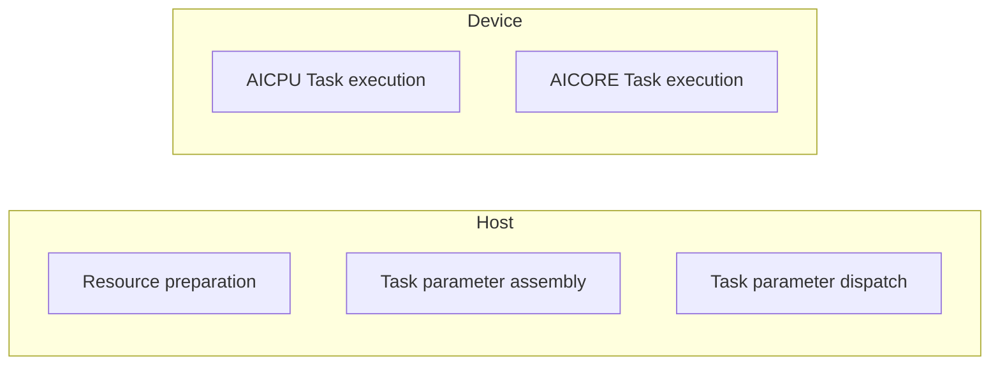

# Functional Debugging

<!-- md-trans-meta sourceCommit=1cc26711dfa4dcb46fee694d2efa62bd31a4f6ad translatedAt=2026-08-11T09:22:27.735Z pushedAt=2026-09-04T09:24:05.413Z -->

## Compilation and Execution Process

After developers complete the definition of tensors and build a complete computation flow through a series of basic tensor operations, the system generates a graph structure consisting of tensors and Operations interconnected alternately, known as a compute graph. This compute graph goes through the PyPTO compilation and optimization process, completing the compilation from the original compute graph to an executable graph, and ultimately generates executable code that can run in the Ascend hardware environment to perform the actual computation tasks.

### Graph Compilation Process

The following figure shows the complete compute graph compilation process. The Tensor Graph, Tile Graph, and Block Graph stages undergo multiple pass optimizations, and finally the Execute Graph stage integrates the graph information and generates the final hardware execution graph through code generation.

For the specific pass list, see the framework/src/passes/pass_mgr/pass_manager.cpp file.

**Figure 1**  Compute graph compilation process


The graphs generated at each stage of compute graph compilation are Tensor Graph, Tile Graph, Block Graph, and Execute Graph. These graphs are key artifacts of the compilation process, representing the complete compilation flow of a PyPTO program from abstract computation description to hardware execution.

- **Tensor Graph**: A Tensor Graph consists of tensor and Operation nodes, describing the computation flow defined by the user. This graph does not involve low-level semantics such as tile expansion and memory hierarchy, serving only as a high-level representation of computation logic. Optimizations on the Tensor Graph focus primarily on hardware-independent general graph optimization techniques, such as redundant node elimination and constant folding.
- **Tile Graph**: A Tile Graph consists of Tile and TileOp nodes. The Tensor Graph is expanded based on TileShape, decomposing tensors into Tiles and Operations into TileOps. Based on TileOp information and the memory hierarchy of the target hardware, the Tile Graph automatically deduces the storage location of each Tile and inserts memory copy nodes when necessary to ensure correct data transfer between different memory levels.
- **Block Graph**: The Block Graph is formed by partitioning the Tile Graph into multiple subgraphs, each of which can be scheduled to run on a single AI Core. The Block Graph is used for hardware-related optimizations, including instruction scheduling, on-chip memory allocation, and synchronization operation insertion, thereby improving hardware execution efficiency.
- **Execute Graph**: The Execute Graph is the final output of the compilation process. It integrates all optimization results and precisely describes the dependencies between Block Graphs for scheduling and execution by the device scheduler.

With the PyPTO Toolkit visualization tool, you can intuitively view the compute graph structure and inspect node information, helping debug operator functions more conveniently.

### Graph Execution Process

The following figure shows the complete execution process from resource preparation and task dispatch to computation execution.

- Resource preparation phase: Based on the execution resource information described in the Execute Graph, global resources such as workspace memory and streams are requested from the execution hardware.
- Task parameter assembly and dispatch phase: PyPTO hardware execution tasks are classified into AI CPU tasks and AI Core tasks. After the parameter assembly and task configuration required for these two types of tasks are completed, they are submitted to RTS for task dispatch.
- Task execution phase: The entire computation task is executed through close coordination between the AI CPU and AI Core in a client-server-like architecture. The AI CPU parses and distributes subtasks based on the Execute Graph, while the AI Core receives the subtasks distributed by the AI CPU and executes them.

Before execution, you can enable the collection and output of swimlane diagrams and use the PyPTO Toolkit visualization tool to intuitively view the inter-core parallelism and execution order of each subtask on AIC/AIV, helping you more conveniently understand the overall pipeline distribution and perform targeted operator performance optimization.



The following figure shows the relationship between the AI CPU and AI Core during PyPTO task execution on hardware, as well as the detailed execution process. The main process is summarized as: HostMachine initializes resources \> DeviceMachine generates DeviceTasks through Stitch and schedules CallTasks \> CoreMachine executes CallTasks \> DeviceProgram coordinates the entire process.

- HostMachine: Runs on the host side, responsible for actual hardware task execution, including resource preparation and task assembly.
- DeviceMachine: Runs on the AI CPU side, responsible for distributing and scheduling AI Core execution subtasks based on execution data such as the Execute Graph. The specific process is as follows: Control-AICPU uses Stitch (literally meaning "stitching") to combine CallTasks from multiple dependency-free loops into a single DeviceTask, breaking loop boundaries and maximizing CallTask parallelism. Schedule-AICPU distributes and manages AI Core CallTasks based on DeviceTasks. Each DeviceTask is shared among three Schedule-AICPUs, and each Schedule-AICPU extracts ready CallTasks from the DeviceTask for dispatch based on the idle status of the AIC/AIV cores it manages.
- CoreMachine: Runs on the AI Core side, responsible for receiving CallTasks dispatched from the AI CPU and executing them. A CallTask is the smallest unit that runs on AIC/AIV, consisting of a series of CCE instructions used to perform specific data movement and computation tasks on the AI Core.
- DeviceProgram: DeviceProgram is the core data for each PyPTO operator running on the device side, generated from the information described in the Execute Graph combined with hardware resource management.

**Figure 3** Execution state runtime diagram


## NPU On-Device Debugging

If errors occur or results do not meet expectations during graph compilation or graph execution, you can enable debug mode to generate compute graph files at different stages. A compute graph describes the structure of the computation flow of a PyPTO program and consists of multiple computation nodes and data nodes. It represents data flow and computation logic in the form of a directed acyclic graph (DAG), characterizing the complete compilation process of a PyPTO program from abstract computation description to hardware execution. This section describes how to collect and view compute graphs, and presents the key information in the graphs.

### Enabling Debug Mode

1. Enable the debug mode switch for the graph compilation phase.

    ```python
    @pypto.frontend.jit(
        debug_options={"compile_debug_mode": 1}
    )
    ```

2. Run the use case.

    ```bash
    python3 examples/02_intermediate/operators/softmax/softmax.py
    ```

3. Upon successful execution, compute graph files (.json format) at different stages are generated in the ${work_path}/output/output_*/ directory (* represents the timestamp).

    ```txt
    ├── Pass_<NNN>_ExpandFunction
    │   ├── After_<NNN>_ExpandFunction_TENSOR_s0_Unroll1_PATH0_4.json # Compute graph file after pass optimization
    │   ├── After_<NNN>_ExpandFunction_TENSOR_s0_Unroll1_PATH0_4.tifwkgr # No user attention required.
    │   ├── Before_<NNN>_ExpandFunction_TENSOR_s0_Unroll1_PATH0_4.json # Compute graph file before pass optimization.
    │   ├── Before_<NNN>_ExpandFunction_TENSOR_s0_Unroll1_PATH0_4.tifwkgr # No user attention required.
    │   └── ExpandFunctionTENSOR_s0_Unroll1_PATH0_4.log
    ├── program.json # Records static information such as function names and semantic labels.
    ├── ...
    ```
    Where `<NNN>` indicates the pass execution sequence number, which may vary across versions (for example, 004, 005, etc.). The actual value is subject to the generated result.

### Viewing Compute Graphs

The following sections select the last compute graph from each compilation stage and use the PyPTO Toolkit visualization tool to help you understand key information on various compute graphs and locate issues.

- `Tensor Graph`: Before\_004\_ExpandFunction\_TENSOR\_loop\_0\_Unroll1\_PATH0\_hiddenfunc0\_8.json
- `Tile Graph`: Before\_026\_SubgraphToFunction\_TENSOR\_loop\_0\_Unroll1\_PATH0\_hiddenfunc0\_8.json
- `Block Graph`: After\_036\_CodegenPreproc\_TENSOR\_loop\_0\_Unroll1\_PATH0\_hiddenfunc0\_8\_LEAF\_program\_id\_00\_15536366383870408930.json
- `Execute Graph`: After\_036\_CodegenPreproc\_TENSOR\_loop\_0\_Unroll1\_PATH0\_hiddenfunc0\_8\_ROOT.json

1. Use PyPTO Toolkit to view the Tensor Graph.

    Right-click the Before\_004\_ExpandFunction\_TENSOR\_loop\_0\_Unroll1\_PATH0\_hiddenfunc0\_8.json file and select "Open with PyPTO Toolkit" from the pop-up menu.

    

    In the upper right corner, you can see that the compute graph type is Tensor Graph. A Tensor Graph consists of tensors and operations. The tensor shapes in the graph are consistent with the code definitions and have not undergone tile expansion.

2. View the Tile Graph using PyPTO Toolkit.

    Right-click the Before_026_SubgraphToFunction_TENSOR_loop_0_Unroll1_PATH0_hiddenfunc0_8.json file and choose "Open with PyPTO Toolkit" from the pop-up menu.

    

    In the upper right corner, you can see that the compute graph type is Tile Graph. Compared with the graph before tile expansion, the Tile Graph contains many more nodes. This is because the original tensor with shape (-1, 32, 1, 256) is split into tiles with shape (1, 4, 1, 64) after tiling. Meanwhile, memory hierarchy levels are assigned to the tiles (asis-original address and tobe-destination address in the graph), and memory copy nodes (TILE_COPY_IN and TILE_COPY_OUT in the graph) are automatically inserted.

3. View the Block Graph using PyPTO Toolkit.

    Right-click the After\_036\_CodegenPreproc\_TENSOR\_loop\_0\_Unroll1\_PATH0\_hiddenfunc0\_8\_LEAF\_program\_id\_00\_15536366383870408930.json file and select "Open with PyPTO Toolkit" from the pop-up menu.

    

    In the upper right corner, you can see that the compute graph type is Block Graph. During the Block Graph stage, the Tile Graph is split into several subgraphs, each corresponding to a Block Graph. Therefore, compared with the Tile Graph, the scale of the Block Graph is significantly reduced.

    The current sample is split into multiple subgraphs with the same structure (referred to as isomorphic subgraphs). Therefore, the Pass\_36\_CodegenPreproc directory contains only one JSON file whose name includes the After\_036\_CodegenPreproc\_\*\_**LEAF**\_\* keyword.

4. View the Execute Graph through PyPTO Toolkit.

    Right-click the After\_036\_CodegenPreproc\_TENSOR\_loop\_0\_Unroll1\_PATH0\_hiddenfunc0\_8\_ROOT.json file and select "Open with PyPTO Toolkit" from the pop-up menu.

    

    In the upper right corner, you can see that the compute graph type is Execute Graph. The Execute Graph contains tensor nodes and call nodes (marked with an fx identifier, indicating a call to a Block Graph). Double-click a call node to view the corresponding Block Graph subgraph information and understand the specific execution process.
