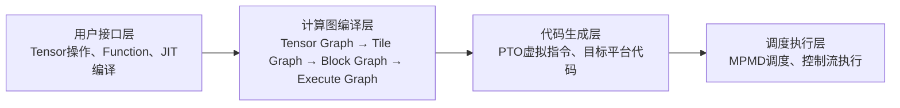

# PyPTO简介

PyPTO（发音：pai p-t-o）是CANN推出的一款面向AI加速器的高效算子编程框架，采用PTO（Parallel Tensor/Tile Operation）编程范式，旨在简化算子开发流程，同时保留高性能计算能力。PyPTO提供PyPTO Tensor和PyPTO Pro两种编程方式，开发者可以根据算子开发效率、性能调优需求和硬件控制粒度进行选择。

| 编程方式 | 核心差异 | 适用场景 |
| --- | --- | --- |
| PyPTO Tensor | 采用Tensor级编程和MPMD（Multiple Program Multiple Data，多程序多数据）执行模型。开发者主要描述计算逻辑，由编译器完成Tile切分、内存分配、任务调度和代码生成，抽象层次较高。 | 适合希望以接近数学表达式的方式快速开发算子的开发者，以及通用深度学习算子、大模型组件和动态Shape等场景。 |
| PyPTO Pro | 采用Kernel级编程和SPMD（Single Program Multiple Data，单程序多数据）执行模型。开发者可显式控制多核分工、数据搬运、Tile计算和流水编排，硬件控制粒度更细。 | 适合熟悉硬件架构、需要精细调优的开发者，以及Cube与Vector融合、复杂流水和追求极致性能的算子场景。 |

## PyPTO Tensor

### 核心架构

PyPTO Tensor采用分层架构，从用户接口到底层硬件执行包括以下层次：

- **用户接口层**：提供Python风格的Tensor编程接口，开发者可以直接表达计算逻辑，无需关注底层硬件指令。
- **计算图编译层**：通过模块化Pass完成多层级计算图的转换与优化。
    - Tensor Graph面向算法表达，描述高层Tensor计算。
    - Tile Graph将Tensor计算展开为硬件感知的Tile计算，并进行布局变换、内存类型分配和数据搬运等优化。
    - Block Graph将Tile图切分为可并行执行的计算子图，并进行乱序调度、内存复用和同步点插入等优化。
    - Execute Graph整合计算子图及其依赖关系，形成最终执行图。
- **代码生成层**：根据Execute Graph生成PTO虚拟指令代码，并进一步编译为目标平台代码。
- **调度执行层**：将可执行代码以MPMD方式调度到设备处理器核，并负责依赖关系和控制流的执行。

### 核心特性

- **Tensor级编程**：以Tensor为基本数据单位，编程表达贴近算子的数学定义。
- **多层级计算图**：通过Tensor Graph、Tile Graph、Block Graph和Execute Graph逐级降低抽象层次，为不同阶段的优化保留信息。
- **自动编译与调度**：自动完成Tile切分、布局变换、内存分配、数据搬运、子图切分、同步和代码生成等工作。
- **MPMD执行模型**：根据计算子图和资源情况生成多个程序，并调度到不同处理器核并行执行。
- **动态Shape与符号化编程**：支持动态Batch Size等动态Shape场景。
- **工具链支持**：支持查看各编译阶段的中间计算图和运行时性能数据，并提供编译及调度控制能力。

### 设计理念

PyPTO Tensor以“算法表达与硬件执行解耦”为主要设计理念。开发者使用Tensor描述计算，将硬件相关的切分、搬运、流水和调度交由编译器处理，在降低算子开发门槛的同时保留全局优化空间。

- **计算层**：尽可能贴近算法设计者的数学表达式，以Tensor而非单个元素描述计算，为内存布局、数据搬运和多算子联合优化保留完整信息。
- **编译层**：通过多阶段Lowering Pipeline将Tensor Graph逐步转换为Tile Graph、Block Graph和Execute Graph，把高层计算映射为硬件友好的执行形式。
- **执行层**：根据编译结果生成PTO虚拟指令和目标平台代码，并通过MPMD方式在设备侧并行执行。
- **工具链**：提供编译中间产物和运行时性能数据的可视化能力，支持开发者定位问题并按需控制编译与调度行为。

### 产品支持情况

PyPTO Tensor当前支持以下产品型号：

<!-- npu="950" id1 -->
- Ascend 950PR/Ascend 950DT：支持
<!-- end id1 -->
<!-- npu="A3" id2 -->
- Atlas A3 训练系列产品/Atlas A3 推理系列产品：支持
<!-- end id2 -->
<!-- npu="910b" id3 -->
- Atlas A2 训练系列产品/Atlas A2 推理系列产品：支持
<!-- end id3 -->

## PyPTO Pro

### 核心架构

PyPTO Pro提供Tile API、Reg API、SIMT API和Utils API，并通过JIT编译与执行链将Python Kernel编译为可在AI Core上运行的二进制文件。

**图1 PyPTO Pro总体架构**

PyPTO Pro应用由Host代码和Device代码组成。Host侧使用Python和PyTorch准备输入、输出Tensor并下发任务；Device侧使用PyPTO Pro编写[核函数Kernel](programming_guide/pro/development/kernel_function.md)，在AI Core上完成数据搬运和计算。两部分代码可以写在同一个`.py`文件中，并通过`@pypto_pro.language.jit()`标记Kernel函数。

编译与执行过程包括以下阶段：

1. **前端解析与优化**：解析JIT标记的Python Kernel，构建PyPTO IR，并通过IR Pass完成优化。
2. **代码生成**：CCE CodeGen根据优化后的IR生成Device侧代码和Tiling相关头文件。
3. **编译与链接**：通过毕昇编译器编译、链接Device侧代码和Host封装代码，生成JIT共享库。
4. **加载与执行**：运行时加载共享库并下发Kernel任务，由AI Core执行。

### 核心特性

- **SPMD执行模型**：参与执行的逻辑AI Core运行同一份Kernel代码，并通过核索引处理不同的数据分片。
- **多层次编程接口**：提供面向二维Tile计算的Tile API、面向寄存器级编程的Reg API、面向逐线程编程的SIMT API，以及辅助开发的Utils API。
- **显式硬件控制**：开发者可以控制逻辑Block数量、多核数据分配、数据搬运、计算过程和同步行为。
- **核内流水表达**：通过TileGroup及其`next()`、`current()`等接口表达多缓冲流水；开启自动同步后，框架可根据Tile绑定的`mutex_id`插入核内同步。
- **核间流水编排**：在支持的Cube、Vector融合场景中，通过stage机制和相应标签表达计算阶段，框架可自动插入核间同步并进行Preload流水编排。
- **JIT编译**：Python Kernel经PyPTO IR优化和CCE CodeGen生成Device侧代码，再编译为可在NPU上运行的二进制文件；后续调用可以复用编译产物。

### 设计理念

PyPTO Pro以“Python易用性与硬件可控性兼顾”为主要设计理念。框架使用Tile等抽象简化坐标偏移和指令参数配置，同时将多核分工、数据搬运、计算与流水编排能力开放给开发者，使开发者能够根据算子特点进行针对性优化。

- **并行设计**：采用外层SPMD与核内SIMD相结合的方式。多个逻辑AI Core执行同一份Kernel，并根据索引处理不同数据分片；AI Core内部使用向量或矩阵指令并行处理数据。
- **数据设计**：以Tensor表示Device Memory中的数据，以Tile表示片上数据块，并通过RegTensor和MaskReg支持更细粒度的寄存器级操作。
- **流水设计**：开发者显式组织数据搬入、计算和搬出过程，并通过TileGroup、自动同步及stage机制实现核内和核间流水。
- **编译设计**：以Python DSL承载Kernel表达，通过JIT、IR Pass和代码生成链路将其转换为AI Core可执行代码。

### 产品支持情况

PyPTO Pro当前支持以下产品型号：

<!-- npu="950" id4 -->
- Ascend 950PR/Ascend 950DT：支持
<!-- end id4 -->
<!-- npu="A3" id5 -->
- Atlas A3 训练系列产品/Atlas A3 推理系列产品：不支持
<!-- end id5 -->
<!-- npu="910b" id6 -->
- Atlas A2 训练系列产品/Atlas A2 推理系列产品：不支持
<!-- end id6 -->
