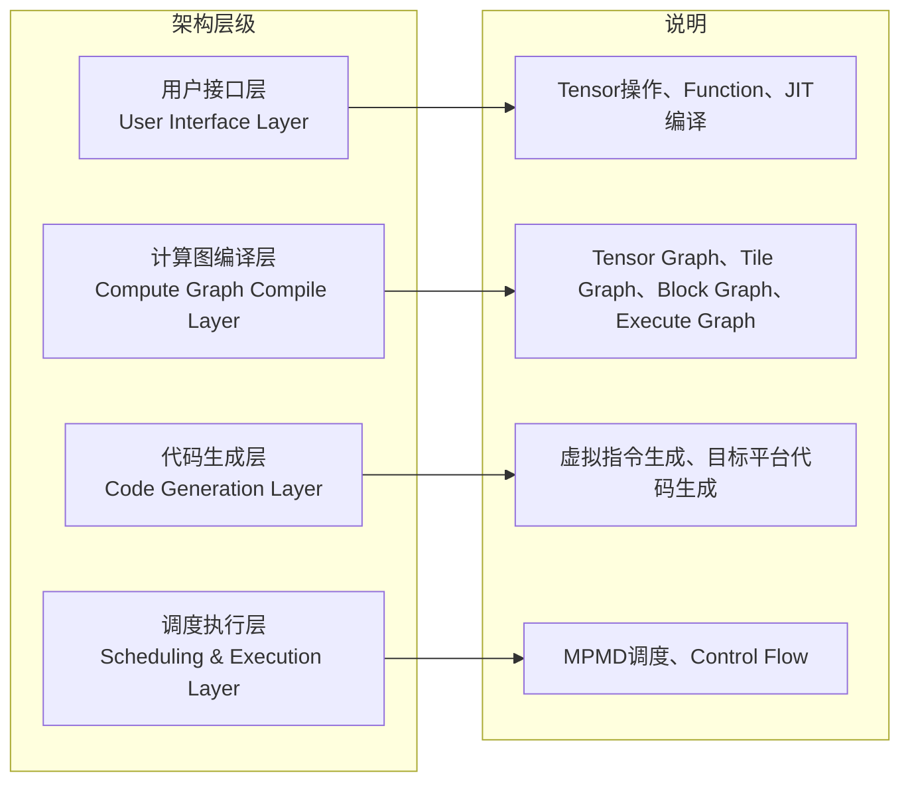

# 简介

## PyPTO Tensor

PyPTO（发音：pai p-t-o）是CANN推出的一款面向AI加速器的高效编程框架，旨在简化算子开发流程，同时保持高性能计算能力。该框架采用创新的PTO（Parallel Tensor/Tile Operation）编程范式，以基于Tile的编程模型为核心设计理念，通过多层次的计算图表达，将用户通过API构建的AI模型从高层次的Tensor计算图逐步编译成硬件指令，最终生成可在目标平台上高效执行的代码，并由设备侧以MPMD（Multiple Program Multiple Data）方式调度执行。

### 核心架构

PyPTO框架采用分层架构设计，从用户API到底层硬件执行，共分为以下几个层次：

- 用户接口层（User Interface Layer）：是PyPTO框架与开发者交互的接口层，提供Python友好的编程接口，使开发者能够以直观的方式表达计算逻辑，而无需深入了解底层硬件实现细节。
- 计算图编译层（Compute Graph Compile Layer）：PyPTO采用多层级计算图表达，支持从高到低多个抽象层次的计算图的优化和转换。

    - Tensor Graph：高层次的Tensor操作，贴近算法设计者的数学表达式。
    - Tile Graph：硬件感知的Tile操作，充分利用硬件并行性和内存层次结构。
    - Block Graph：子图分区，支持并行执行和资源管理。
    - Execute Graph：执行图，包含依赖关系和调度信息。

    编译过程通过模块化的Pass实现，每个阶段由多个Pass组成，负责特定阶段优化或转换任务。

    - Tensor Graph阶段：实现和硬件无关的图优化，包括冗余操作消除、类型转换、内存冲突推断等。
    - Tile Graph阶段：根据TileShape进行Tile展开，实现Tile级别的优化，包括内存类型分配、移动操作生成、子图切分等。
    - Block Graph阶段：切分生成计算子图，进行Block级别的优化，包括乱序调度、内存重用、同步点插入等。
    - Execute Graph阶段：整合计算子图信息，编排生成最终的执行图。

- 代码生成层（Code Generation Layer）：将优化后的计算图转换为目标平台的可执行代码。
    - 虚拟指令生成：从Execute Graph生成PTO虚拟指令代码（PTO Virtual Instructions）。
    - 目标平台编译：将虚拟指令编译为目标平台代码。

- 调度执行层（Scheduling & Execution Layer）：负责将可执行代码在设备上调度执行。
    - MPMD调度：可执行代码在设备上通过MPMD方式调度到设备处理器核。
    - 控制流执行：管理任务依赖关系，执行控制流逻辑。

### 核心特性

- 技术创新点：
    - 基于Tile的编程模型：计算基于Tile（硬件感知的数据块）进行，充分利用硬件的并行计算能力和内存层次结构。
    - 多层级计算图表达和优化：通过计算图编译层将Tensor Graph转换为Tile Graph、Block Graph和Execute Graph，每一步都包含一系列Pass优化流程。
    - 自动化代码生成：编译结果通过代码生成层生成PTO虚拟指令代码，然后通过编译器编译为目标平台的可执行代码。
    - MPMD执行调度：可执行代码被加载到设备侧，通过MPMD方式调度到设备处理器核，实现高效并行执行。
    - 完整的工具链支持：全流程的编译中间产物和运行时性能数据可以通过IDE集成的工具链进行可视化，以便识别性能瓶颈。开发者还可以通过工具链控制编译和调度行为。
    - Python友好API：提供直观的Tensor级别抽象，贴近算法开发者的思维模式，支持动态Shape和符号化编程。
    - 分层抽象设计：对不同开发者暴露不同的抽象层次，算法开发者使用Tensor层次，性能专家使用Tile层次，系统开发者使用Block层次。

### 适用场景

PyPTO适用于以下场景：

- 深度学习算子开发：快速实现各种神经网络算子。
- 大模型开发：支持Attention、MoE、FFN等大模型组件。
- 动态Shape处理：支持动态Batch Size等动态Shape场景。

### 设计理念

传统的模型开发通常分为算法开发人员和算子开发人员。这种分工的根源在于高性能算子开发的复杂性：算子开发人员不仅需要理解算子的数学计算属性，还必须考虑如何将其转换为对硬件友好的执行方式。这类似于早期CPU时代，在乱序执行和编译器技术尚未成熟时，程序员需要手动安排流水线指令。

为了降低这种复杂性，PyPTO提出了一种新的编程框架设计理念，旨在简化算子开发流程，同时保留高性能计算的潜力。

- 计算层设计

    计算层的设计理念是尽可能贴近算法设计者的数学表达式，使用Tensor而非单个元素来描述计算过程。用户通过API构建的AI模型通过Tensor Graph表达，这种设计保留了最大化的优化潜力，包括：

    - 内存布局优化：自动优化数据在内存中的排布方式
    - 数据搬运优化：最小化数据在不同内存层次间的传输
    - 多算子联合优化：识别并融合可优化的算子组合

    通过Tensor作为基本数据单位，计算层能够更自然地表达复杂的数学运算，同时为后续的编译优化提供丰富的信息。

- 编译层设计

    编译层是连接计算层和执行层的关键环节，负责将Tensor Graph转换为硬件友好的执行形式。编译过程通过多阶段的Lowering Pipeline实现：

    - Tensor Graph到Tile Graph：通过编译Pass将Tensor操作转换为Tile操作，选择Tiling策略，进行布局变换、Tile融合、Tile重排序等。
    - Tile Graph到Block Graph：将Tile图分区为子图，检测同构子图，规范化Block Graph，追踪依赖关系。
    - Block Graph到Execute Graph：构建执行图，分析Block Graph之间的依赖关系，规划全局资源，生成调度提示。

    每个阶段都包含多个优化Pass，通过模块化的图变换和优化流程，将计算层保留的优化空间转化为实际性能提升。

    编译层提供了以下核心能力：

    - 快速可用：保证第一时间生成可运行的结果，满足快速开发的需求。
    - 灵活调优：支持性能敏感的配置调整，方便开发者根据实际需求进行优化。
    - 深度优化：允许高级用户深度定制编译流程，追求极致性能。

- 执行层设计

    执行层负责将编译后的代码转换为硬件友好的指令并执行。执行过程包括：

    - 代码生成：编译结果通过CodeGen生成底层PTO虚拟指令代码。
    - 目标平台编译：通过编译器将虚拟指令代码编译成目标NPU平台的可执行代码。
    - MPMD调度：可执行代码被加载到设备侧，通过MPMD方式调度到设备上的处理器核。

    通过自动化代码生成技术，执行层能够根据硬件特性自动生成最优的执行指令，充分释放硬件算力。这种设计避免了传统算子开发中手动调整硬件指令的复杂性，同时确保了高性能计算的实现。

- 工具链设计

    PyPTO提供了完整的工具链支持，包括：

    - 编译中间产物可视化：支持在编译的不同阶段（如Tensor Graph、Tile Graph、Block Graph、Execute Graph等）保存中间产物（计算图），便于调试和分析。
    - 运行时性能分析：收集并可视化运行时性能数据（泳道图），帮助识别性能瓶颈。
    - 编译和调度控制：开发者可以通过工具链控制编译Pass的执行和调度行为，实现深度定制。

    通过上述设计理念，PyPTO实现了算法开发与算子开发的高效协同，显著降低了算子开发的复杂性，同时保留了高性能计算的能力。

### 支持的产品型号

PyPTO支持在如下产品型号使用：

<!-- npu="950" id1 -->
- Ascend 950PR/Ascend 950DT
<!-- end id1 -->
<!-- npu="A3" id2 -->
- Atlas A3 训练系列产品/Atlas A3 推理系列产品
<!-- end id2 -->
<!-- npu="910b" id3 -->
- Atlas A2 训练系列产品/Atlas A2 推理系列产品
<!-- end id3 -->

## PyPTO Pro

PyPTO Pro是一种面向Ascend 950PR/Ascend 950DT、以Python为前端的DSL（Domain-Specific Language，领域特定语言）。它采用SPMD（Single Program Multiple Data，单程序多数据）执行模型，并以二维Tile作为Tile API中Cube、Vector计算和数据搬运的主要载体；对于需要寄存器级编程的场景，还提供基于RegTensor和MaskReg的Reg API。PyPTO Pro通过Tile等抽象，在保留硬件控制能力的同时简化算子开发，并可在经过合理的Tiling切分和流水设计后获得较好的性能。

### PyPTO Pro总体架构

PyPTO Pro提供Tile API、Reg API、SIMT API和Utils API，并通过JIT编译与执行链将Python Kernel编译为可在AI Core上运行的二进制。

**图1 PyPTO Pro总体架构**

PyPTO Pro的编译与执行链包括以下阶段：

1. **前端解析与优化**：`@pypto_pro.language.jit`标记的Python Kernel由前端解析并构建为PyPTO IR，再通过IR Pass完成优化。
2. **代码生成**：CCE CodeGen根据优化后的IR生成Device侧`kernel.cpp`及Tiling相关头文件。
3. **编译与链接**：生成的Device侧代码与Host封装代码`call_kernel.cpp`经毕昇编译器编译、链接，生成带内容哈希的JIT共享库`call_kernel_<hash>.so`。
4. **加载与执行**：运行时加载该共享库并下发Kernel任务，最终由AI Core执行。

### 适用场景

PyPTO Pro适用于开发高性能深度学习算子，可以较为快速地实现各种神经网络算子，尤其是Cube和Vector都涉及的融合算子，并达到较为理想的性能。

### 异构系统与程序组成

基于昇腾处理器的异构系统由Host和Device协同工作：

| 角色 | 组成 | 职责 |
|------|------|------|
| **Host（主机）** | CPU + Host Memory | 负责通用计算、设备资源管理、数据准备和任务调度 |
| **Device（设备）** | 昇腾NPU + Device Memory | 负责执行深度学习算子等高密度并行计算任务 |

PyPTO Pro应用程序相应地包含Host代码和Device代码。Host侧使用Python和PyTorch在Device Memory上准备输入、输出张量，调用并等待Device任务；Device侧使用PyPTO Pro编写[核函数Kernel](programming_guide/pro/development/kernel_function.md)，在AI Core上完成数据搬运和计算。两部分代码可以写在同一个`.py`文件中，由`@pypto_pro.language.jit()`标记Kernel函数，框架负责JIT编译和任务下发。

### AI Core与并行执行模型

一个昇腾NPU通常包含多个AI Core，每个AI Core内部具有标量、向量和矩阵运算单元以及片上存储。PyPTO Pro使用逻辑Block描述并行任务，启动Kernel时通过`block_dim`配置逻辑Block数量：

- `pypto_pro.language.get_block_num()`获取本次启动的Block总数。
- `pypto_pro.language.get_block_idx()`获取当前执行域中逻辑AI Core的全局索引。仅启动Cube或仅启动Vector时，其范围为`[0, block_num)`；
  AIC:AIV为1:2的混合Kernel的Vector段中，其范围为`[0, 2 * block_num)`。
- `pypto_pro.language.get_subblock_idx()`获取当前逻辑Block内的subblock索引，仅在混合Kernel需要区分同一Block内的AIV时使用；Vector段的`get_block_idx()`已经包含该信息。

PyPTO Pro采用外层SPMD与内层SIMD结合的并行方式。SPMD（Single Program Multiple Data，单程序多数据）表示多个逻辑AI Core执行同一份Kernel代码，并依据全局逻辑索引处理不同的数据分片；SIMD（Single Instruction Multiple Data，单指令多数据）表示AI Core内部的一条指令同时处理多个同构数据元素，适合矩阵、向量及融合计算。

### Kernel运行流程

PyPTO Pro算子的典型运行流程如下：

1. **准备数据**：Host侧通过PyTorch在Device Memory上创建输入、输出张量。
2. **启动Kernel**：通过`kernel[stream, block_dim](...)`调用Kernel；首次调用触发JIT编译，后续调用可复用编译产物。
3. **多核分块**：各AI Core通过Block编号认领数据分片，通常使用`pypto_pro.language.range(core_id, total, num_cores)`实现跨步分配。
4. **搬入、计算与搬出**：Kernel使用`pypto_pro.language.load`/`pypto_pro.language.load_tile`将数据搬入片上缓冲区，调用`pypto_pro.language.add`、`pypto_pro.language.matmul`等Tile API完成计算，再通过`pypto_pro.language.store`/`pypto_pro.language.store_tile`将结果写回Device Memory。
5. **同步并访问结果**：Kernel相对于Host异步执行，Host在读取结果前应调用`torch.npu.synchronize()`等待任务完成。

### 核心特性

- **SPMD执行模型**：参与执行的AI Core运行同一份Kernel代码，并通过核索引划分各自处理的数据。
- **基于Tile的编程模型**：Tile API使用Tile（硬件感知的数据块）描述片上数据及其计算，通过Tile简化坐标偏移计算和指令参数配置。
- **基于TileGroup的核内流水表达**：使用TileGroup将同一流水线中可轮转复用的多块Tile封装为一组，用户通过`next()`和`current()`等接口表达多缓冲流水。使用`@pypto_pro.language.jit(auto_mutex=True)`开启自动同步后，框架根据每块Tile绑定的`mutex_id`自动插入核内同步。
- **融合场景的自动核间流水编排**：在支持的Cube、Vector融合场景中，用户通过stage机制和相应标签表达计算阶段，框架可自动插入核间同步，并进行Preload流水编排。
- **Python前端API**：提供更友好的Python API前端，贴近算法开发者的思维模式。
- **IR与编译优化**：Python前端代码会被转换为PyPTO IR，在IR层完成通用代码优化，再由CCE CodeGen生成Device侧代码并编译为可在NPU上运行的二进制文件。

### 产品支持情况

PyPTO Pro当前支持以下产品型号：

<!-- npu="950" id4 -->
- Ascend 950PR/Ascend 950DT：支持
<!-- end id4 -->
<!-- npu="A3" id5 -->
- Atlas A3 训练系列产品/Atlas A3 推理系列产品：不支持
<!-- end id5 -->
<!-- npu="910b" id6 -->
- Atlas A2 训练系列产品/Atlas A2 推理系列产品：不支持
<!-- end id6 -->

### 学习路径

建议按照以下路径学习PyPTO Pro：

1. **环境准备**：参考[环境准备](../install/prepare_environment.md)完成基础环境搭建。
2. **快速入门**：从[HelloWorld](quick_start/pro/helloworld_simd.md)开始，了解Kernel函数定义、JIT编译和运行的基本流程；再通过[Add算子（SIMD）快速入门](quick_start/pro/add_simd.md)学习主要的Tile配置、数据搬运和向量计算方式。需要逐线程编程时，可进一步参考[Add算子（SIMT）快速入门](quick_start/pro/add_simt.md)。
3. **编程范式**：阅读[编程范式概述](programming_guide/pro/programming_paradigm/programming_paradigm_overview.md)，理解SPMD编程、Tile抽象和流水机制。
4. **算子开发**：深入学习[Tensor创建和操作](programming_guide/pro/development/tensor_creation_and_operations.md)，掌握Tensor、Tile、TileGroup等核心数据结构的使用。
5. **API参考**：查阅[SIMD API](../api/pro_api/SIMD-API/index.md)、[SIMT API](../api/pro_api/SIMT-API/index.md)和[Utils API](../api/pro_api/Utils-API/index.md)，了解各接口的详细用法。
