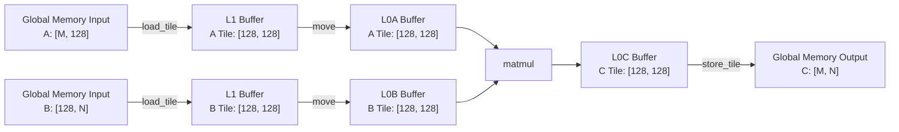

# Matmul算子快速入门（SIMD）

## 任务与目标

本节将详细介绍如何使用PyPTO Pro框架实现一个简单的Matmul算子，并通过测试用例验证其正确性。通过本节的学习，您将了解如何使用PyPTO Pro的API来构建自定义Matmul算子。

本示例固定K=128，支持运行时传入M和N；M和N均须为128的正整数倍。

## 算子设计规格

**表1**Matmul算子设计规格

|    name     |  shape   | data type | format |
| :---------: | :------: | :-------: | :----: |
| input_left  | [-1,128] |  float16  |   ND   |
| input_right | [128,-1] |  float16  |   ND   |
|   output    | [-1,-1]  |  float32  |   ND   |

- 数学表达式

  给定左矩阵***A***和右矩阵***B***，通过矩阵乘法得到矩阵***C***
  $$
  A \in \mathbb{R}^{M \times K}, \qquad B \in \mathbb{R}^{K \times N}, \qquad C = A B \in \mathbb{R}^{M \times N}
  $$

  每个C矩阵中的输出元素是***A***矩阵第 *i* 行和***B***矩阵第 *j* 列的点积：
  $$
  C_{i,j} = \sum_{k = 0}^{K-1} A_{i,k} \, B_{k,j}
  \qquad \text{for } 0 \le i < M, \; 0 \le j < N
  $$

- 使用的主要接口

  基础搬运接口：[pypto_pro.language.load_tile](../../../api/pro_api/SIMD-API/memory_data_movement/load_tile.md)、[pypto_pro.language.store_tile](../../../api/pro_api/SIMD-API/memory_data_movement/store_tile.md)、[pypto_pro.language.move](../../../api/pro_api/SIMD-API/memory_data_movement/move.md)

  基础计算接口：[pypto_pro.language.matmul](../../../api/pro_api/SIMD-API/cube_computation/matmul.md)

## 导入PyPTO Pro模块

在开始实现Matmul算子之前，需要导入PyPTO Pro、PyTorch、torch_npu和pytest模块，并配置待使用的NPU设备。

```python
import os

import pytest
import pypto_pro.language as pl
import torch
import torch_npu
from pypto_pro.runtime.platform import get_platform_info

ST_DEVICE_ID = int(os.environ.get("TILE_FWK_DEVICE_ID", 0))
ST_DEVICE = f"npu:{ST_DEVICE_ID}"
```

## 核心代码逻辑

Matmul Kernel负责数据切块，并依次调用load_tile、move、matmul和store_tile完成矩阵计算。标准数据流向如下：



以下是Matmul算子的核心计算函数实现：

```python
@pl.jit(auto_mutex=True)
def matmul_example(
    a: pl.Tensor[[pl.DYNAMIC, 128], pl.DT_FP16],
    b: pl.Tensor[[128, pl.DYNAMIC], pl.DT_FP16],
    out: pl.Tensor[[pl.DYNAMIC, pl.DYNAMIC], pl.DT_FP32],
):
    num_cores = pl.get_block_num()
    core_id = pl.get_block_idx()
    m = a.shape[0]
    n = b.shape[1]

    with pl.section_cube():
        a_mat_4_buffer = pl.make_tile_group(
            type=pl.TileType(shape=[128, 128], dtype=pl.DT_FP16, target_memory=pl.MemorySpace.Mat),
            addrs=0, mutex_ids=[0, 1, 10, 11])
        b_mat_4_buffer = pl.make_tile_group(
            type=pl.TileType(shape=[128, 128], dtype=pl.DT_FP16, target_memory=pl.MemorySpace.Mat),
            addrs=0x20000, mutex_ids=[2, 3, 12, 13])
        a_left_db = pl.make_tile_group(
            type=pl.TileType(shape=[128, 128], dtype=pl.DT_FP16, target_memory=pl.MemorySpace.Left),
            addrs=0, mutex_ids=[4, 5])
        b_right_db = pl.make_tile_group(
            type=pl.TileType(shape=[128, 128], dtype=pl.DT_FP16, target_memory=pl.MemorySpace.Right),
            addrs=0, mutex_ids=[6, 7])
        acc_db = pl.make_tile_group(
            type=pl.TileType(shape=[128, 128], dtype=pl.DT_FP32, target_memory=pl.MemorySpace.Acc),
            addrs=0, mutex_ids=[8, 9])

        for i in pl.range(core_id, m // 128, num_cores):
            for j in pl.range(0, n // 128, 1):
                a_l1_tile = a_mat_4_buffer.next()
                pl.load_tile(a_l1_tile, a, [i, 0])
                b_l1_tile = b_mat_4_buffer.next()
                pl.load_tile(b_l1_tile, b, [0, j])

                cur_a_left = a_left_db.next()
                pl.move(cur_a_left, a_l1_tile)
                cur_b_right = b_right_db.next()
                pl.move(cur_b_right, b_l1_tile)

                acc_tile = acc_db.next()
                pl.matmul(acc_tile, cur_a_left, cur_b_right)

                pl.store_tile(out, acc_tile, [i, j])
```

## 测试用例

测试用例使用PyTorch Tensor准备输入，通过PyPTO Pro Kernel完成计算，并与PyTorch内置的Matmul结果进行比较。

```python
def _require_a5():
    try:
        torch.npu.set_device(ST_DEVICE)
    except RuntimeError as exc:
        pytest.skip(f"NPU unavailable: {exc}")
    name = torch.npu.get_device_name()
    if "Ascend950" not in name:
        pytest.skip(f"Current device is {name}, not A5 (Ascend950). Skip.")


@pytest.mark.soc("950")
def test_matmul_kernel():
    _require_a5()
    device = ST_DEVICE
    torch.manual_seed(0)
    m, k, n = 256, 128, 256

    a = torch.randn(m, k, device=device, dtype=torch.float16)
    b = torch.randn(k, n, device=device, dtype=torch.float16)
    out = torch.zeros(m, n, device=device, dtype=torch.float32)

    # block_dim取平台可用AIC数量和M方向Tile数量中的较小值。
    block_dim = min(get_platform_info().cube_core_num, m // 128)
    matmul_example[None, block_dim](a, b, out)
    torch.npu.synchronize()

    golden = torch.matmul(a.float(), b.float())
    torch.testing.assert_close(out, golden, rtol=1e-2, atol=1e-2)
```

## 编译与执行

将上述代码按顺序保存为matmul_example.py，在已安装PyPTO Pro的环境中运行：

```bash
source /usr/local/Ascend/ascend-toolkit/set_env.sh
pytest -q matmul_example.py::test_matmul_kernel
```

用例执行成功后，pytest显示`1 passed`。
