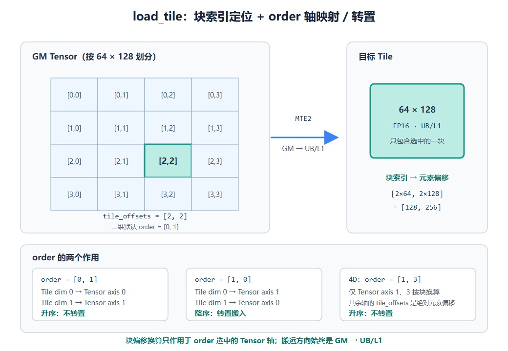

# pypto_pro.language.load_tile

## 产品支持情况

<!-- npu="950" id1 -->
- Ascend 950PR/Ascend 950DT：支持
<!-- end id1 -->
<!-- npu="A3" id2 -->
- Atlas A3 训练系列产品/Atlas A3 推理系列产品：不支持
<!-- end id2 -->
<!-- npu="910b" id3 -->
- Atlas A2 训练系列产品/Atlas A2 推理系列产品：不支持
<!-- end id3 -->

## 功能说明

把 GM 中一块数据搬入 L1/UB Tile，与 [`pypto_pro.language.load`](load.md) 不同，`load_tile` 的偏移以 **tile 块索引**为单位，内部自动按 `块索引 × tile_shape` 换算成绝对元素坐标。在按 tile 规整切分的循环中，可直接用块号定位，省去手动乘 tile 大小的计算。

例如 tile shape 为 `[64, 128]` 时，`tile_offsets=[2, 2]` 等价于 [`pypto_pro.language.load`](load.md) 的绝对偏移 `[128, 256]`。



## 函数原型

```python
pypto_pro.language.load_tile(dst_tile, src_tensor, tile_offsets, *, order=None)
```

## 参数类型

| 参数 | 输入/输出 | 说明 |
|---|---|---|
| `dst_tile` | 输出 | 只能是 L1、UB Tile，搬入目的地 |
| `src_tensor` | 输入 | Tensor 类型，来自 GM 的源数据 |
| `tile_offsets` | 输入 | 以 tile 为单位的块索引，内部换算为 `块索引 × tile_shape` 的绝对元素偏移 |
| `order` | 输入 | 可选，Tile 维度在 GlobalTensor 维度中对应哪几根轴；元素为 Tensor 绝对轴索引，升序表示不转置，反序表示转置；省略时默认 `[ndim-2, ndim-1]`（不转置） |

## 参数范围

| 参数 | 输入/输出 | 说明 |
|---|---|---|
| `dst_tile` | 输出 | 数据类型：b8、b16、b32、b64<br>尾块处理：<br>• 可通过 set_validshape 设置尾块大小，Tile shape 需要 32 字节对齐，不对齐报错<br>• valid_shape 可以不对齐<br>• set_validshape 需要 compact=1，compact 不等于 1 且 validshape 不等于 shape 时需要报错<br>• 支持设定 padding 值<br>地址配置：<br>• Tile 的类型只能是 L1、UB，Cube 侧非 L1 报错<br>• Vector 侧非 UB 报错<br>• L1、UB buffer 首地址必须 32 字节对齐，不对齐编译报错 |
| `src_tensor` | 输入 | 数据类型：b8、b16、b32、b64<br>layout：支持 `ND`、`DN`、`NZ`<br>stride：支持配置 Stride，stride 维度需要等于 tensor 维度数，默认不配置时是尾轴 stride=1 的连续场景 |
| `tile_offsets` | 输入 | 单位为 tile 块索引，换算后的绝对偏移不超过对应维度的 shape，不支持负数索引<br>被切分的维度（由 `order` 指定）按 `块索引 × tile 该维大小` 换算；其余维度的取值按绝对偏移直接使用 |
| `order` | 输入 | 只支持配置 tensor 维度范围内的 dim，只支持二维数组配置，其余配置报错<br>用于高维 tensor 中指定 tile 对应哪几个维度；order 中轴索引的顺序决定是否转置：升序不转置（ND 行主序），反序转置（DN 列主序），需要配合 Tensor 的 layout 以及 Tile 的 shape 和 stride 填写<br>省略时默认取 tensor 的最后两维 `[ndim-2, ndim-1]`（不转置） |

## 流水类型

MTE2（GM → L1/UB 的搬入流水）。

## 调用示例

下面是一个完整 kernel：GM 输入按 64×64 的 tile 规整切分，用块索引逐块载入、翻倍后写回对应位置。`pypto_pro.language.load_tile` 用块号 `[ti, 0]` 定位，内部自动换算为绝对偏移 `[ti*64, 0]`。vector kernel 开 `auto_mutex`，同步由 `make_tile_group` 自动管理。

```python
import pypto_pro.language as pl


@pl.jit(auto_mutex=True)
def load_tile_kernel(
    x: pl.Tensor[[256, 64], pl.DT_FP16],   # 4 个 64x64 的块
    out: pl.Tensor[[256, 64], pl.DT_FP16],
):
    tt = pl.TileType(shape=[64, 64], dtype=pl.DT_FP16, target_memory=pl.MemorySpace.Vec)
    x_db = pl.make_tile_group(type=tt, addrs=0x0000, mutex_ids=[0, 1])
    out_db = pl.make_tile_group(type=tt, addrs=0x4000, mutex_ids=[2, 3])

    with pl.section_vector():
        for ti in pl.range(0, 4, 1):
            cur_x = x_db.next()
            cur_out = out_db.next()
            pl.load_tile(cur_x, x, [ti, 0])
            pl.add(cur_out, cur_x, cur_x)   # 翻倍，验证 load_tile 取到了正确的块
            pl.store_tile(out, cur_out, [ti, 0])
```

其他典型用法（节选）：

```python
# 4D BSND tensor：tile 对应第 1、3 维，其余维按绝对偏移
pl.load_tile(q_buf, q, [b_idx, qi, n_idx, 0], order=[1, 3])

# 列主序载入（DN 布局）
pl.load_tile(k_mat_buf, k, [b_idx, n_idx, j, 0], order=[1, 0])
```
