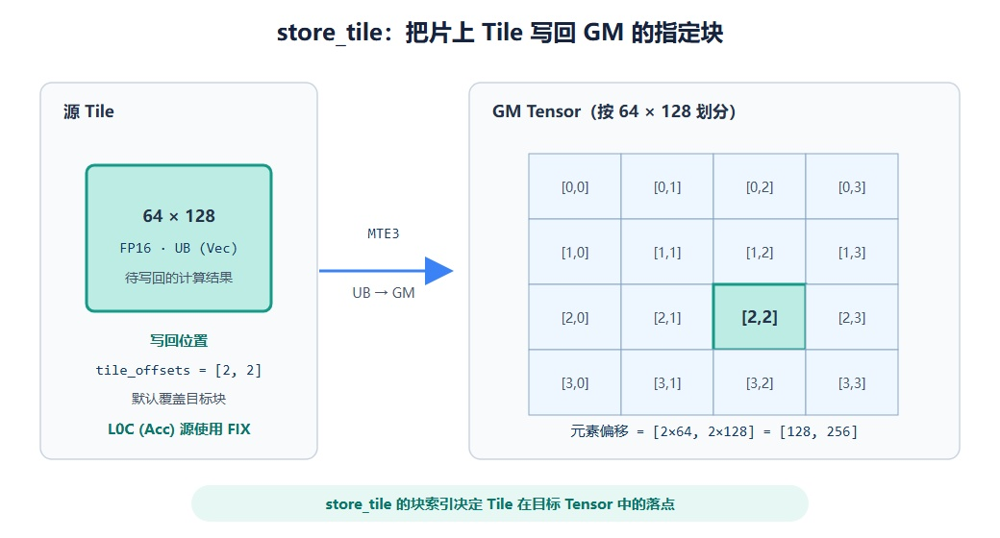

# pypto_pro.language.store_tile

## 产品支持情况

<!-- npu="950" id1 -->
- Ascend 950PR/Ascend 950DT：支持
<!-- end id1 -->
<!-- npu="A3" id2 -->
- Atlas A3 训练系列产品/Atlas A3 推理系列产品：不支持
<!-- end id2 -->
<!-- npu="910b" id3 -->
- Atlas A2 训练系列产品/Atlas A2 推理系列产品：不支持
<!-- end id3 -->

## 功能说明

把 UB（`Vec`）或 L0C（`Acc`）Tile 的结果写回 GM，与 [`pypto_pro.language.store`](store.md) 的区别在于：偏移以 **tile 块索引**为单位，内部自动按 `块索引 × tile_shape` 换算成绝对元素坐标。是 [`pypto_pro.language.load_tile`](load_tile.md) 的反向操作。

例如 tile shape 为 `[64, 128]` 时，`tile_offsets=[2, 2]` 等价于 [`pypto_pro.language.store`](store.md) 的绝对偏移 `[128, 256]`。

下图以 UB 源 Tile 为例展示按块索引写回 GM Tensor 的过程。块索引先换算为元素偏移，再确定目标块的落点；L0C 源 Tile 使用 FIX 流水。



## 函数原型

```python
pypto_pro.language.store_tile(dst_tensor, src_tile, tile_offsets, *, relu_pre_mode=None, pre_quant_scalar=None, fp_tile=None, tile_dims=None, atomic=pl.AtomicType.AtomicNone, phase=None)
```

## 参数类型

| 参数 | 输入/输出 | 说明 |
|---|---|---|
| `dst_tensor` | 输出 | 目标 GM tensor，写出目的地 |
| `src_tile` | 输入 | 源 Tile，内存空间只能是 `Vec`(UB) 或 `Acc`(L0C) |
| `tile_offsets` | 输入 | 以 tile 为单位的块索引，内部换算为 `块索引 × tile_shape` 的绝对元素偏移 |
| `relu_pre_mode` | 输入 | 可选，写回前融合 ReLU |
| `pre_quant_scalar` | 输入 | 可选，写回前量化标量 |
| `fp_tile` | 输入 | 可选，fixpipe 量化 tile |
| `tile_dims` | 输入 | 可选，Tile 维度在目标 tensor 维度中对应哪几根轴 |
| `atomic` | 输入 | 可选，原子写模式，默认 `pl.AtomicType.AtomicNone` |
| `phase` | 输入 | 可选，fixpipe 分阶段写回模式 |

## 参数范围

| 参数 | 输入/输出 | 说明 |
|---|---|---|
| `dst_tensor` | 输出 | 数据类型：b8、b16、b32、b64<br>layout：支持 `ND`、`DN`、`NZ`<br>换算后的写入范围不得越过对应维度 shape |
| `src_tile` | 输入 | 数据类型：b8、b16、b32、b64<br>内存空间：只支持 `Vec`(UB) 和 `Acc`(L0C)；UB 源通过 MTE3 写回，L0C 源通过 FIX 写回<br>地址对齐：UB 为 32 字节，L0C 为 64 字节 |
| `tile_offsets` | 输入 | 单位为 tile 块索引，支持运行时 `Expr`，换算后的绝对偏移不超过对应维度的 shape，不支持负数索引<br>被切分的维度（由 `tile_dims` 指定）按 `块索引 × tile 该维大小` 换算；其余维度的取值按绝对偏移直接使用 |
| `relu_pre_mode` | 输入 | 可选，支持 `pl.ReluPreMode.NormalRelu`；与 `fp_tile` 互斥 |
| `pre_quant_scalar` | 输入 | 可选，预量化标量（i64 bit pattern）；与 `fp_tile` 互斥 |
| `fp_tile` | 输入 | 可选，启用 `store_fp` 路径的量化 tile；与 `relu_pre_mode`、`pre_quant_scalar`、`phase` 互斥 |
| `tile_dims` | 输入 | 只支持配置 tensor 维度范围内的 dim，只支持二维数组配置，其余配置报错<br>用于高维 tensor 中指定 tile 对应哪几个维度；不配置时默认取 tensor 的最后两维 |
| `atomic` | 输入 | 支持 `pl.AtomicType.AtomicNone`（覆盖写）或 `pl.AtomicType.AtomicAdd`（原子累加） |
| `phase` | 输入 | 可选，支持 `pl.STPhase.Partial` 或 `pl.STPhase.Final`；与 `fp_tile` 互斥 |

## 流水类型

源 Tile 位于 `Vec`(UB) 时为 MTE3（UB → GM）；源 Tile 位于 `Acc`(L0C) 时为 FIX（L0C → GM）。不支持从 L1 直接调用 `store_tile` 写回 GM。

## 调用示例

下面是一个完整 kernel：把同一块 UB 结果按块索引逐块写到 GM 输出的不同位置。`pypto_pro.language.store_tile` 用块号 `[ti, 0]` 定位，内部自动换算为绝对偏移 `[ti*64, 0]`。vector kernel 开 `auto_mutex`，同步由 `make_tile_group` 自动管理。

```python
import pypto_pro.language as pl


@pl.jit(auto_mutex=True)
def store_tile_kernel(
    x: pl.Tensor[[64, 64], pl.DT_FP16],
    out: pl.Tensor[[256, 64], pl.DT_FP16],   # 4 个 64x64 的块
):
    tt = pl.TileType(shape=[64, 64], dtype=pl.DT_FP16, target_memory=pl.MemorySpace.Vec)
    tile_x = pl.make_tile_group(type=tt, addrs=0x0000, mutex_ids=[0])

    with pl.section_vector():
        cur_x = tile_x.current()
        pl.load(cur_x, x, [0, 0])
        for ti in pl.range(0, 4, 1):
            pl.store_tile(out, cur_x, [ti, 0])
```

其他典型用法（节选）：

```python
# 4D BSND tensor：tile 对应第 1、3 维，其余维按绝对偏移
pl.store_tile(p_buf, p_f16, [b_idx, qi * 2 + sub_id, n_idx, ki], tile_dims=[1, 3])
```
