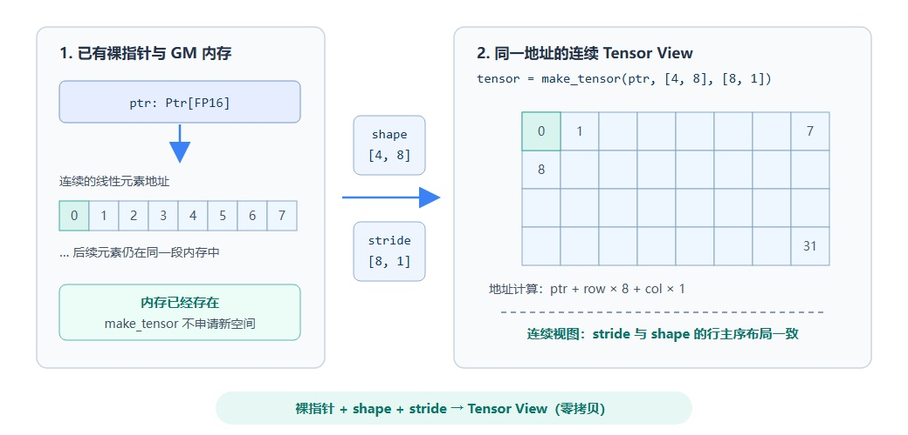
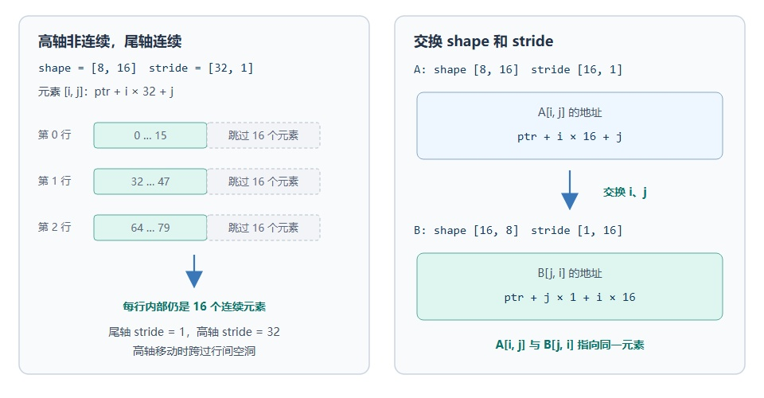

# pypto_pro.language.make_tensor

## 产品支持情况

<!-- npu="950" id1 -->
- Ascend 950PR/Ascend 950DT：支持
<!-- end id1 -->
<!-- npu="A3" id2 -->
- Atlas A3 训练系列产品/Atlas A3 推理系列产品：不支持
<!-- end id2 -->
<!-- npu="910b" id3 -->
- Atlas A2 训练系列产品/Atlas A2 推理系列产品：不支持
<!-- end id3 -->

## 功能说明

用一个裸指针（`pypto_pro.language.Ptr[dtype]`）或已有 Tensor，加上显式的 shape / stride，构造一个 tensor view。view 本身不分配内存，只是给同一段 GM 地址套上“形状 + 步长”的解释，之后即可像普通 GM tensor 一样被 [`load`](../memory_data_movement/load.md)/[`store`](../memory_data_movement/store.md) 使用。

常与 [`pypto_pro.language.addptr`](addptr.md) 配合：用 `addptr` 切出 workspace 的某一段地址，再用 `make_tensor` 把它包装成可读写的 tensor。

下图展示 `make_tensor` 的核心语义：它使用 shape 和 stride 为已有地址创建 Tensor View，不申请新内存，也不搬运数据。



## 函数原型

```python
pypto_pro.language.make_tensor(ptr, shape, stride, dtype=None) -> Tensor
```

## 参数类型

| 参数 | 输入/输出 | 说明 |
|---|---|---|
| `ptr` | 输入 | 裸指针 `pypto_pro.language.Ptr[dtype]`（PtrType）或已有 Tensor；新 view 复用其底层地址 |
| `shape` | 输入 | 各维大小，list 或 MakeTuple |
| `stride` | 输入 | 各维步长（单位元素），list 或 MakeTuple |
| `dtype` | 输入 | 可选，view 的元素 dtype；不传时从源指针的 pointee 类型或源 Tensor 的 dtype 推导 |

## 参数范围

| 参数 | 输入/输出 | 说明 |
|---|---|---|
| `ptr` | 输入 | 须为 `pypto_pro.language.Ptr[dtype]` 标注的裸指针或已有 Tensor；view 与源对象共享底层数据地址 |
| `shape` | 输入 | 各维大小（int 常量或 `Expr`）；与 `stride` 长度一致 |
| `stride` | 输入 | 各维步长，单位为**元素**。元素 `[i0, i1, ...]` 相对 `ptr` 的偏移为 `i0 * stride[0] + i1 * stride[1] + ...`；stride 可以表达连续视图、高轴非连续视图或交换轴后的视图 |
| `dtype` | 输入 | 可选，若传入则 view 以该 dtype 创建（相当于把源地址 reinterpret 为 `dtype`）；不传时沿用源指针或源 Tensor 的元素类型 |

> [!NOTE]
> `make_tensor` 可以记录下面示例中的非连续或转置 stride。将 view 继续传给 `load`、`store` 等接口时，还需要满足目标后端和对应搬运接口的 stride 支持范围；当前 CCE 后端的通用 `load`/`store` 地址换算主要覆盖尾轴连续的二维访问。

## stride 视图示例

下面两个场景都是对基础 Tensor View 的进一步使用：左侧通过高轴 stride 表达行间空洞，右侧通过交换 shape 和 stride 表达转置后的逻辑索引。



### 高轴非连续、尾轴连续

高轴非连续是指同一行内部连续，但相邻两行的起始地址之间存在间隔。例如：

```python
pitched = pl.make_tensor(ptr, [8, 16], [32, 1])
```

其中尾轴 stride 为 1，因此 `pitched[i, 0]` 到 `pitched[i, 15]` 对应 16 个连续元素；高轴 stride 为 32，因此下一行从 `ptr + (i + 1) * 32` 开始，中间跳过 16 个元素。元素 `pitched[i, j]` 的地址为：

```text
ptr + i * 32 + j
```

这种视图适合表达带行间填充（padding）或从更宽二维 Tensor 中截取的尾轴连续区域。

### 交换 shape 和 stride 表达转置视图

同一段连续内存可以使用不同的 shape / stride 解释：

```python
normal = pl.make_tensor(ptr, [8, 16], [16, 1])
transposed = pl.make_tensor(ptr, [16, 8], [1, 16])
```

两者共享同一个 `ptr`，但逻辑轴的解释相反：

```text
normal[i, j]     -> ptr + i * 16 + j
transposed[j, i] -> ptr + j * 1 + i * 16
```

因此 `normal[i, j]` 与 `transposed[j, i]` 指向同一个物理元素。这里的“等价”是指交换逻辑索引后地址相同，并不是两个 view 在相同索引下取值相同。

## 调用示例

下面是一个完整 kernel：用 `addptr` 将 workspace 偏移到后半段后，`make_tensor` 把裸指针包装成 `[64, 128]` 的 tensor view 作为暂存区，完成 `a*2` 写回 `out`。vector kernel 开 `auto_mutex`，同步由 `make_tile_group` 自动管理。

```python
import pypto_pro.language as pl


@pl.jit(auto_mutex=True)
def workspace_kernel(
    a: pl.Tensor[[64, 128], pl.DT_FP16],
    workspace: pl.Ptr[pl.DT_FP16],
    out: pl.Tensor[[64, 128], pl.DT_FP16],
):
    ws_buf_ptr = pl.addptr(workspace, 64 * 128)
    ws_buf = pl.make_tensor(ws_buf_ptr, [64, 128], [128, 1])

    tt = pl.TileType(shape=[64, 128], dtype=pl.DT_FP16, target_memory=pl.MemorySpace.Vec)
    tile = pl.make_tile_group(type=tt, addrs=0x0000, mutex_ids=[0])

    with pl.section_vector():
        t = tile.current()
        pl.load(t, a, [0, 0])
        pl.add(t, t, t)
        pl.store(ws_buf, t, [0, 0])
        pl.load(t, ws_buf, [0, 0])
        pl.store(out, t, [0, 0])
```
