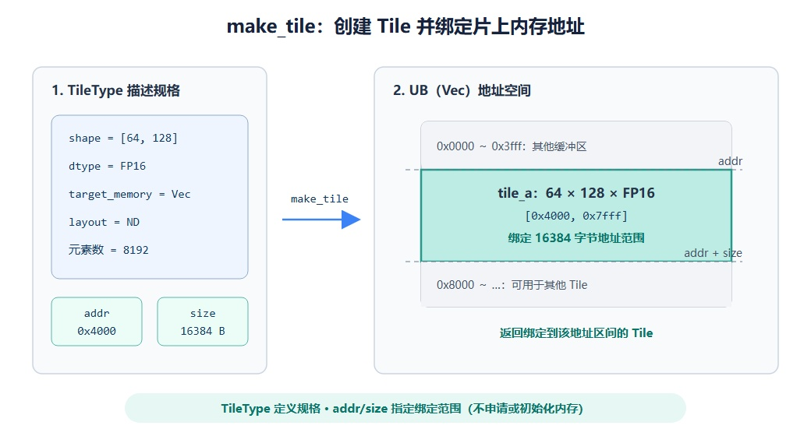

# pypto_pro.language.make_tile

## 产品支持情况

<!-- npu="950" id1 -->
- Ascend 950PR/Ascend 950DT：支持
<!-- end id1 -->
<!-- npu="A3" id2 -->
- Atlas A3 训练系列产品/Atlas A3 推理系列产品：不支持
<!-- end id2 -->
<!-- npu="910b" id3 -->
- Atlas A2 训练系列产品/Atlas A2 推理系列产品：不支持
<!-- end id3 -->

## 功能说明

按 [`TileType`](../../basic_data_structures/TileType.md) 在指定内存空间的精确地址创建一个 Tile，是 kernel 中创建 Tile 的核心接口。Tile 的形状、数据类型、内存空间、排布等"规格"都由 `TileType` 描述，`make_tile` 负责把它落到具体地址。

如果需要多块同规格 tile 做 ping-pong 双缓冲，并自动管理互斥，使用 [`pypto_pro.language.make_tile_group`](make_tile_group.md)。

下图展示了 `TileType`、`addr` 和 `size` 如何共同确定 Tile 绑定的片上地址范围。



## 函数原型

```python
pypto_pro.language.make_tile(tile_type, addr=None, size=None) -> tile
```

## 参数类型

| 参数 | 输入/输出 | 说明 |
|---|---|---|
| `tile_type` | 输入 | `TileType` 描述符，定义 shape/dtype/内存空间/排布等 |
| `addr` | 输入 | 可选，Tile 在该内存空间内绑定的起始地址（字节） |
| `size` | 输入 | 可选，Tile 绑定的地址范围大小（字节） |

## 参数范围

| 参数 | 输入/输出 | 说明 |
|---|---|---|
| `tile_type` | 输入 | 须为 [`pypto_pro.language.TileType`](../../basic_data_structures/TileType.md)，其内存空间决定该 tile 能用于哪些接口（如 Left/Right 用于 matmul 输入，Acc 用于 matmul 输出） |
| `addr` | 输入 | 内存空间内的字节偏移；指定 `addr` 时必须同时指定 `size`<br>对齐要求：`Vec`（UB）和 `Mat`（L1）为 32 字节，`Left`（L0A）和 `Right`（L0B）为 512 字节，`Acc`（L0C）为 64 字节 |
| `size` | 输入 | 与 `addr` 对应的地址范围大小，单位为字节<br>对于普通非分形 Tile，可按"元素数 × dtype 字节数"计算，例如 `[64, 128]` 的 FP16 Tile 为 16384 字节；其他布局按对应 API 的存储规格计算 |

## 调用示例

下面是一个完整 kernel：用 `pypto_pro.language.make_tile` 将输入/输出 Tile 分别绑定到 UB 的三个地址区间，完成一次 element-wise 加法。纯 vector kernel，同步用 `sync_src`/`sync_dst` 手写。

```python
import pypto_pro.language as pl


@pl.jit()
def make_tile_add_kernel(
    a: pl.Tensor[[64, 128], pl.DT_FP16],
    b: pl.Tensor[[64, 128], pl.DT_FP16],
    out: pl.Tensor[[64, 128], pl.DT_FP16],
):
    tt = pl.TileType(shape=[64, 128], dtype=pl.DT_FP16, target_memory=pl.MemorySpace.Vec)
    tile_a = pl.make_tile(tt, addr=0x0000, size=16384)
    tile_b = pl.make_tile(tt, addr=0x4000, size=16384)
    tile_out = pl.make_tile(tt, addr=0x8000, size=16384)

    with pl.section_vector():
        pl.load(tile_a, a, [0, 0])
        pl.load(tile_b, b, [0, 0])
        pl.system.sync_src(set_pipe=pl.PipeType.MTE2, wait_pipe=pl.PipeType.V, event_id=0)
        pl.system.sync_dst(set_pipe=pl.PipeType.MTE2, wait_pipe=pl.PipeType.V, event_id=0)
        pl.add(tile_out, tile_a, tile_b)
        pl.system.sync_src(set_pipe=pl.PipeType.V, wait_pipe=pl.PipeType.MTE3, event_id=1)
        pl.system.sync_dst(set_pipe=pl.PipeType.V, wait_pipe=pl.PipeType.MTE3, event_id=1)
        pl.store(out, tile_out, [0, 0])
```

> tile 规格（shape/dtype/内存空间/排布/尾块）的完整说明见 [`pypto_pro.language.TileType`](../../basic_data_structures/TileType.md)。
