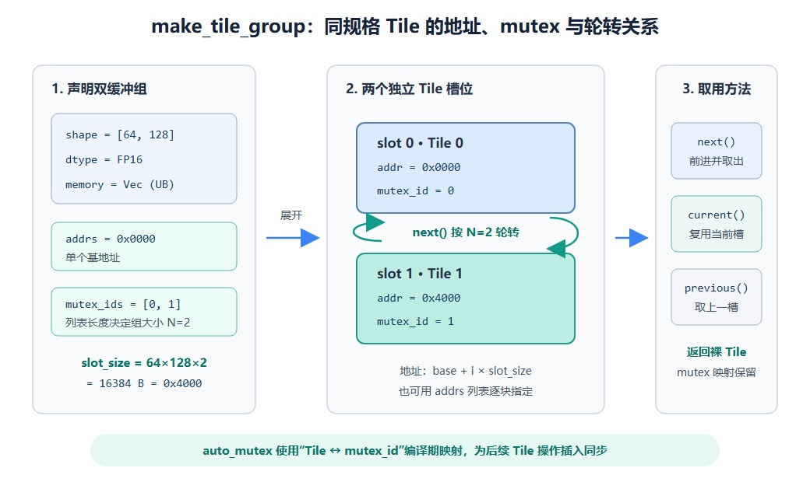

# pypto_pro.language.make_tile_group

## 产品支持情况

<!-- npu="950" id1 -->
- Ascend 950PR/Ascend 950DT：支持
<!-- end id1 -->
<!-- npu="A3" id2 -->
- Atlas A3 训练系列产品/Atlas A3 推理系列产品：不支持
<!-- end id2 -->
<!-- npu="910b" id3 -->
- Atlas A2 训练系列产品/Atlas A2 推理系列产品：不支持
<!-- end id3 -->

## 功能说明

一次性创建一组**同规格、可轮转复用**的 Tile，为每块 Tile 绑定独立地址，并建立 Tile 与 `mutex_id` 的一一映射。解析器会将 group 展开成多个 [`make_tile`](make_tile.md)；配合 `auto_mutex`，框架根据该映射为后续 Tile 操作自动插入同步，是实现多缓冲（N-buffer）流水并行的核心接口。

缓冲深度由 `mutex_ids` 列表长度决定：

- **1-buffer**（`mutex_ids` 长度 1）：单块 tile，用 `current()` 取用，无轮转
- **2-buffer**（double-buffer / ping-pong）：两块 tile 交替使用，最常用
- **3-buffer / 4-buffer / N-buffer**：更多 tile 轮转，适用于搬运延迟较高、需要更深流水掩盖的场景

与多次调用 [`pypto_pro.language.make_tile`](make_tile.md) 相比，`make_tile_group` 的优势是：统一管理地址布局、轮转游标和 mutex 元数据，无需手动维护 Tile 下标与同步关系。group 句柄本身不在运行时执行加锁/解锁；其 mutex 映射由 `auto_mutex` 在编译期消费。

下图以 UB 中的双缓冲为例，展示单个基地址如何展开成两个连续 Tile 槽位，以及地址、mutex 和轮转访问之间的对应关系。



## 函数原型

```python
pypto_pro.language.make_tile_group(type=, addrs=, mutex_ids=) -> group
```

> 只接受关键字参数 `type=`、`addrs=`、`mutex_ids=`，三者均必填。

## 参数类型

| 参数 | 输入/输出 | 说明 |
|---|---|---|
| `type` | 输入 | `pypto_pro.language.TileType`，组内每块 tile 的统一规格 |
| `addrs` | 输入 | 单个基地址（组内 tile 连续排布），或地址列表（逐块指定） |
| `mutex_ids` | 输入 | 每块 tile 的 mutex id 列表，组的 tile 数量 = 该列表长度 |

## 参数范围

| 参数 | 输入/输出 | 说明 |
|---|---|---|
| `type` | 输入 | 须为 [`pypto_pro.language.TileType`](../../basic_data_structures/TileType.md)；非该类型报错 |
| `addrs` | 输入 | 给单个基址时，第 i 块地址自动取 `base + i × slot_size`（`slot_size` 为单块字节数）；给列表时，长度必须等于 `mutex_ids` 长度，逐块指定（用于非连续布局） |
| `mutex_ids` | 输入 | 非空整数列表，取值范围 `[0, 31]`，且必须互不相同；否则报错 |

## 补充说明

返回一个 group 句柄，提供三个方法取出裸 Tile。Tile 与 mutex 的映射会随返回值保留，供 `auto_mutex` 使用：

| 方法 | 说明 |
|---|---|
| `group.next()` | 推进轮转状态并返回下一个 Tile；连续调用时按组大小 N 循环选择槽位 |
| `group.current()` | 不推进轮转状态，返回当前选择的 Tile |
| `group.previous()` | 不推进轮转状态，返回当前选择之前的 Tile |

group 句柄可直接传给 [`pypto_pro.language.set_validshape`](../memory_vector_computation/transpose_and_element_access/set_validshape.md)，对 group 中所有 tile 批量设置 valid_shape，适用于全局只需设置一次、后续直接 `next()` 的场景。

## 调用示例

### 2-buffer（double-buffer / ping-pong）

`make_tile_group` + `auto_mutex` 的典型场景是 matmul：L1 暂存用 `next()` 轮转开双缓冲，L0A/L0B/L0C 用单 mutex_id 的 group 配 `current()`。开启 `auto_mutex=True` 后，相邻搬运与计算间的同步由框架按 tile 的 mutex 自动插入，无需手写 `sync_src`/`sync_dst`。

```python
import pypto_pro.language as pl

TILE = 128
MM_M, MM_K, MM_N = 256, 128, 256


@pl.jit(auto_mutex=True)
def tile_group_matmul_kernel(
    a: pl.Tensor[[MM_M, MM_K], pl.DT_FP16],
    b: pl.Tensor[[MM_K, MM_N], pl.DT_FP16],
    c: pl.Tensor[[MM_M, MM_N], pl.DT_FP32],
):
    # L1 双缓冲（next() 轮转）
    a_l1_db = pl.make_tile_group(
        type=pl.TileType(shape=[TILE, MM_K], dtype=pl.DT_FP16, target_memory=pl.MemorySpace.Mat),
        addrs=0x00000, mutex_ids=[0, 1])
    b_l1_db = pl.make_tile_group(
        type=pl.TileType(shape=[MM_K, TILE], dtype=pl.DT_FP16, target_memory=pl.MemorySpace.Mat),
        addrs=0x10000, mutex_ids=[2, 3])
    # L0A / L0B / Acc 单 tile group（current()）
    a_left = pl.make_tile_group(
        type=pl.TileType(shape=[TILE, MM_K], dtype=pl.DT_FP16, target_memory=pl.MemorySpace.Left),
        addrs=0x0000, mutex_ids=[4])
    b_right = pl.make_tile_group(
        type=pl.TileType(shape=[MM_K, TILE], dtype=pl.DT_FP16, target_memory=pl.MemorySpace.Right),
        addrs=0x0000, mutex_ids=[5])
    acc = pl.make_tile_group(
        type=pl.TileType(shape=[TILE, TILE], dtype=pl.DT_FP32, target_memory=pl.MemorySpace.Acc),
        addrs=0x0000, mutex_ids=[6])

    with pl.section_cube():
        for i in pl.range(0, MM_M, TILE):
            for j in pl.range(0, MM_N, TILE):
                cur_a = a_l1_db.next()      # 双缓冲轮转
                cur_b = b_l1_db.next()
                al = a_left.current()       # 单 tile group
                br = b_right.current()
                ac = acc.current()
                pl.load(cur_a, a, [i, 0])
                pl.load(cur_b, b, [0, j])
                pl.move(al, cur_a)
                pl.move(br, cur_b)
                pl.matmul(ac, al, br)
                pl.store(c, ac, [i, j])
```

### 4-buffer

L1 使用 4 块 tile 轮转，适用于搬运延迟较高（如大 K 维分块）的场景。`mutex_ids` 长度为 4，`next()` 按 `cursor % 4` 自动轮转。

```python
import pypto_pro.language as pl

TILE = 128
MM_M, MM_K, MM_N = 256, 128, 256


@pl.jit(auto_mutex=True)
def tile_group_4buf_matmul_kernel(
    a: pl.Tensor[[MM_M, MM_K], pl.DT_FP16],
    b: pl.Tensor[[MM_K, MM_N], pl.DT_FP16],
    c: pl.Tensor[[MM_M, MM_N], pl.DT_FP32],
):
    a_l1 = pl.make_tile_group(
        type=pl.TileType(shape=[TILE, MM_K], dtype=pl.DT_FP16, target_memory=pl.MemorySpace.Mat),
        addrs=0x00000, mutex_ids=[0, 1, 2, 3])
    b_l1 = pl.make_tile_group(
        type=pl.TileType(shape=[MM_K, TILE], dtype=pl.DT_FP16, target_memory=pl.MemorySpace.Mat),
        addrs=0x20000, mutex_ids=[4, 5, 6, 7])
    a_left = pl.make_tile_group(
        type=pl.TileType(shape=[TILE, MM_K], dtype=pl.DT_FP16, target_memory=pl.MemorySpace.Left),
        addrs=0x0000, mutex_ids=[8])
    b_right = pl.make_tile_group(
        type=pl.TileType(shape=[MM_K, TILE], dtype=pl.DT_FP16, target_memory=pl.MemorySpace.Right),
        addrs=0x0000, mutex_ids=[9])
    acc = pl.make_tile_group(
        type=pl.TileType(shape=[TILE, TILE], dtype=pl.DT_FP32, target_memory=pl.MemorySpace.Acc),
        addrs=0x0000, mutex_ids=[10])

    with pl.section_cube():
        for i in pl.range(0, MM_M, TILE):
            for j in pl.range(0, MM_N, TILE):
                cur_a = a_l1.next()
                cur_b = b_l1.next()
                al = a_left.current()
                br = b_right.current()
                ac = acc.current()
                pl.load(cur_a, a, [i, 0])
                pl.load(cur_b, b, [0, j])
                pl.move(al, cur_a)
                pl.move(br, cur_b)
                pl.matmul(ac, al, br)
                pl.store(c, ac, [i, j])
```

非连续布局可用地址列表逐块指定：

```python
# 两块 tile 分别落在 0x0 和 0x10000
buf = pl.make_tile_group(type=tt, addrs=[0x0, 0x10000], mutex_ids=[0, 1])
```
