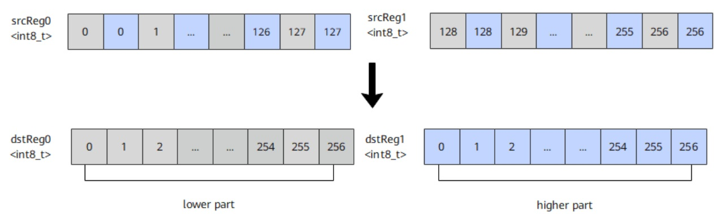

# vf.de_interleave

## 产品支持情况

<!-- npu="950" id1 -->
- Ascend 950PR/Ascend 950DT：支持
<!-- end id1 -->
<!-- npu="A3" id2 -->
- Atlas A3 训练系列产品/Atlas A3 推理系列产品：不支持
<!-- end id2 -->
<!-- npu="910b" id3 -->
- Atlas A2 训练系列产品/Atlas A2 推理系列产品：不支持
<!-- end id3 -->

## 功能说明

给定源操作数寄存器 src0 和 src1，将 src0 和 src1 中的元素解交织存入结果操作数 dst0 和 dst1 中。解交织排列方式如下图所示，其中每个方格代表一个元素：



## 函数原型

```python
# 元组赋值形式（推荐）
dst0, dst1 = vf.de_interleave(src0, src1)

# 语句形式（dst 需预声明）
vf.de_interleave(dst0, dst1, src0, src1)
```

> 本接口为统一接口，同时支持 RegTensor 和 MaskReg 输入。当源操作数为 MaskReg 时，目标寄存器自动推断为 MaskReg。

## 参数说明

| 参数 | 输入/输出 | 说明 |
|---|---|---|
| `dst0` | 输出 | 目的操作数，向量寄存器 |
| `dst1` | 输出 | 目的操作数，向量寄存器 |
| `src0` | 输入 | 源操作数，向量寄存器。数据类型需要与目的操作数保持一致 |
| `src1` | 输入 | 源操作数，向量寄存器。数据类型需要与目的操作数保持一致 |

## 数据类型

目的操作数与源操作数的数据类型需要保持一致。支持的数据类型为：INT8、UINT8、INT16、UINT16、FP16、BF16、INT32、UINT32、FP32、INT64、UINT64。

## 返回值说明

返回元组 `(dst0, dst1)`：`dst0` 为偶数元素寄存器，`dst1` 为奇数元素寄存器，均为 `RegTensor` 类型。

## 约束说明

- 数据类型为 b64 时，仅支持 RegTraitNumTwo。

## 调用示例

```python
import pypto_pro.language as pl
import torch
import torch_npu


@pl.vector_function
def example_vf(src_a, src_b, dst_tile):
    preg = vf.create_mask(pattern=pl.MaskPattern.ALL, dtype=pl.DT_FP16)
    src0 = vf.load_align(src_a, 0)
    src1 = vf.load_align(src_b, 0)
    dst0, dst1 = vf.de_interleave(src0, src1)
    vf.store_align(dst_tile, dst0, preg)


@pl.jit()
def example_kernel(
    a: pl.Tensor[[pl.DYNAMIC, pl.DYNAMIC], pl.DT_FP16],
    b: pl.Tensor[[pl.DYNAMIC, pl.DYNAMIC], pl.DT_FP16],
    out: pl.Tensor[[pl.DYNAMIC, pl.DYNAMIC], pl.DT_FP16],
):
    tf = pl.TileType(shape=[1, 128], dtype=pl.DT_FP16, target_memory=pl.MemorySpace.Vec)
    in_a = pl.make_tile(tf, addr=0, size=256)
    in_b = pl.make_tile(tf, addr=256, size=256)
    t_out = pl.make_tile(tf, addr=512, size=256)
    with pl.section_vector():
        pl.load(in_a, a, [0, 0])
        pl.load(in_b, b, [0, 0])
        pl.system.sync_src(set_pipe=pl.PipeType.MTE2, wait_pipe=pl.PipeType.V, event_id=0)
        pl.system.sync_dst(set_pipe=pl.PipeType.MTE2, wait_pipe=pl.PipeType.V, event_id=0)
        example_vf(in_a, in_b, t_out)
        pl.system.sync_src(set_pipe=pl.PipeType.V, wait_pipe=pl.PipeType.MTE3, event_id=1)
        pl.system.sync_dst(set_pipe=pl.PipeType.V, wait_pipe=pl.PipeType.MTE3, event_id=1)
        pl.store(out, t_out, [0, 0])


def test_example():
    device = "npu:0"
    core_nums = 1
    torch.npu.set_device(device)
    a = torch.randn([1, 128], device=device, dtype=torch.float16)
    b = torch.randn([1, 128], device=device, dtype=torch.float16)
    out = torch.empty([1, 128], device=device, dtype=torch.float16)
    example_kernel[None, core_nums](a, b, out)
    torch.npu.synchronize()
    assert out.shape == torch.Size([1, 128])


if __name__ == "__main__":
    test_example()
    print("PASSED")
```

## MaskReg 调用示例

当源操作数为 MaskReg 时，`vf.de_interleave` 按位解交织两个掩码寄存器。解交织位宽由 MaskReg 的数据类型决定。

```python
import pypto_pro.language as pl
import torch
import torch_npu


@pl.vector_function
def example_vf(src_tile, dst_tile):
    preg = vf.create_mask(pattern=pl.MaskPattern.ALL, dtype=pl.DT_FP32)
    mask_full = vf.create_mask(pattern=pl.MaskPattern.ALL, dtype=pl.DT_FP32)
    mask_m3 = vf.create_mask(pattern=pl.MaskPattern.M3, dtype=pl.DT_FP32)
    reg = vf.load_align(src_tile, 0)
    # 先交织再解交织，掩码恢复原值
    new_mask0, new_mask1 = vf.interleave(mask_full, mask_m3)
    new_mask0, new_mask1 = vf.de_interleave(new_mask0, new_mask1)
    # new_mask0 恢复为 ALL，用其做 abs：对所有元素取绝对值
    reg_dst = vf.abs(reg, new_mask0)
    vf.store_align(dst_tile, reg_dst, preg)


@pl.jit()
def example_kernel(
    a: pl.Tensor[[pl.DYNAMIC, pl.DYNAMIC], pl.DT_FP32],
    out: pl.Tensor[[pl.DYNAMIC, pl.DYNAMIC], pl.DT_FP32],
):
    tf = pl.TileType(shape=[1, 64], dtype=pl.DT_FP32, target_memory=pl.MemorySpace.Vec)
    in_a = pl.make_tile(tf, addr=0, size=256)
    t_out = pl.make_tile(tf, addr=256, size=256)
    with pl.section_vector():
        pl.load(in_a, a, [0, 0])
        pl.system.sync_src(set_pipe=pl.PipeType.MTE2, wait_pipe=pl.PipeType.V, event_id=0)
        pl.system.sync_dst(set_pipe=pl.PipeType.MTE2, wait_pipe=pl.PipeType.V, event_id=0)
        example_vf(in_a, t_out)
        pl.system.sync_src(set_pipe=pl.PipeType.V, wait_pipe=pl.PipeType.MTE3, event_id=1)
        pl.system.sync_dst(set_pipe=pl.PipeType.V, wait_pipe=pl.PipeType.MTE3, event_id=1)
        pl.store(out, t_out, [0, 0])


def test_example():
    device = "npu:0"
    core_nums = 1
    torch.npu.set_device(device)
    a = torch.randn([1, 64], device=device, dtype=torch.float32)
    out = torch.empty([1, 64], device=device, dtype=torch.float32)
    example_kernel[None, core_nums](a, out)
    torch.npu.synchronize()
    torch.testing.assert_close(out, torch.abs(a), rtol=1e-5, atol=1e-5)


if __name__ == "__main__":
    test_example()
    print("PASSED")
```
