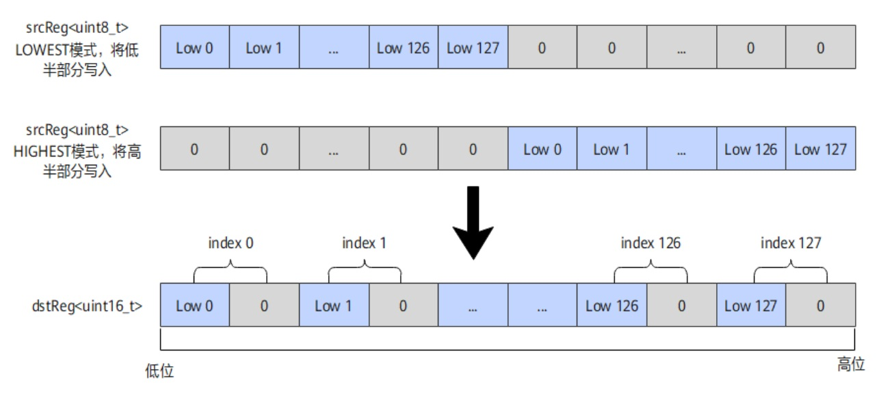

# vf.unpack

## 产品支持情况

<!-- npu="950" id1 -->
- Ascend 950PR/Ascend 950DT：支持
<!-- end id1 -->
<!-- npu="A3" id2 -->
- Atlas A3 训练系列产品/Atlas A3 推理系列产品：不支持
<!-- end id2 -->
<!-- npu="910b" id3 -->
- Atlas A2 训练系列产品/Atlas A2 推理系列产品：不支持
<!-- end id3 -->

## 功能说明

对于无符号整型，将源操作数 src 中低半部分或高半部分的元素以高位填 0 扩充位宽的方式写入 dst。对于有符号整型，将源操作数 src 中低半部分或高半部分的元素以保持符号位扩充位宽的方式写入 dst。用于将窄类型数据展开为宽类型数据。

**图 1** UnPack 示意图



## 函数原型

```python
dst = vf.unpack(src, part=pl.PackPart.LOWER, *, dtype=pl.DT_UINT16)
```

> 本接口为统一接口，同时支持 RegTensor 和 MaskReg 输入。当源操作数为 MaskReg 时，目标寄存器自动推断为 MaskReg。

## 参数说明

| 参数 | 输入/输出 | 说明 |
|---|---|---|
| `dst` | 输出 | 目的操作数，向量寄存器。数据类型为展开后的宽类型 |
| `src` | 输入 | 源操作数，向量寄存器。数据类型为展开前的窄类型 |
| `part` | 输入 | 枚举类型，用于控制读取 src 的低半部分还是高半部分。``pl.PackPart.LOWER``：低位模式，读取 src 的低半部分；``pl.PackPart.UPPER``：高位模式，读取 src 的高半部分。默认 ``pl.PackPart.LOWER``。注：RegTraitNumTwo 只支持 ``pl.PackPart.LOWER`` 模式 |
| `dtype` | 输入 | 必选，指定目标寄存器的数据类型（如 `pl.DT_UINT16`、`pl.DT_UINT32` 等）。由于展开后目标类型与源类型不同，必须显式指定 |

## dtype 说明

`vf.unpack` 是类型展开算子，将窄类型展开为宽类型（如 UINT8→UINT16），目标寄存器的数据类型与源寄存器不同，无法从源操作数推断目标类型。因此必须通过 `dtype` 参数显式指定目标数据类型。

## 数据类型

**源操作数和目的操作数的数据类型对应表**

| dst 数据类型 | src 数据类型 |
|---|---|
| INT16 | INT8 |
| UINT16 | UINT8 |
| INT32 | INT16 |
| UINT32 | UINT16 |
| INT64 | INT32 |
| UINT64 | UINT32 |

## 返回值说明

返回目标向量寄存器（`RegTensor` 类型）。

## 约束说明

无

## 调用示例

```python
import pypto_pro.language as pl
import torch
import torch_npu


@pl.vector_function
def example_vf(src_tile, dst_tile):
    preg = vf.create_mask(pattern=pl.MaskPattern.ALL, dtype=pl.DT_UINT16)
    src = vf.load_align(src_tile, 0)
    dst = vf.unpack(src, part=pl.PackPart.LOWER, dtype=pl.DT_UINT16)
    vf.store_align(dst_tile, dst, preg)


@pl.jit()
def example_kernel(
    a: pl.Tensor[[pl.DYNAMIC, pl.DYNAMIC], pl.DT_UINT8],
    out: pl.Tensor[[pl.DYNAMIC, pl.DYNAMIC], pl.DT_UINT16],
):
    tf_src = pl.TileType(shape=[1, 256], dtype=pl.DT_UINT8, target_memory=pl.MemorySpace.Vec)
    tf_dst = pl.TileType(shape=[1, 128], dtype=pl.DT_UINT16, target_memory=pl.MemorySpace.Vec)
    in_a = pl.make_tile(tf_src, addr=0, size=256)
    t_out = pl.make_tile(tf_dst, addr=256, size=256)
    with pl.section_vector():
        pl.load(in_a, a, [0, 0])
        pl.system.sync_src(set_pipe=pl.PipeType.MTE2, wait_pipe=pl.PipeType.V, event_id=0)
        pl.system.sync_dst(set_pipe=pl.PipeType.MTE2, wait_pipe=pl.PipeType.V, event_id=0)
        example_vf(in_a, t_out)
        pl.system.sync_src(set_pipe=pl.PipeType.V, wait_pipe=pl.PipeType.MTE3, event_id=1)
        pl.system.sync_dst(set_pipe=pl.PipeType.V, wait_pipe=pl.PipeType.MTE3, event_id=1)
        pl.store(out, t_out, [0, 0])


def test_example():
    device = "npu:0"
    core_nums = 1
    torch.npu.set_device(device)
    a = torch.randint(0, 256, [1, 256], device=device, dtype=torch.uint8)
    out = torch.empty([1, 128], device=device, dtype=torch.int16)
    example_kernel[None, core_nums](a, out)
    torch.npu.synchronize()
    assert out.dtype == torch.int16


if __name__ == "__main__":
    test_example()
    print("PASSED")
```

## MaskReg 调用示例

当源操作数为 MaskReg 时，`vf.unpack` 将掩码的低半部分或高半部分展开（每 bit 展开为 2bit，高位置零）。MaskReg 变体与 RegTensor 变体共用 `part=` 参数指定模式。

```python
import pypto_pro.language as pl
import torch
import torch_npu


@pl.vector_function
def example_vf(src_tile, dst_tile):
    preg = vf.create_mask(pattern=pl.MaskPattern.ALL, dtype=pl.DT_FP32)
    reg = vf.load_align(src_tile, 0)
    # 生成比较掩码：reg >= 0 的位置为 1
    mask_a = vf.ge(reg, 0.0, preg)
    # pack 后 unpack 为 roundtrip，掩码恢复原值
    preg_packed = vf.pack(mask_a, part=pl.PackPart.LOWER)
    preg_unpacked = vf.unpack(preg_packed, part=pl.PackPart.LOWER)
    # 使用恢复后的掩码做 abs：reg >= 0 处取 abs（即自身），否则置零
    reg_dst = vf.abs(reg, preg_unpacked)
    vf.store_align(dst_tile, reg_dst, preg)


@pl.jit()
def example_kernel(
    a: pl.Tensor[[pl.DYNAMIC, pl.DYNAMIC], pl.DT_FP32],
    out: pl.Tensor[[pl.DYNAMIC, pl.DYNAMIC], pl.DT_FP32],
):
    tf = pl.TileType(shape=[1, 64], dtype=pl.DT_FP32, target_memory=pl.MemorySpace.Vec)
    in_a = pl.make_tile(tf, addr=0, size=256)
    t_out = pl.make_tile(tf, addr=256, size=256)
    with pl.section_vector():
        pl.load(in_a, a, [0, 0])
        pl.system.sync_src(set_pipe=pl.PipeType.MTE2, wait_pipe=pl.PipeType.V, event_id=0)
        pl.system.sync_dst(set_pipe=pl.PipeType.MTE2, wait_pipe=pl.PipeType.V, event_id=0)
        example_vf(in_a, t_out)
        pl.system.sync_src(set_pipe=pl.PipeType.V, wait_pipe=pl.PipeType.MTE3, event_id=1)
        pl.system.sync_dst(set_pipe=pl.PipeType.V, wait_pipe=pl.PipeType.MTE3, event_id=1)
        pl.store(out, t_out, [0, 0])


def test_example():
    device = "npu:0"
    core_nums = 1
    torch.npu.set_device(device)
    a = torch.randn([1, 64], device=device, dtype=torch.float32)
    out = torch.empty([1, 64], device=device, dtype=torch.float32)
    example_kernel[None, core_nums](a, out)
    torch.npu.synchronize()
    expected = torch.where(a >= 0, a, torch.zeros_like(a))
    torch.testing.assert_close(out, expected, rtol=1e-5, atol=1e-5)


if __name__ == "__main__":
    test_example()
    print("PASSED")
```
