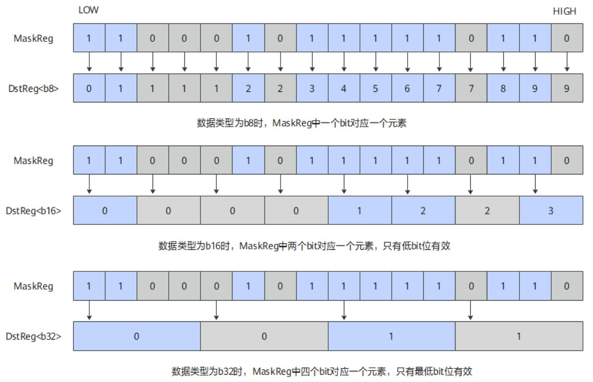

# vf.unsqueeze

## 产品支持情况

<!-- npu="950" id1 -->
- Ascend 950PR/Ascend 950DT：支持
<!-- end id1 -->
<!-- npu="A3" id2 -->
- Atlas A3 训练系列产品/Atlas A3 推理系列产品：不支持
<!-- end id2 -->
<!-- npu="910b" id3 -->
- Atlas A2 训练系列产品/Atlas A2 推理系列产品：不支持
<!-- end id3 -->

## 功能说明

将掩码寄存器的每个 bit 扩展到目标向量寄存器的对应 lane：mask bit 为 1 时对应 lane 填 1，mask bit 为 0 时对应 lane 填 0。

具体算法如下图所示，dstReg 的首位为 0，后续 mask[i] 对应 mask 值为 1 时，dst[i] 的值为 dst[i-1] + 1；mask[i] 对应 mask 值为 0 时，dst[i] 的值为 dst[i-1]。mask 最高位被忽略不参与统计。

**图 1** Unsqueeze 示意图



## 函数原型

```python
dst = vf.unsqueeze(preg)
```

## 参数说明

| 参数 | 输入/输出 | 说明 |
|---|---|---|
| `dst` | 输出 | 目标操作数，向量寄存器，存放扩展结果 |
| `preg` | 输入 | 掩码寄存器，类型为 `MaskReg`（由 `vf.create_mask` 或 `vf.update_mask` 产生） |

## 数据类型

支持的数据类型为：INT8、UINT8、INT16、UINT16、INT32、UINT32。

## 返回值说明

无

## 约束说明

无

## 调用示例

```python
import pypto_pro.language as pl
import torch
import torch_npu


@pl.vector_function
def example_vf(src_tile, dst_tile):
    preg = vf.create_mask(pattern=pl.MaskPattern.ALL, dtype=pl.DT_UINT32)
    src = vf.load_align(src_tile, 0)
    dst = vf.unsqueeze(preg)
    vf.store_align(dst_tile, dst, preg)


@pl.jit()
def example_kernel(
    a: pl.Tensor[[pl.DYNAMIC, pl.DYNAMIC], pl.DT_UINT32],
    out: pl.Tensor[[pl.DYNAMIC, pl.DYNAMIC], pl.DT_UINT32],
):
    tf = pl.TileType(shape=[1, 64], dtype=pl.DT_UINT32, target_memory=pl.MemorySpace.Vec)
    in_a = pl.make_tile(tf, addr=0, size=256)
    t_out = pl.make_tile(tf, addr=256, size=256)
    with pl.section_vector():
        pl.load(in_a, a, [0, 0])
        pl.system.sync_src(set_pipe=pl.PipeType.MTE2, wait_pipe=pl.PipeType.V, event_id=0)
        pl.system.sync_dst(set_pipe=pl.PipeType.MTE2, wait_pipe=pl.PipeType.V, event_id=0)
        example_vf(in_a, t_out)
        pl.system.sync_src(set_pipe=pl.PipeType.V, wait_pipe=pl.PipeType.MTE3, event_id=1)
        pl.system.sync_dst(set_pipe=pl.PipeType.V, wait_pipe=pl.PipeType.MTE3, event_id=1)
        pl.store(out, t_out, [0, 0])


def test_example():
    device = "npu:0"
    core_nums = 1
    torch.npu.set_device(device)
    a = torch.randint(0, 100, [1, 64], device=device, dtype=torch.int32)
    out = torch.empty([1, 64], device=device, dtype=torch.int32)
    example_kernel[None, core_nums](a, out)
    torch.npu.synchronize()
    assert out.shape == torch.Size([1, 64])


if __name__ == "__main__":
    test_example()
    print("PASSED")
```
