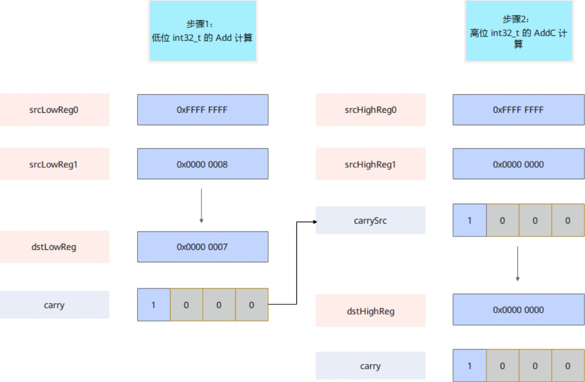

# vf.addc

## 产品支持情况

<!-- npu="950" id1 -->
- Ascend 950PR/Ascend 950DT：支持
<!-- end id1 -->
<!-- npu="A3" id2 -->
- Atlas A3 训练系列产品/Atlas A3 推理系列产品：不支持
<!-- end id2 -->
<!-- npu="910b" id3 -->
- Atlas A2 训练系列产品/Atlas A2 推理系列产品：不支持
<!-- end id3 -->

## 功能说明

该接口根据mask，对源操作数srcReg0、srcReg1及输入进位carrySrc进行按元素求和操作，将结果写入目的操作数dstReg，同时将每个元素的进位结果写入carry。计算公式如下：

$$\{carry_i, dstReg_i\} = srcReg0_i + srcReg1_i + carrySrc_i$$

Carry flag（进位标志）用于表示加法进位，若srcReg0，srcReg1，carrySrc输入按位相加后最高位有进位，在carry（存放进位的MaskReg寄存器）中对应位置每4bit设置1，否则写0。

以 int64_t 类型数据计算 -1 + 8 = 7 为例，AddC 接口的适用场景如下图所示：



## 函数原型

```python
carry, dst = vf.addc(src0, src1, carry_src, preg)
```

## 参数说明

| 参数 | 输入/输出 | 说明 |
|---|---|---|
| `carry` | 输出 | 目标操作数，输出进位值，类型为 `MaskReg` |
| `dst` | 输出 | 目标向量寄存器，向量寄存器 |
| `src0` | 输入 | 源操作数，向量寄存器 |
| `src1` | 输入 | 源操作数，向量寄存器 |
| `carry_src` | 输入 | 输入进位寄存器，类型为 `MaskReg` |
| `preg` | 输入 | 掩码寄存器，类型为 `MaskReg` |

## 数据类型

目的操作数与源操作数的数据类型需要保持一致。支持的数据类型为：INT32、UINT32。

## 返回值说明

返回元组 `(carry, dst)`：`carry` 为 `MaskReg` 类型的进位标志寄存器，`dst` 为 `RegTensor` 类型的求和寄存器。

## 约束说明

无

## 调用示例

```python
import pypto_pro.language as pl
import torch
import torch_npu


@pl.vector_function
def example_vf(src_a, src_b, dst_tile):
    preg = vf.create_mask(pattern=pl.MaskPattern.ALL, dtype=pl.DT_UINT32)
    carry_src = vf.create_mask(pattern=pl.MaskPattern.ALL, dtype=pl.DT_UINT32)
    carry = vf.create_mask(pattern=pl.MaskPattern.ALL, dtype=pl.DT_UINT32)
    reg_a = vf.load_align(src_a, 0, dtype=pl.DT_UINT32)
    reg_b = vf.load_align(src_b, 0, dtype=pl.DT_UINT32)
    carry, reg_out = vf.addc(reg_a, reg_b, carry_src, preg)
    vf.store_align(dst_tile, reg_out, preg)


@pl.jit()
def example_kernel(
    a: pl.Tensor[[pl.DYNAMIC, pl.DYNAMIC], pl.DT_UINT32],
    b: pl.Tensor[[pl.DYNAMIC, pl.DYNAMIC], pl.DT_UINT32],
    out: pl.Tensor[[pl.DYNAMIC, pl.DYNAMIC], pl.DT_UINT32],
):
    tf = pl.TileType(shape=[1, 64], dtype=pl.DT_UINT32, target_memory=pl.MemorySpace.Vec)
    in_a = pl.make_tile(tf, addr=0, size=256)
    in_b = pl.make_tile(tf, addr=256, size=256)
    t_out = pl.make_tile(tf, addr=512, size=256)
    with pl.section_vector():
        pl.load(in_a, a, [0, 0])
        pl.load(in_b, b, [0, 0])
        pl.system.sync_src(set_pipe=pl.PipeType.MTE2, wait_pipe=pl.PipeType.V, event_id=0)
        pl.system.sync_dst(set_pipe=pl.PipeType.MTE2, wait_pipe=pl.PipeType.V, event_id=0)
        example_vf(in_a, in_b, t_out)
        pl.system.sync_src(set_pipe=pl.PipeType.V, wait_pipe=pl.PipeType.MTE3, event_id=1)
        pl.system.sync_dst(set_pipe=pl.PipeType.V, wait_pipe=pl.PipeType.MTE3, event_id=1)
        pl.store(out, t_out, [0, 0])


def test_example():
    device = "npu:0"
    core_nums = 1
    torch.npu.set_device(device)
    a = torch.randint(0, 50, [1, 64], device=device, dtype=torch.int32)
    b = torch.randint(0, 50, [1, 64], device=device, dtype=torch.int32)
    out = torch.empty([1, 64], device=device, dtype=torch.int32)
    example_kernel[None, core_nums](a, b, out)
    torch.npu.synchronize()
    expected = (a.to(torch.int64) + b.to(torch.int64) + 1).to(torch.int32)
    assert torch.equal(out, expected)


if __name__ == "__main__":
    test_example()
    print("PASSED")
```
