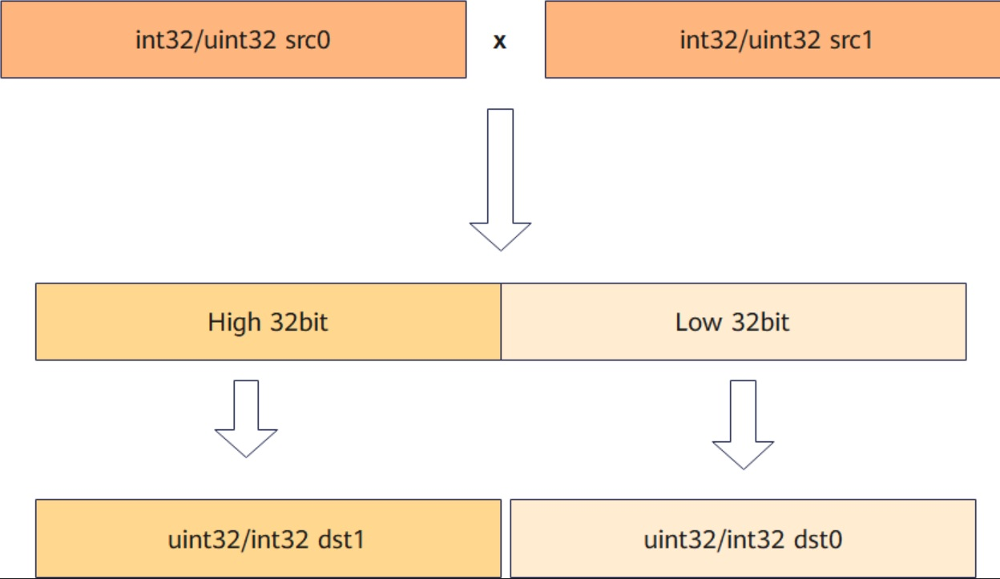

# vf.mull

## 产品支持情况

<!-- npu="950" id1 -->
- Ascend 950PR/Ascend 950DT：支持
<!-- end id1 -->
<!-- npu="A3" id2 -->
- Atlas A3 训练系列产品/Atlas A3 推理系列产品：不支持
<!-- end id2 -->
<!-- npu="910b" id3 -->
- Atlas A2 训练系列产品/Atlas A2 推理系列产品：不支持
<!-- end id3 -->

## 功能说明

该接口根据mask对输入数据srcReg0、srcReg1按元素相乘操作，将乘法结果的低位部分写入dstReg0，溢出（高位）部分写入dstReg1。计算公式如下：

$$dstReg0_i = (srcReg0_i \times srcReg1_i) \bmod 2^{bit}$$

$$dstReg1_i = \lfloor (srcReg0_i \times srcReg1_i) / 2^{bit} \rfloor$$

其中，bit表示操作数的位宽bit数。



## 函数原型

```python
# 元组赋值形式（推荐）
dst_lo, dst_hi = vf.mull(src0, src1, preg)

# 语句形式（dst 需预声明）
vf.mull(dst_lo, dst_hi, src0, src1, preg)
```

## 参数说明

| 参数 | 输入/输出 | 说明 |
|---|---|---|
| `dst_lo` | 输出 | 目标向量寄存器（乘法结果低位），向量寄存器 |
| `dst_hi` | 输出 | 目标向量寄存器（乘法结果高位），向量寄存器 |
| `src0` | 输入 | 源操作数，向量寄存器 |
| `src1` | 输入 | 源操作数，向量寄存器 |
| `preg` | 输入 | 掩码寄存器，类型为 `MaskReg` |

## 数据类型

目的操作数与源操作数的数据类型需要保持一致。支持的数据类型为：INT32、UINT32。

## 返回值说明

返回元组 `(dst_lo, dst_hi)`：`dst_lo` 为乘法结果低 32 位的 `RegTensor` 寄存器，`dst_hi` 为乘法结果高 32 位的 `RegTensor` 寄存器。

## 约束说明

无

## 调用示例

```python
import pypto_pro.language as pl
import torch
import torch_npu


@pl.vector_function
def example_vf(src_a, src_b, dst_lo, dst_hi):
    # vf 是 @pl.vector_function 函数内的保留命名空间，无需 import
    preg = vf.create_mask(pattern=pl.MaskPattern.ALL, dtype=pl.DT_UINT32)

    reg_a = vf.load_align(src_a, 0, dtype=pl.DT_UINT32)
    reg_b = vf.load_align(src_b, 0, dtype=pl.DT_UINT32)
    reg_lo, reg_hi = vf.mull(reg_a, reg_b, preg)
    vf.store_align(dst_lo, reg_lo, preg)
    vf.store_align(dst_hi, reg_hi, preg)


@pl.jit()
def example_kernel(
    a: pl.Tensor[[pl.DYNAMIC, pl.DYNAMIC], pl.DT_UINT32],
    b: pl.Tensor[[pl.DYNAMIC, pl.DYNAMIC], pl.DT_UINT32],
    out_lo: pl.Tensor[[pl.DYNAMIC, pl.DYNAMIC], pl.DT_UINT32],
    out_hi: pl.Tensor[[pl.DYNAMIC, pl.DYNAMIC], pl.DT_UINT32],
):
    tf = pl.TileType(shape=[1, 64], dtype=pl.DT_UINT32, target_memory=pl.MemorySpace.Vec)
    in_a = pl.make_tile(tf, addr=0, size=256)
    in_b = pl.make_tile(tf, addr=256, size=256)
    t_lo = pl.make_tile(tf, addr=512, size=256)
    t_hi = pl.make_tile(tf, addr=768, size=256)
    with pl.section_vector():
        pl.load(in_a, a, [0, 0])
        pl.load(in_b, b, [0, 0])
        pl.system.sync_src(set_pipe=pl.PipeType.MTE2, wait_pipe=pl.PipeType.V, event_id=0)
        pl.system.sync_dst(set_pipe=pl.PipeType.MTE2, wait_pipe=pl.PipeType.V, event_id=0)
        example_vf(in_a, in_b, t_lo, t_hi)
        pl.system.sync_src(set_pipe=pl.PipeType.V, wait_pipe=pl.PipeType.MTE3, event_id=1)
        pl.system.sync_dst(set_pipe=pl.PipeType.V, wait_pipe=pl.PipeType.MTE3, event_id=1)
        pl.store(out_lo, t_lo, [0, 0])
        pl.store(out_hi, t_hi, [0, 0])


def test_example():
    device = "npu:0"
    core_nums = 1
    torch.npu.set_device(device)
    a = torch.randint(1, 1000, [1, 64], device=device, dtype=torch.int32)
    b = torch.randint(1, 1000, [1, 64], device=device, dtype=torch.int32)
    out_lo = torch.empty([1, 64], device=device, dtype=torch.int32)
    out_hi = torch.empty([1, 64], device=device, dtype=torch.int32)
    example_kernel[None, core_nums](a, b, out_lo, out_hi)
    torch.npu.synchronize()
    product = a.to(torch.int64) * b.to(torch.int64)
    expected_lo = (product & 0xFFFFFFFF).to(torch.int32)
    expected_hi = (product >> 32).to(torch.int32)
    assert torch.equal(out_lo, expected_lo)
    assert torch.equal(out_hi, expected_hi)


if __name__ == "__main__":
    test_example()
    print("PASSED")
```
