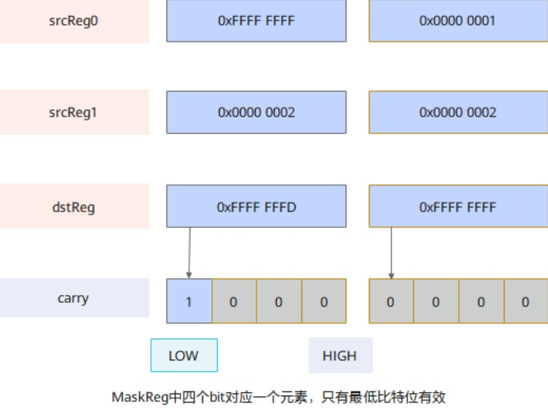

# vf.sub

## 产品支持情况

<!-- npu="950" id1 -->
- Ascend 950PR/Ascend 950DT：支持
<!-- end id1 -->
<!-- npu="A3" id2 -->
- Atlas A3 训练系列产品/Atlas A3 推理系列产品：不支持
<!-- end id2 -->
<!-- npu="910b" id3 -->
- Atlas A2 训练系列产品/Atlas A2 推理系列产品：不支持
<!-- end id3 -->

## 功能说明

两个向量寄存器逐元素减法。

根据 mask，对源操作数 src_a、src_b 进行按元素求差操作，将结果写入目的操作数 dst，计算公式如下：

$$dst_i = src\_a_i - src\_b_i$$

同时可以在 carry（MaskReg 寄存器）中标记每次减法是否产生借位，若 src_a、src_b 输入按位相减最高位有借位，在 MaskReg carry 中对应位置每 4bit 的最低位写 0，否则写 1。



## 函数原型

```python
dst = vf.sub(src_a, src_b, preg)
```

## 参数说明

| 参数 | 输入/输出 | 说明 |
|---|---|---|
| `dst` | 输出 | 目标向量寄存器 |
| `src_a` | 输入 | 源操作数 A |
| `src_b` | 输入 | 源操作数 B |
| `preg` | 输入 | 掩码寄存器 |

## 数据类型

| src | dst |
|---|---|
| FP16 | FP16 |
| FP32 | FP32 |
| BF16 | BF16 |
| INT32 | INT32 |
| UINT32 | UINT32 |

## 返回值说明

返回目标向量寄存器（`RegTensor` 类型）。

## 约束说明

- 本接口操作数为寄存器，不涉及地址对齐。
- 本接口不修改全局寄存器的值。
- 源操作数与目标操作数的数据类型需要保持一致。

## 调用示例

```python
import pypto_pro.language as pl
import torch
import torch_npu


@pl.vector_function
def example_vf(src_a, src_b, dst_tile):
    # vf 是 @pl.vector_function 函数内的保留命名空间，无需 import
    preg = vf.create_mask(pattern=pl.MaskPattern.ALL, dtype=pl.DT_FP32)
    reg_a = vf.load_align(src_a, 0)
    reg_b = vf.load_align(src_b, 0)
    reg_out = vf.sub(reg_a, reg_b, preg)
    vf.store_align(dst_tile, reg_out, preg)


@pl.jit()
def example_kernel(
    a: pl.Tensor[[pl.DYNAMIC, pl.DYNAMIC], pl.DT_FP32],
    b: pl.Tensor[[pl.DYNAMIC, pl.DYNAMIC], pl.DT_FP32],
    out: pl.Tensor[[pl.DYNAMIC, pl.DYNAMIC], pl.DT_FP32],
):
    tf = pl.TileType(shape=[1, 64], dtype=pl.DT_FP32, target_memory=pl.MemorySpace.Vec)
    in_a = pl.make_tile(tf, addr=0, size=256)
    in_b = pl.make_tile(tf, addr=256, size=256)
    t_out = pl.make_tile(tf, addr=512, size=256)
    with pl.section_vector():
        pl.load(in_a, a, [0, 0])
        pl.load(in_b, b, [0, 0])
        pl.system.sync_src(set_pipe=pl.PipeType.MTE2, wait_pipe=pl.PipeType.V, event_id=0)
        pl.system.sync_dst(set_pipe=pl.PipeType.MTE2, wait_pipe=pl.PipeType.V, event_id=0)
        example_vf(in_a, in_b, t_out)
        pl.system.sync_src(set_pipe=pl.PipeType.V, wait_pipe=pl.PipeType.MTE3, event_id=1)
        pl.system.sync_dst(set_pipe=pl.PipeType.V, wait_pipe=pl.PipeType.MTE3, event_id=1)
        pl.store(out, t_out, [0, 0])


def test_example():
    device = "npu:0"
    core_nums = 1
    torch.npu.set_device(device)
    a = torch.randn([1, 64], device=device, dtype=torch.float32)
    b = torch.randn([1, 64], device=device, dtype=torch.float32)
    out = torch.empty([1, 64], device=device, dtype=torch.float32)
    example_kernel[None, core_nums](a, b, out)
    torch.npu.synchronize()
    torch.testing.assert_close(out, a - b, rtol=1e-5, atol=1e-5)


if __name__ == "__main__":
    test_example()
    print("PASSED")
```
