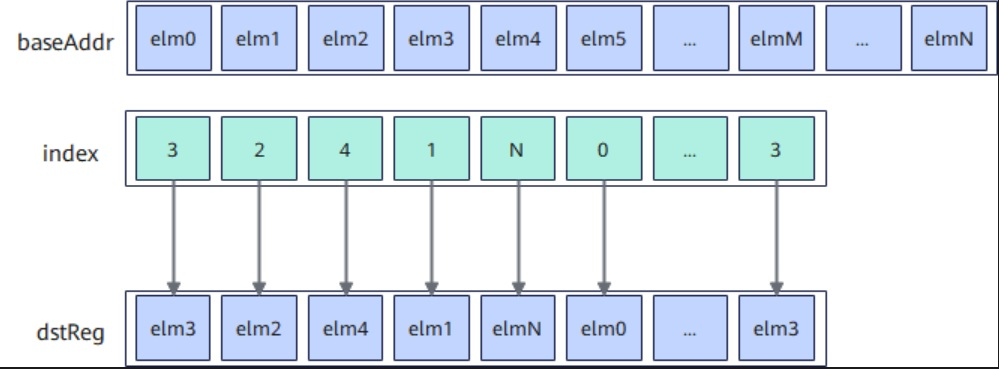
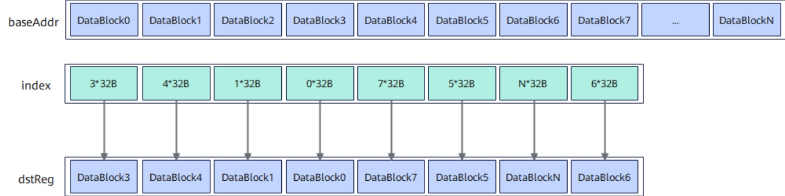

# vf.gather

## 产品支持情况

<!-- npu="950" id1 -->
- Ascend 950PR/Ascend 950DT：支持
<!-- end id1 -->
<!-- npu="A3" id2 -->
- Atlas A3 训练系列产品/Atlas A3 推理系列产品：不支持
<!-- end id2 -->
<!-- npu="910b" id3 -->
- Atlas A2 训练系列产品/Atlas A2 推理系列产品：不支持
<!-- end id3 -->

## 功能说明

该指令会根据索引值 index 将源操作数收集到目的操作数 dstReg 中。通过 `data_copy_mode` 选择收集粒度：

- `pl.DataCopyMode.NORM`（默认）：按元素收集，index 单位为元素。
- `pl.DataCopyMode.DATA_BLOCK_LOAD`：按 DataBlock（32B）收集，index 单位为字节且需 32B 对齐。

> 说明：原独立接口 `vf.gatherb` 已合并进 `vf.gather`，等价于 `vf.gather(..., data_copy_mode=pl.DataCopyMode.DATA_BLOCK_LOAD)`。

### NORM 模式（按元素收集）

根据索引值 indexReg 将源操作数 srcReg 按元素收集到目的操作数 dstReg 中。收集过程如下图所示：

**图 1** Gather 功能说明



### DATA_BLOCK_LOAD 模式（按 DataBlock 收集）

根据索引值 index 将源操作数按 DataBlock（32B）收集到目的操作数 dstReg 中。收集过程如下图所示：

**图 2** block 模式 Gather 功能说明



## 函数原型

```python
# 按元素收集（默认）
dst = vf.gather(tile, index, preg)

# 按 DataBlock（32B）收集
dst = vf.gather(tile, index, preg, data_copy_mode=pl.DataCopyMode.DATA_BLOCK_LOAD)
```

## 参数说明

| 参数 | 输入/输出 | 说明 |
|---|---|---|
| `dst` | 输出 | 目的操作数，向量寄存器 |
| `tile` | 输入 | 源操作数，UB 中的基地址，需要 32 字节对齐 |
| `index` | 输入 | 索引值，向量寄存器，index 中的值可以重复。NORM 模式下为 dst 中每个元素相对于 baseAddr 的位置，单位：元素；DATA_BLOCK_LOAD 模式下为每个 DataBlock 相对于 baseAddr 的位置，单位：字节，且必须 32B 对齐 |
| `preg` | 输入 | 掩码寄存器，类型为 `MaskReg` |
| `data_copy_mode` | 输入 | 可选关键字参数，收集粒度。`pl.DataCopyMode.NORM`（默认，按元素）或 `pl.DataCopyMode.DATA_BLOCK_LOAD`（按 32B DataBlock） |

## 数据类型

### NORM 模式（按元素）

| dst（T0） | baseAddr（T1） | index（T2） |
|---|---|---|
| INT16 | INT8 | UINT16 |
| INT16 | INT16 | UINT16 |
| UINT16 | UINT8 | UINT16 |
| UINT16 | UINT16 | UINT16 |
| FP16 | FP16 | UINT16 |
| BF16 | BF16 | UINT16 |
| INT32 | INT32 | UINT32 |
| UINT32 | UINT32 | UINT32 |
| FP32 | FP32 | UINT32 |
| INT64 | INT64 | UINT32 |
| INT64 | INT64 | UINT64 |
| UINT64 | UINT64 | UINT32 |
| UINT64 | UINT64 | UINT64 |

### DATA_BLOCK_LOAD 模式（按 32B DataBlock）

目的操作数与源操作数的数据类型需要保持一致。支持的数据类型为：INT8、UINT8、INT16、UINT16、FP16、BF16、INT32、UINT32、FP32、INT64、UINT64。

索引值支持的数据类型为：UINT32。

赋值形式 `dst = vf.gather(...)` 返回目标向量寄存器。

## 约束说明

- index 索引值对应的数据必须在 UB 有效地址范围内。
- NORM 模式下，当 dst 为 b16 类型，baseAddr 为 b8 数据类型时，目的操作数的低 8 位与源操作数相同，高 8 位自动补 0。
- DATA_BLOCK_LOAD 模式下，源操作数和目的操作数数据类型必须相同；index 索引值必须 32 字节对齐，即一个索引值对应 1 个 DataBlock。

## 调用示例

```python
import pypto_pro.language as pl
import torch
import torch_npu


@pl.vector_function
def example_vf(src_tile, index_tile, dst_tile):
    # vf 是 @pl.vector_function 函数内的保留命名空间，无需 import
    preg = vf.create_mask(pattern=pl.MaskPattern.ALL, dtype=pl.DT_FP32)
    # 先加载索引寄存器
    index_reg = vf.load_align(index_tile, 0)
    # 根据索引从 src_tile 按元素收集到 dst_reg
    dst_reg = vf.gather(src_tile, index_reg, preg)
    vf.store_align(dst_tile, dst_reg, preg)


@pl.jit()
def example_kernel(
    a: pl.Tensor[[pl.DYNAMIC, pl.DYNAMIC], pl.DT_FP32],
    idx: pl.Tensor[[pl.DYNAMIC, pl.DYNAMIC], pl.DT_UINT32],
    out: pl.Tensor[[pl.DYNAMIC, pl.DYNAMIC], pl.DT_FP32],
):
    tf = pl.TileType(shape=[1, 64], dtype=pl.DT_FP32, target_memory=pl.MemorySpace.Vec)
    tf_idx = pl.TileType(shape=[1, 64], dtype=pl.DT_UINT32, target_memory=pl.MemorySpace.Vec)
    in_a = pl.make_tile(tf, addr=0, size=256)
    in_idx = pl.make_tile(tf_idx, addr=256, size=256)
    t_out = pl.make_tile(tf, addr=512, size=256)
    with pl.section_vector():
        pl.load(in_a, a, [0, 0])
        pl.load(in_idx, idx, [0, 0])
        pl.system.sync_src(set_pipe=pl.PipeType.MTE2, wait_pipe=pl.PipeType.V, event_id=0)
        pl.system.sync_dst(set_pipe=pl.PipeType.MTE2, wait_pipe=pl.PipeType.V, event_id=0)
        example_vf(in_a, in_idx, t_out)
        pl.system.sync_src(set_pipe=pl.PipeType.V, wait_pipe=pl.PipeType.MTE3, event_id=1)
        pl.system.sync_dst(set_pipe=pl.PipeType.V, wait_pipe=pl.PipeType.MTE3, event_id=1)
        pl.store(out, t_out, [0, 0])


def test_example():
    device = "npu:0"
    core_nums = 1
    torch.npu.set_device(device)
    a = torch.randn([1, 64], device=device, dtype=torch.float32)
    idx = torch.arange(64, device=device, dtype=torch.int32).reshape([1, 64])
    out = torch.empty([1, 64], device=device, dtype=torch.float32)
    example_kernel[None, core_nums](a, idx, out)
    torch.npu.synchronize()
    torch.testing.assert_close(out, a, rtol=1e-5, atol=1e-5)


if __name__ == "__main__":
    test_example()
    print("PASSED")
```

按 DataBlock（32B）收集（原 `vf.gatherb` 用法）：

```python
import pypto_pro.language as pl
import torch
import torch_npu


@pl.vector_function
def example_vf_datablock(src_tile, dst_tile):
    # vf 是 @pl.vector_function 函数内的保留命名空间，无需 import
    preg = vf.create_mask(pattern=pl.MaskPattern.ALL, dtype=pl.DT_FP32)
    # 生成元素索引 [0, 1, 2, ..., 63]
    reg_idx = vf.arange(0, dtype=pl.DT_INT32)
    # 转换为字节偏移：shift_left 5 等价于 ×32（每个 DataBlock 32 字节）
    preg_u = vf.create_mask(pattern=pl.MaskPattern.ALL, dtype=pl.DT_UINT32)
    reg_idx_b = vf.shift_left(reg_idx, 5, preg_u)
    # 根据字节偏移从 src_tile 按 DataBlock 收集到 dst_reg
    dst_reg = vf.gather(src_tile, reg_idx_b, preg,
                        data_copy_mode=pl.DataCopyMode.DATA_BLOCK_LOAD)
    vf.store_align(dst_tile, dst_reg, preg)


@pl.jit()
def example_kernel(
    a: pl.Tensor[[pl.DYNAMIC, pl.DYNAMIC], pl.DT_FP32],
    out: pl.Tensor[[pl.DYNAMIC, pl.DYNAMIC], pl.DT_FP32],
):
    tf = pl.TileType(shape=[1, 64], dtype=pl.DT_FP32, target_memory=pl.MemorySpace.Vec)
    in_a = pl.make_tile(tf, addr=0, size=256)
    t_out = pl.make_tile(tf, addr=256, size=256)
    with pl.section_vector():
        pl.load(in_a, a, [0, 0])
        pl.system.sync_src(set_pipe=pl.PipeType.MTE2, wait_pipe=pl.PipeType.V, event_id=0)
        pl.system.sync_dst(set_pipe=pl.PipeType.MTE2, wait_pipe=pl.PipeType.V, event_id=0)
        example_vf_datablock(in_a, t_out)
        pl.system.sync_src(set_pipe=pl.PipeType.V, wait_pipe=pl.PipeType.MTE3, event_id=1)
        pl.system.sync_dst(set_pipe=pl.PipeType.V, wait_pipe=pl.PipeType.MTE3, event_id=1)
        pl.store(out, t_out, [0, 0])


def test_example_2():
    device = "npu:0"
    core_nums = 1
    torch.npu.set_device(device)
    a = torch.randn([1, 64], device=device, dtype=torch.float32)
    out = torch.empty([1, 64], device=device, dtype=torch.float32)
    example_kernel[None, core_nums](a, out)
    torch.npu.synchronize()
    torch.testing.assert_close(out, a, rtol=1e-5, atol=1e-5)


if __name__ == "__main__":
    test_example_2()
    print("PASSED")
```
