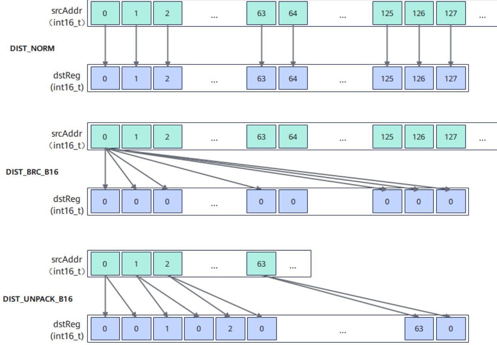

# vf.load_align

## 产品支持情况

<!-- npu="950" id1 -->
- Ascend 950PR/Ascend 950DT：支持
<!-- end id1 -->
<!-- npu="A3" id2 -->
- Atlas A3 训练系列产品/Atlas A3 推理系列产品：不支持
<!-- end id2 -->
<!-- npu="910b" id3 -->
- Atlas A2 训练系列产品/Atlas A2 推理系列产品：不支持
<!-- end id3 -->

## 功能说明

从 UB tile 对齐加载数据到向量寄存器或掩码寄存器（MaskReg）。支持普通加载、广播加载、de-interleave 加载、post-update 连续加载和 MaskReg 加载模式。当目标变量已通过 `vf.create_mask` 预声明为 MaskReg 时，后端自动分派 MaskReg 加载路径。

数据搬入时，可以通过 `dist` 关键字参数配置搬运的数据分布模式，能够实现 broadcast、上采样、下采样、解压缩等功能。下图展示了 DIST_NORM、DIST_BRC_B16、DIST_UNPACK_B16 等分布模式的搬入示意：

**图 1** 连续对齐搬入分布模式图示



## 函数原型

```python
# 普通对齐加载（赋值形式）
dst = vf.load_align(tile, offset)

# 普通对齐加载（语句形式，dst 需预声明）
vf.load_align(dst, tile, offset)

# 广播加载
dst = vf.load_align(tile, offset, *, dist=pl.LoadDist.BRC_B32)

# De-interleave 加载（拆分为偶数/奇数寄存器）
dst_even, dst_odd = vf.load_align(tile, offset, *, dist=pl.LoadDist.DINTLV_B8|pl.LoadDist.DINTLV_B32)

# 指定 dtype 加载（将 FP32 tile 数据按 UINT32 位重解释加载到寄存器）
dst = vf.load_align(tile, offset, *, dtype=pl.DT_UINT32)

# 带 post-update 的连续加载（搬运后地址自动累进）
dst = vf.load_align(tile, offset, *, post_update=True)

# 非连续 DataBlock 加载；DATA_BLOCK_COPY 为 AscendC 命名，DATA_BLOCK_LOAD 为等价旧别名
dst = vf.load_align(tile, preg, data_copy_mode=pl.DataCopyMode.DATA_BLOCK_COPY, block_stride=32)

# AddrReg 偏移加载：offset 传入 AddrReg（由 vf.create_addr_reg 创建）
#   目标为向量寄存器 → 对齐加载；目标为 MaskReg → MaskReg 加载
a_reg = vf.create_addr_reg(i, 64, dtype=pl.DT_FP32)
dst = vf.load_align(tile, a_reg)

# MaskReg 加载（需先用 vf.create_mask 预声明 MaskReg；dist 指定分布模式，默认 NORM）
mask = vf.load_align(tile)                               # dist 省略，默认 NORM
mask = vf.load_align(tile, dist=pl.LoadDist.US)          # 上采样
mask = vf.load_align(tile, addr_reg, dist=pl.LoadDist.NORM)  # AddrReg 偏移
```

## 参数说明

| 参数 | 输入/输出 | 说明 |
|---|---|---|
| `dst` | 输出 | 目标向量寄存器 |
| `dst_even` / `dst_odd` | 输出 | De-interleave 模式下的偶数/奇数目标寄存器 |
| `tile` | 输入 | 源 UB tile |
| `offset` | 输入 | 偏移量（元素数量）；也可传入由 `vf.create_addr_reg` 创建的 AddrReg 作为地址偏移寄存器 |
| `dist` | 输入 | 可选，数据分布模式：<br>RegTensor 目标：``pl.LoadDist.BRC_B32``（广播单个 B32 元素到整寄存器）、``pl.LoadDist.DINTLV_B8``（de-interleave 拆分为 B8 偶奇寄存器）、``pl.LoadDist.DINTLV_B32``（de-interleave 拆分为 B32 偶奇寄存器）<br>MaskReg 目标：``pl.LoadDist.NORM``（正常模式，搬运 VL/8）、``pl.LoadDist.US``（上采样模式，每 bit 重复两次）、``pl.LoadDist.DS``（下采样模式，每间隔 1bit 舍弃）。目标为 MaskReg 时需先用 ``vf.create_mask`` 预声明 |
| `dtype` | 输入 | 可选，指定目标寄存器的数据类型。当源 tile 的数据类型与期望的寄存器数据类型不一致时需要指定（例如源 tile 为 FP32 但需要按 UINT32 位重解释加载到寄存器）。默认从源 tile 的数据类型推断 |
| `post_update` | 输入 | 可选，`True` 时搬运后源地址自动累进，默认 `False`。适用于循环内连续加载，避免手动更新 offset |
| `block_stride` | 输入 | 可选，DataBlock 加载模式下的块步长 |
| `repeat_stride` | 输入 | 可选，DataBlock 加载模式下的重复步长 |
| `data_copy_mode` | 输入 | 可选，数据拷贝模式：``pl.DataCopyMode.NORM``（默认）或 ``pl.DataCopyMode.DATA_BLOCK_COPY``（非连续 DataBlock 加载）。``DATA_BLOCK_LOAD`` 作为等价旧别名保留 |

## dtype 说明

采用赋值形式（`dst = vf.load_align(...)`）时，目标寄存器的数据类型默认从源 tile 推断。当需要将 FP32 tile 的比特位按整型（如 UINT32、UINT16）解释加载时，必须通过 `dtype` 参数显式指定目标寄存器的数据类型。

例如：源 tile 的数据类型为 `pl.DT_FP32`，但需要将其比特位按 `pl.DT_UINT32` 加载到寄存器进行位运算（如移位、与、或等），此时需要指定 `dtype=pl.DT_UINT32`。

## 数据类型

| tile | dst |
|---|---|
| INT8 | INT8 |
| UINT8 | UINT8 |
| INT16 | INT16 |
| UINT16 | UINT16 |
| FP16 | FP16 |
| BF16 | BF16 |
| INT32 | INT32 |
| UINT32 | UINT32 |
| FP32 | FP32 |
| INT64 | INT64 |
| UINT64 | UINT64 |

## 返回值说明

赋值形式 `dst = vf.load_align(...)` 返回目标向量寄存器。语句形式 `vf.load_align(dst, ...)` 无返回值。

## 约束说明

- 源地址需要 32 字节对齐。
- 使用 AddrReg 偏移时，按目标类型自动分派：目标为向量寄存器走对齐加载，目标为 MaskReg 走 MaskReg 加载（指针按 uint32_t 处理）。

## 调用示例

```python
import pypto_pro.language as pl
import torch
import torch_npu


@pl.vector_function
def example_vf(src_tile, dst_tile):
    # vf 是 @pl.vector_function 函数内的保留命名空间，无需 import
    preg = vf.create_mask(pattern=pl.MaskPattern.ALL, dtype=pl.DT_FP32)
    # 普通对齐加载：第二个参数为元素偏移
    src0 = vf.load_align(src_tile, 0)
    vf.store_align(dst_tile, src0, preg)
    # post-update 模式：搬运后地址自动累进，适合循环内连续加载
    reg = vf.load_align(src_tile, 0, post_update=True)
    vf.store_align(dst_tile, reg, preg)


@pl.jit()
def example_kernel(
    a: pl.Tensor[[pl.DYNAMIC, pl.DYNAMIC], pl.DT_FP32],
    out: pl.Tensor[[pl.DYNAMIC, pl.DYNAMIC], pl.DT_FP32],
):
    tf = pl.TileType(shape=[1, 64], dtype=pl.DT_FP32, target_memory=pl.MemorySpace.Vec)
    in_a = pl.make_tile(tf, addr=0, size=256)
    t_out = pl.make_tile(tf, addr=256, size=256)
    with pl.section_vector():
        pl.load(in_a, a, [0, 0])
        pl.system.sync_src(set_pipe=pl.PipeType.MTE2, wait_pipe=pl.PipeType.V, event_id=0)
        pl.system.sync_dst(set_pipe=pl.PipeType.MTE2, wait_pipe=pl.PipeType.V, event_id=0)
        example_vf(in_a, t_out)
        pl.system.sync_src(set_pipe=pl.PipeType.V, wait_pipe=pl.PipeType.MTE3, event_id=1)
        pl.system.sync_dst(set_pipe=pl.PipeType.V, wait_pipe=pl.PipeType.MTE3, event_id=1)
        pl.store(out, t_out, [0, 0])


def test_example():
    device = "npu:0"
    core_nums = 1
    torch.npu.set_device(device)
    a = torch.randn([1, 64], device=device, dtype=torch.float32)
    out = torch.empty([1, 64], device=device, dtype=torch.float32)
    example_kernel[None, core_nums](a, out)
    torch.npu.synchronize()
    torch.testing.assert_close(out, a, rtol=1e-5, atol=1e-5)


if __name__ == "__main__":
    test_example()
    print("PASSED")
```

## De-interleave 加载示例

使用 `dist=pl.LoadDist.DINTLV_B32` 将连续数据拆分为偶数/奇数两个寄存器：

```python
import pypto_pro.language as pl
import torch
import torch_npu


@pl.vector_function
def example_vf(src_tile, dst_tile):
    # vf 是 @pl.vector_function 函数内的保留命名空间，无需 import
    preg = vf.create_mask(pattern=pl.MaskPattern.ALL, dtype=pl.DT_FP32)
    # DINTLV_B32：将 64 个 FP32 元素按 B32 粒度拆分为偶数/奇数两组
    dst_even, dst_odd = vf.load_align(src_tile, 0, dist=pl.LoadDist.DINTLV_B32)
    # 偶数元素存储到输出
    vf.store_align(dst_tile, dst_even, preg)


@pl.jit()
def example_kernel(
    a: pl.Tensor[[pl.DYNAMIC, pl.DYNAMIC], pl.DT_FP32],
    out: pl.Tensor[[pl.DYNAMIC, pl.DYNAMIC], pl.DT_FP32],
):
    tf = pl.TileType(shape=[1, 64], dtype=pl.DT_FP32, target_memory=pl.MemorySpace.Vec)
    in_a = pl.make_tile(tf, addr=0, size=256)
    t_out = pl.make_tile(tf, addr=256, size=256)
    with pl.section_vector():
        pl.load(in_a, a, [0, 0])
        pl.system.sync_src(set_pipe=pl.PipeType.MTE2, wait_pipe=pl.PipeType.V, event_id=0)
        pl.system.sync_dst(set_pipe=pl.PipeType.MTE2, wait_pipe=pl.PipeType.V, event_id=0)
        example_vf(in_a, t_out)
        pl.system.sync_src(set_pipe=pl.PipeType.V, wait_pipe=pl.PipeType.MTE3, event_id=1)
        pl.system.sync_dst(set_pipe=pl.PipeType.V, wait_pipe=pl.PipeType.MTE3, event_id=1)
        pl.store(out, t_out, [0, 0])


def test_example_2():
    device = "npu:0"
    core_nums = 1
    torch.npu.set_device(device)
    a = torch.randn([1, 64], device=device, dtype=torch.float32)
    out = torch.empty([1, 64], device=device, dtype=torch.float32)
    example_kernel[None, core_nums](a, out)
    torch.npu.synchronize()
    expected = a[:, ::2]
    if expected.shape[1] < 64:
        expected = torch.cat([expected, torch.zeros(1, 64 - expected.shape[1], device=device, dtype=torch.float32)], dim=1)
    torch.testing.assert_close(out, expected, rtol=1e-5, atol=1e-5)


if __name__ == "__main__":
    test_example_2()
    print("PASSED")
```

## AddrReg 偏移加载示例（RegTensor 模式）

使用 `vf.create_addr_reg` 创建地址偏移寄存器，在循环中自动累进地址：

```python
import pypto_pro.language as pl
import torch
import torch_npu


@pl.vector_function
def example_vf(src_tile, dst_tile):
    # vf 是 @pl.vector_function 函数内的保留命名空间，无需 import
    preg = vf.create_mask(pattern=pl.MaskPattern.ALL, dtype=pl.DT_FP32)
    one_repeat_size = 64
    repeat_times = 2
    for i in pl.range(0, repeat_times, 1):
        # offset = i * one_repeat_size，AddrReg 自动累进地址
        a_reg = vf.create_addr_reg(i, one_repeat_size, dtype=pl.DT_FP32)
        reg = vf.load_align(src_tile, a_reg)
        vf.store_align(dst_tile, reg, preg, a_reg)


@pl.jit()
def example_kernel(
    a: pl.Tensor[[pl.DYNAMIC, pl.DYNAMIC], pl.DT_FP32],
    out: pl.Tensor[[pl.DYNAMIC, pl.DYNAMIC], pl.DT_FP32],
):
    tf = pl.TileType(shape=[1, 128], dtype=pl.DT_FP32, target_memory=pl.MemorySpace.Vec)
    in_a = pl.make_tile(tf, addr=0, size=512)
    t_out = pl.make_tile(tf, addr=512, size=512)
    with pl.section_vector():
        pl.load(in_a, a, [0, 0])
        pl.system.sync_src(set_pipe=pl.PipeType.MTE2, wait_pipe=pl.PipeType.V, event_id=0)
        pl.system.sync_dst(set_pipe=pl.PipeType.MTE2, wait_pipe=pl.PipeType.V, event_id=0)
        example_vf(in_a, t_out)
        pl.system.sync_src(set_pipe=pl.PipeType.V, wait_pipe=pl.PipeType.MTE3, event_id=1)
        pl.system.sync_dst(set_pipe=pl.PipeType.V, wait_pipe=pl.PipeType.MTE3, event_id=1)
        pl.store(out, t_out, [0, 0])


def test_example_3():
    device = "npu:0"
    core_nums = 1
    torch.npu.set_device(device)
    a = torch.randn([1, 128], device=device, dtype=torch.float32)
    out = torch.empty([1, 128], device=device, dtype=torch.float32)
    example_kernel[None, core_nums](a, out)
    torch.npu.synchronize()
    torch.testing.assert_close(out, a, rtol=1e-5, atol=1e-5)


if __name__ == "__main__":
    test_example_3()
    print("PASSED")
```

## MaskReg 加载示例

通过 `vf.create_mask` 预声明 MaskReg 后，使用 `dist` 关键字参数指定分布模式，将 UB 中的掩码数据加载到 MaskReg：

```python
import pypto_pro.language as pl
import torch
import torch_npu


@pl.vector_function
def example_vf(src_tile, mask_buf_tile, dst_tile):
    # vf 是 @pl.vector_function 函数内的保留命名空间，无需 import
    preg = vf.create_mask(pattern=pl.MaskPattern.ALL, dtype=pl.DT_FP32)
    reg_a = vf.load_align(src_tile, 0)
    # 比较生成掩码，存储到 UB（PK 压缩模式：32B MaskReg → 16B UB）
    cmp_mask = vf.ge(reg_a, 0.0, preg)
    vf.store_align(mask_buf_tile, cmp_mask, dist=pl.StoreDist.PACK)
    vf.mem_bar(mode=pl.MemBarMode.VST_VLD)
    # 从 UB 加载掩码到 MaskReg（plds 指令），US 上采样模式与 PK 互补（16B → 32B）
    # dist 为可选参数（默认 NORM）；此处用 US 是为了与上面的 PK 存储互补
    # 需先用 create_mask 预声明 MaskReg 的 dtype，避免从 UINT32 tile 推断出错误 dtype
    loaded_mask = vf.create_mask(pattern=pl.MaskPattern.ALL, dtype=pl.DT_FP32)
    loaded_mask = vf.load_align(mask_buf_tile, dist=pl.LoadDist.US)
    # 使用加载的掩码控制运算：mask=1 处取 abs，mask=0 处置零
    reg_dst = vf.abs(reg_a, loaded_mask)
    vf.store_align(dst_tile, reg_dst, preg)


@pl.jit()
def example_kernel(
    a: pl.Tensor[[pl.DYNAMIC, pl.DYNAMIC], pl.DT_FP32],
    out: pl.Tensor[[pl.DYNAMIC, pl.DYNAMIC], pl.DT_FP32],
):
    tf = pl.TileType(shape=[1, 64], dtype=pl.DT_FP32, target_memory=pl.MemorySpace.Vec)
    tu = pl.TileType(shape=[1, 64], dtype=pl.DT_UINT32, target_memory=pl.MemorySpace.Vec)
    in_a = pl.make_tile(tf, addr=0, size=256)
    t_mask = pl.make_tile(tu, addr=256, size=256)
    t_out = pl.make_tile(tf, addr=512, size=256)
    with pl.section_vector():
        pl.load(in_a, a, [0, 0])
        pl.system.sync_src(set_pipe=pl.PipeType.MTE2, wait_pipe=pl.PipeType.V, event_id=0)
        pl.system.sync_dst(set_pipe=pl.PipeType.MTE2, wait_pipe=pl.PipeType.V, event_id=0)
        example_vf(in_a, t_mask, t_out)
        pl.system.sync_src(set_pipe=pl.PipeType.V, wait_pipe=pl.PipeType.MTE3, event_id=1)
        pl.system.sync_dst(set_pipe=pl.PipeType.V, wait_pipe=pl.PipeType.MTE3, event_id=1)
        pl.store(out, t_out, [0, 0])


def test_example_4():
    device = "npu:0"
    core_nums = 1
    torch.npu.set_device(device)
    a = torch.randn([1, 64], device=device, dtype=torch.float32)
    out = torch.empty([1, 64], device=device, dtype=torch.float32)
    example_kernel[None, core_nums](a, out)
    torch.npu.synchronize()
    expected = torch.where(a >= 0, torch.abs(a), torch.tensor(0.0, device=device))
    torch.testing.assert_close(out, expected, rtol=1e-5, atol=1e-5)


if __name__ == "__main__":
    test_example_4()
    print("PASSED")
```
