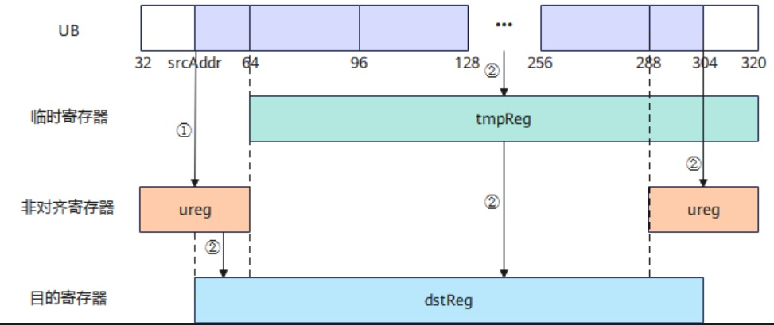
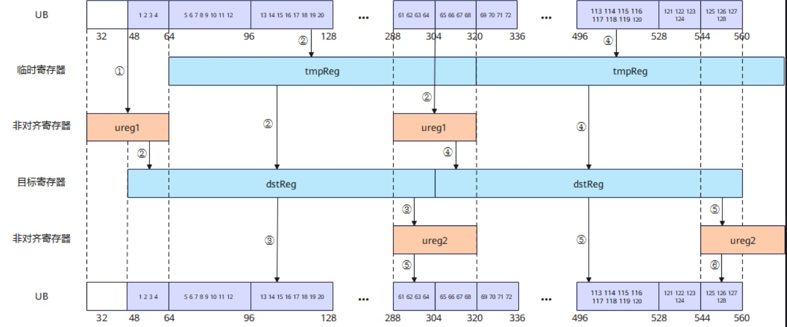

# vf.load_unalign

## 产品支持情况

<!-- npu="950" id1 -->
- Ascend 950PR/Ascend 950DT：支持
<!-- end id1 -->
<!-- npu="A3" id2 -->
- Atlas A3 训练系列产品/Atlas A3 推理系列产品：不支持
<!-- end id2 -->
<!-- npu="910b" id3 -->
- Atlas A2 训练系列产品/Atlas A2 推理系列产品：不支持
<!-- end id3 -->

## 功能说明

为提升对不规则内存地址的处理能力，Reg 矢量计算支持在数据搬运过程中对非 32 字节对齐的地址进行访问，降低非对齐访问带来的性能开销。`vf.load_unalign` 能够实现数据从非对齐的 Unified Buffer（UB）连续搬运至 RegTensor，利用非对齐寄存器 UnalignRegForLoad 作为临时缓存区，暂存跨对齐边界的数据，从而实现高效的连续非对齐数据传输。

在读非对齐地址前，应该先通过 `vf.load_unalign_pre` 进行初始化，保存非 32 字节对齐的数据，然后再调用 `vf.load_unalign` 进行数据搬入。

连续非对齐搬入时，`vf.load_unalign` 会将后续未对齐的数据缓存至 ureg，所以下一次搬入不需要再次调用 `vf.load_unalign_pre`，只需在迭代开始前调用一次 `vf.load_unalign_pre`，从而实现非对齐搬入的性能优化。

### 非对齐搬入原理

如下图所示，从 UB 地址 srcAddr ~ 304 读取数据，并将其搬运至目标寄存器 dstReg（256B）。处理流程如下：

① 调用 **load_unalign_pre** 进行非对齐搬入初始化。非对齐寄存器 ureg 缓存 UB 地址 32 ~ 64 的有效数据，作为后续非对齐访问的前置数据缓存。

② 调用 **load_unalign**，硬件指令将 UB 地址 64 ~ 320 的对齐数据搬入临时寄存器 tmpReg，并将 ureg 中 srcAddr ~ 64 对应的数据与 tmpReg 中地址 64 ~ 304 对应的数据拼接在一起，将结果写入 dstReg。此外，UB 地址 288 ~ 320 的数据会被写入 ureg。

**图 1** 非对齐搬入示例



### 连续非对齐搬入搬出示例

**图 2** 连续非对齐搬入搬出示例（数据类型 uint32_t）



连续非对齐搬入时，`vf.load_unalign` 会将后续未对齐的数据缓存至 ureg，所以下一次搬入不需要再次调用 `vf.load_unalign_pre`，只需在迭代开始前调用一次 `vf.load_unalign_pre`，从而实现非对齐搬入的性能优化。

连续非对齐搬出时，下次迭代的 `vf.store_unalign` 会将本次迭代 `vf.store_unalign` 缓存至 ureg 中的数据写入 UB，所以本次迭代不需要调用 `vf.store_unalign_post` 将 ureg 数据写入 UB，只需在迭代结束后调用一次 `vf.store_unalign_post`，从而实现非对齐搬出的性能优化。

## 函数原型

```python
# 不带步长
dst = vf.load_unalign(align_reg, tile, *, post_update=False)

# 带步长（post_update=True 时自动累进地址）
dst = vf.load_unalign(align_reg, tile, stride, *, post_update=False)
```

## 参数说明

| 参数 | 输入/输出 | 说明 |
|---|---|---|
| `dst` | 输出 | 目的操作数，向量寄存器 |
| `tile` | 输入 | 源 UB tile，起始地址不需要 32 字节对齐 |
| `align_reg` | 输入/输出 | 非对齐寄存器，UnalignRegForLoad 类型，用于存储非 32 字节的数据，寄存器大小为 32 字节（由 `vf.load_unalign_init()` 创建） |
| `stride` | 输入 | 可选，地址更新步长，单位：字节 |
| `post_update` | 输入 | 可选，`True` 时搬运后地址自动累进，默认 `False` |

## 数据类型

目的操作数与源操作数的数据类型需要保持一致。支持的数据类型为：INT8、UINT8、INT16、UINT16、FP16、BF16、INT32、UINT32、FP32、INT64、UINT64。

## 返回值说明

赋值形式 `dst = vf.load_unalign(...)` 返回目标向量寄存器。

## 约束说明

- `vf.load_unalign_pre` 与 `vf.load_unalign` 接口需要组合使用。
- 使用 `stride` 参数时自动进入 POST_UPDATE 模式。

## 调用示例

```python
import pypto_pro.language as pl
import torch
import torch_npu


@pl.vector_function
def example_vf(src_tile, dst_tile):
    # vf 是 @pl.vector_function 函数内的保留命名空间，无需 import
    preg = vf.create_mask(pattern=pl.MaskPattern.ALL, dtype=pl.DT_FP32)
    # 非对齐搬入初始化，只需在迭代开始前调用一次
    ureg = vf.load_unalign_init()
    vf.load_unalign_pre(ureg, src_tile)
    # 非对齐搬入：ureg 缓存跨对齐边界数据
    src_reg = vf.load_unalign(ureg, src_tile, post_update=True)
    vf.store_align(dst_tile, src_reg, preg)


@pl.jit()
def example_kernel(
    a: pl.Tensor[[pl.DYNAMIC, pl.DYNAMIC], pl.DT_FP32],
    out: pl.Tensor[[pl.DYNAMIC, pl.DYNAMIC], pl.DT_FP32],
):
    tf = pl.TileType(shape=[1, 64], dtype=pl.DT_FP32, target_memory=pl.MemorySpace.Vec)
    in_a = pl.make_tile(tf, addr=0, size=256)
    t_out = pl.make_tile(tf, addr=256, size=256)
    with pl.section_vector():
        pl.load(in_a, a, [0, 0])
        pl.system.sync_src(set_pipe=pl.PipeType.MTE2, wait_pipe=pl.PipeType.V, event_id=0)
        pl.system.sync_dst(set_pipe=pl.PipeType.MTE2, wait_pipe=pl.PipeType.V, event_id=0)
        example_vf(in_a, t_out)
        pl.system.sync_src(set_pipe=pl.PipeType.V, wait_pipe=pl.PipeType.MTE3, event_id=1)
        pl.system.sync_dst(set_pipe=pl.PipeType.V, wait_pipe=pl.PipeType.MTE3, event_id=1)
        pl.store(out, t_out, [0, 0])


def test_example():
    device = "npu:0"
    core_nums = 1
    torch.npu.set_device(device)
    a = torch.randn([1, 64], device=device, dtype=torch.float32)
    out = torch.empty([1, 64], device=device, dtype=torch.float32)
    example_kernel[None, core_nums](a, out)
    torch.npu.synchronize()
    torch.testing.assert_close(out, a, rtol=1e-5, atol=1e-5)


if __name__ == "__main__":
    test_example()
    print("PASSED")
```

## 带步长的连续非对齐加载示例

```python
import pypto_pro.language as pl
import torch
import torch_npu


@pl.vector_function
def example_vf(src_tile, dst_tile):
    # vf 是 @pl.vector_function 函数内的保留命名空间，无需 import
    preg = vf.create_mask(pattern=pl.MaskPattern.ALL, dtype=pl.DT_FP32)
    ureg = vf.load_unalign_init()
    vf.load_unalign_pre(ureg, src_tile)
    # 带步长形式：stride=64 指定每次搬运后地址累进 64 个元素
    src_reg = vf.load_unalign(ureg, src_tile, 64, post_update=True)
    vf.store_align(dst_tile, src_reg, preg)


@pl.jit()
def example_kernel(
    a: pl.Tensor[[pl.DYNAMIC, pl.DYNAMIC], pl.DT_FP32],
    out: pl.Tensor[[pl.DYNAMIC, pl.DYNAMIC], pl.DT_FP32],
):
    tf = pl.TileType(shape=[1, 64], dtype=pl.DT_FP32, target_memory=pl.MemorySpace.Vec)
    in_a = pl.make_tile(tf, addr=0, size=256)
    t_out = pl.make_tile(tf, addr=256, size=256)
    with pl.section_vector():
        pl.load(in_a, a, [0, 0])
        pl.system.sync_src(set_pipe=pl.PipeType.MTE2, wait_pipe=pl.PipeType.V, event_id=0)
        pl.system.sync_dst(set_pipe=pl.PipeType.MTE2, wait_pipe=pl.PipeType.V, event_id=0)
        example_vf(in_a, t_out)
        pl.system.sync_src(set_pipe=pl.PipeType.V, wait_pipe=pl.PipeType.MTE3, event_id=1)
        pl.system.sync_dst(set_pipe=pl.PipeType.V, wait_pipe=pl.PipeType.MTE3, event_id=1)
        pl.store(out, t_out, [0, 0])


def test_example_2():
    device = "npu:0"
    core_nums = 1
    torch.npu.set_device(device)
    a = torch.randn([1, 64], device=device, dtype=torch.float32)
    out = torch.empty([1, 64], device=device, dtype=torch.float32)
    example_kernel[None, core_nums](a, out)
    torch.npu.synchronize()
    torch.testing.assert_close(out, a, rtol=1e-5, atol=1e-5)


if __name__ == "__main__":
    test_example_2()
    print("PASSED")
```
