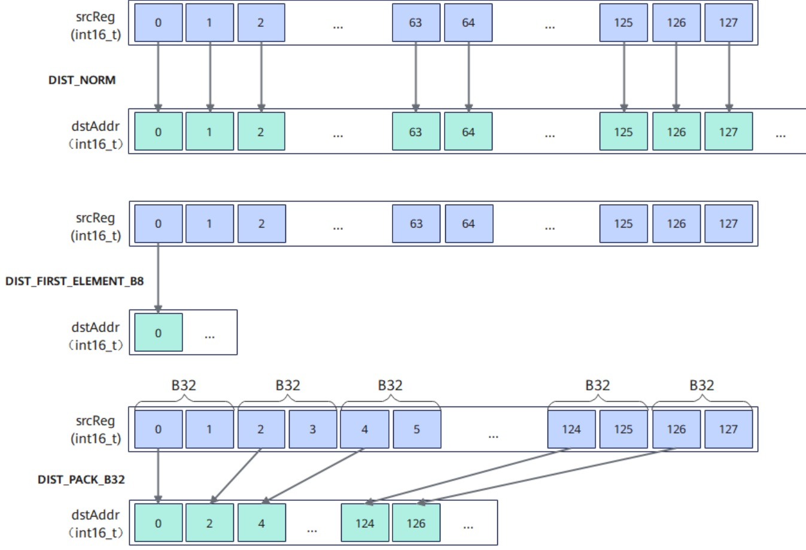

# vf.store_align

## 产品支持情况

<!-- npu="950" id1 -->
- Ascend 950PR/Ascend 950DT：支持
<!-- end id1 -->
<!-- npu="A3" id2 -->
- Atlas A3 训练系列产品/Atlas A3 推理系列产品：不支持
<!-- end id2 -->
<!-- npu="910b" id3 -->
- Atlas A2 训练系列产品/Atlas A2 推理系列产品：不支持
<!-- end id3 -->

## 功能说明

将向量寄存器或掩码寄存器（MaskReg）数据对齐存储到 UB tile。支持普通存储、带 dist 存储、interleaved 存储、post-update 连续存储、DataBlock 拷贝模式存储和 MaskReg 存储模式。当源寄存器为 MaskReg 时，后端自动分派 MaskReg 存储路径，此时无需传入谓词 mask 参数。

数据搬出时，可以通过 `dist` 关键字参数配置搬运的数据分布模式，能够实现压缩、只搬出第一个元素等功能。下图展示了 DIST_NORM、DIST_FIRST_ELEMENT_B16、DIST_PACK_B32 等分布模式的搬出示意：

**图 1** 连续对齐搬出分布模式图示



## 函数原型

```python
# 普通对齐存储
vf.store_align(tile, src, preg)

# 带 dist 对齐存储
vf.store_align(tile, src, preg, *, dist=pl.StoreDist.NORM)
vf.store_align(tile, src, preg, *, dist=pl.StoreDist.NORM_B16)
vf.store_align(tile, src, preg, *, dist=pl.StoreDist.FIRST_ELEMENT)
vf.store_align(tile, src, preg, *, dist=pl.StoreDist.PACK)
vf.store_align(tile, src, preg, *, dist=pl.StoreDist.PACK4)

# Interleaved 存储（偶数/奇数寄存器交错写入）
vf.store_align(tile, src_even, src_odd, preg, *, dist=pl.StoreDist.INTLV)
vf.store_align(tile, src_even, src_odd, preg, *, dist=pl.StoreDist.INTLV_B32)

# 带 post-update 的连续存储（搬运后地址自动累进）
vf.store_align(tile, src, preg, *, post_update=True)
vf.store_align(tile, src, preg, stride, *, post_update=True)

# DataBlock 拷贝模式存储（带块步长和重复步长）
vf.store_align(tile, src, preg, *, data_copy_mode=pl.DataCopyMode.DATA_BLOCK_COPY, block_stride=0, repeat_stride=0)
vf.store_align(tile, src, preg, block_stride, repeat_stride, *, data_copy_mode=pl.DataCopyMode.DATA_BLOCK_COPY)

# AddrReg 偏移存储（第 4 个参数传入 AddrReg）
vf.store_align(tile, src, preg, addr_reg)

# MaskReg 存储（src 为 MaskReg 时自动分派，无需谓词 mask）
vf.store_align(tile, mask_reg)                                       # 固定偏移
vf.store_align(tile, mask_reg, *, dist=pl.StoreDist.PACK)            # 压缩模式
vf.store_align(tile, mask_reg, addr_reg)                             # AddrReg 偏移
vf.store_align(tile, mask_reg, addr_reg, *, dist=pl.StoreDist.PACK)  # AddrReg + 压缩
vf.store_align(tile, mask_reg, offset, *, post_update=True)          # post-update
```

## 参数说明

| 参数 | 输入/输出 | 说明 |
|---|---|---|
| `tile` | 输出 | 目标 UB tile |
| `src` | 输入 | 源向量寄存器 |
| `src_even` / `src_odd` | 输入 | Interleaved 模式下的偶数/奇数源寄存器，类型需一致 |
| `preg` | 输入 | 谓词掩码寄存器，指定写入的元素范围。MaskReg 源时无需传入 |
| `addr_reg` | 输入 | 可选，由 `vf.create_addr_reg` 创建的地址偏移寄存器 |
| `stride` | 输入 | 可选，post-update 模式下的地址累进步长（元素数），作为第 4 个位置参数传入。默认 0。B64 类型自动翻倍 |
| `dist` | 输入 | 可选，数据分布模式：<br>RegTensor 源：``pl.StoreDist.NORM``（普通对齐，默认）、``pl.StoreDist.NORM_B16``、``pl.StoreDist.FIRST_ELEMENT``（仅存储 lane 0）、``pl.StoreDist.PACK``（压缩存储）、``pl.StoreDist.PACK4``（4 元素压缩）、``pl.StoreDist.INTLV``（交错存储，自动按 dtype 选择 B8/B16/B32）、``pl.StoreDist.INTLV_B32``（B32 粒度交错存储）<br>MaskReg 源：``pl.StoreDist.NORM``（正常模式，搬运 VL/8）、``pl.StoreDist.PACK``（压缩模式） |
| `post_update` | 输入 | 可选，`True` 时搬运后目标地址自动累进，默认 `False`。适用于循环内连续存储 |
| `data_copy_mode` | 输入 | 可选，数据拷贝模式：``pl.DataCopyMode.NORM``（默认）或 ``pl.DataCopyMode.DATA_BLOCK_COPY``（非连续 DataBlock 存储） |
| `block_stride` | 输入 | 可选，DataBlock 拷贝模式下的块步长，可作位置参数（第 4 个）或关键字参数传入 |
| `repeat_stride` | 输入 | 可选，DataBlock 拷贝模式下的重复步长，可作位置参数（第 5 个）或关键字参数传入 |

## 数据类型

| src | tile |
|---|---|
| INT8 | INT8 |
| UINT8 | UINT8 |
| INT16 | INT16 |
| UINT16 | UINT16 |
| FP16 | FP16 |
| BF16 | BF16 |
| INT32 | INT32 |
| UINT32 | UINT32 |
| FP32 | FP32 |
| INT64 | INT64 |
| UINT64 | UINT64 |

## 返回值说明

无

## 约束说明

- 目标地址需要 32 字节对齐。
- Interleaved 存储模式（`dist=pl.StoreDist.INTLV` / `INTLV_B32`）需要传入两个源寄存器（`src_even`、`src_odd`），两者类型需一致。
- MaskReg 源存储无需传入谓词 mask 参数，后端自动分派 MaskReg 存储路径。
- 使用 AddrReg 偏移时，按源类型自动分派：RegTensor 源走对齐存储，MaskReg 源走 MaskReg 存储。

## 调用示例

```python
import pypto_pro.language as pl
import torch
import torch_npu


@pl.vector_function
def example_vf(src_tile, dst_tile):
    # vf 是 @pl.vector_function 函数内的保留命名空间，无需 import
    preg = vf.create_mask(pattern=pl.MaskPattern.ALL, dtype=pl.DT_FP32)
    reg = vf.load_align(src_tile, 0)
    # 普通对齐存储
    vf.store_align(dst_tile, reg, preg)


@pl.jit()
def example_kernel(
    a: pl.Tensor[[pl.DYNAMIC, pl.DYNAMIC], pl.DT_FP32],
    out: pl.Tensor[[pl.DYNAMIC, pl.DYNAMIC], pl.DT_FP32],
):
    tf = pl.TileType(shape=[1, 64], dtype=pl.DT_FP32, target_memory=pl.MemorySpace.Vec)
    in_a = pl.make_tile(tf, addr=0, size=256)
    t_out = pl.make_tile(tf, addr=256, size=256)
    with pl.section_vector():
        pl.load(in_a, a, [0, 0])
        pl.system.sync_src(set_pipe=pl.PipeType.MTE2, wait_pipe=pl.PipeType.V, event_id=0)
        pl.system.sync_dst(set_pipe=pl.PipeType.MTE2, wait_pipe=pl.PipeType.V, event_id=0)
        example_vf(in_a, t_out)
        pl.system.sync_src(set_pipe=pl.PipeType.V, wait_pipe=pl.PipeType.MTE3, event_id=1)
        pl.system.sync_dst(set_pipe=pl.PipeType.V, wait_pipe=pl.PipeType.MTE3, event_id=1)
        pl.store(out, t_out, [0, 0])


def test_example():
    device = "npu:0"
    core_nums = 1
    torch.npu.set_device(device)
    a = torch.randn([1, 64], device=device, dtype=torch.float32)
    out = torch.empty([1, 64], device=device, dtype=torch.float32)
    example_kernel[None, core_nums](a, out)
    torch.npu.synchronize()
    torch.testing.assert_close(out, a, rtol=1e-5, atol=1e-5)


if __name__ == "__main__":
    test_example()
    print("PASSED")
```

## Interleaved 存储示例

使用 `dist=pl.StoreDist.INTLV_B32` 将偶数/奇数寄存器交错写入 UB：

```python
import pypto_pro.language as pl
import torch
import torch_npu


@pl.vector_function
def example_vf(src_tile, dst_tile):
    # vf 是 @pl.vector_function 函数内的保留命名空间，无需 import
    preg = vf.create_mask(pattern=pl.MaskPattern.ALL, dtype=pl.DT_FP32)
    # 加载数据，然后按 DINTLV_B32 拆分为偶数/奇数寄存器
    dst_even, dst_odd = vf.load_align(src_tile, 0, dist=pl.LoadDist.DINTLV_B32)
    # INTLV_B32：将偶数/奇数寄存器交错写回 UB（还原原始布局）
    vf.store_align(dst_tile, dst_even, dst_odd, preg, dist=pl.StoreDist.INTLV_B32)


@pl.jit()
def example_kernel(
    a: pl.Tensor[[pl.DYNAMIC, pl.DYNAMIC], pl.DT_FP32],
    out: pl.Tensor[[pl.DYNAMIC, pl.DYNAMIC], pl.DT_FP32],
):
    tf = pl.TileType(shape=[1, 64], dtype=pl.DT_FP32, target_memory=pl.MemorySpace.Vec)
    in_a = pl.make_tile(tf, addr=0, size=256)
    t_out = pl.make_tile(tf, addr=256, size=256)
    with pl.section_vector():
        pl.load(in_a, a, [0, 0])
        pl.system.sync_src(set_pipe=pl.PipeType.MTE2, wait_pipe=pl.PipeType.V, event_id=0)
        pl.system.sync_dst(set_pipe=pl.PipeType.MTE2, wait_pipe=pl.PipeType.V, event_id=0)
        example_vf(in_a, t_out)
        pl.system.sync_src(set_pipe=pl.PipeType.V, wait_pipe=pl.PipeType.MTE3, event_id=1)
        pl.system.sync_dst(set_pipe=pl.PipeType.V, wait_pipe=pl.PipeType.MTE3, event_id=1)
        pl.store(out, t_out, [0, 0])


def test_example_2():
    device = "npu:0"
    core_nums = 1
    torch.npu.set_device(device)
    a = torch.randn([1, 64], device=device, dtype=torch.float32)
    out = torch.empty([1, 64], device=device, dtype=torch.float32)
    example_kernel[None, core_nums](a, out)
    torch.npu.synchronize()
    torch.testing.assert_close(out, a, rtol=1e-5, atol=1e-5)


if __name__ == "__main__":
    test_example_2()
    print("PASSED")
```

## AddrReg 偏移存储示例

使用 `vf.create_addr_reg` 创建地址偏移寄存器，在循环中同步偏移 load 和 store 地址：

```python
import pypto_pro.language as pl
import torch
import torch_npu


@pl.vector_function
def example_vf(src_tile, dst_tile):
    # vf 是 @pl.vector_function 函数内的保留命名空间，无需 import
    preg = vf.create_mask(pattern=pl.MaskPattern.ALL, dtype=pl.DT_FP32)
    one_repeat_size = 64
    repeat_times = 2
    for i in pl.range(0, repeat_times, 1):
        a_reg = vf.create_addr_reg(i, one_repeat_size, dtype=pl.DT_FP32)
        reg = vf.load_align(src_tile, a_reg)
        # store_align 也支持 AddrReg 作为第 4 个参数，同步偏移目标地址
        vf.store_align(dst_tile, reg, preg, a_reg)


@pl.jit()
def example_kernel(
    a: pl.Tensor[[pl.DYNAMIC, pl.DYNAMIC], pl.DT_FP32],
    out: pl.Tensor[[pl.DYNAMIC, pl.DYNAMIC], pl.DT_FP32],
):
    tf = pl.TileType(shape=[1, 128], dtype=pl.DT_FP32, target_memory=pl.MemorySpace.Vec)
    in_a = pl.make_tile(tf, addr=0, size=512)
    t_out = pl.make_tile(tf, addr=512, size=512)
    with pl.section_vector():
        pl.load(in_a, a, [0, 0])
        pl.system.sync_src(set_pipe=pl.PipeType.MTE2, wait_pipe=pl.PipeType.V, event_id=0)
        pl.system.sync_dst(set_pipe=pl.PipeType.MTE2, wait_pipe=pl.PipeType.V, event_id=0)
        example_vf(in_a, t_out)
        pl.system.sync_src(set_pipe=pl.PipeType.V, wait_pipe=pl.PipeType.MTE3, event_id=1)
        pl.system.sync_dst(set_pipe=pl.PipeType.V, wait_pipe=pl.PipeType.MTE3, event_id=1)
        pl.store(out, t_out, [0, 0])


def test_example_3():
    device = "npu:0"
    core_nums = 1
    torch.npu.set_device(device)
    a = torch.randn([1, 128], device=device, dtype=torch.float32)
    out = torch.empty([1, 128], device=device, dtype=torch.float32)
    example_kernel[None, core_nums](a, out)
    torch.npu.synchronize()
    torch.testing.assert_close(out, a, rtol=1e-5, atol=1e-5)


if __name__ == "__main__":
    test_example_3()
    print("PASSED")
```

## MaskReg 存储示例

当 `src` 为 MaskReg 时，`vf.store_align` 自动分派 MaskReg 存储路径，无需传入谓词 mask 参数：

```python
import pypto_pro.language as pl
import torch
import torch_npu


@pl.vector_function
def example_vf(src_tile, mask_buf_tile, dst_tile):
    # vf 是 @pl.vector_function 函数内的保留命名空间，无需 import
    preg = vf.create_mask(pattern=pl.MaskPattern.ALL, dtype=pl.DT_FP32)
    reg_a = vf.load_align(src_tile, 0)
    # 比较生成掩码
    cmp_mask = vf.ge(reg_a, 0.0, preg)
    # 将 MaskReg 存储到 UB（psts 指令，PK 压缩模式：32B → 16B），无需谓词 mask
    vf.store_align(mask_buf_tile, cmp_mask, dist=pl.StoreDist.PACK)
    vf.mem_bar(mode=pl.MemBarMode.VST_VLD)
    # 从 UB 加载掩码回 MaskReg（plds 指令，US 上采样与 PK 互补：16B → 32B）
    # 需先用 create_mask 预声明 MaskReg 的 dtype，避免从 UINT32 tile 推断出错误 dtype
    loaded_mask = vf.create_mask(pattern=pl.MaskPattern.ALL, dtype=pl.DT_FP32)
    loaded_mask = vf.load_align(mask_buf_tile, dist=pl.LoadDist.US)
    # mask=1 处取 abs，mask=0 处置零
    reg_dst = vf.abs(reg_a, loaded_mask)
    vf.store_align(dst_tile, reg_dst, preg)


@pl.jit()
def example_kernel(
    a: pl.Tensor[[pl.DYNAMIC, pl.DYNAMIC], pl.DT_FP32],
    out: pl.Tensor[[pl.DYNAMIC, pl.DYNAMIC], pl.DT_FP32],
):
    tf = pl.TileType(shape=[1, 64], dtype=pl.DT_FP32, target_memory=pl.MemorySpace.Vec)
    tu = pl.TileType(shape=[1, 64], dtype=pl.DT_UINT32, target_memory=pl.MemorySpace.Vec)
    in_a = pl.make_tile(tf, addr=0, size=256)
    t_mask = pl.make_tile(tu, addr=256, size=256)
    t_out = pl.make_tile(tf, addr=512, size=256)
    with pl.section_vector():
        pl.load(in_a, a, [0, 0])
        pl.system.sync_src(set_pipe=pl.PipeType.MTE2, wait_pipe=pl.PipeType.V, event_id=0)
        pl.system.sync_dst(set_pipe=pl.PipeType.MTE2, wait_pipe=pl.PipeType.V, event_id=0)
        example_vf(in_a, t_mask, t_out)
        pl.system.sync_src(set_pipe=pl.PipeType.V, wait_pipe=pl.PipeType.MTE3, event_id=1)
        pl.system.sync_dst(set_pipe=pl.PipeType.V, wait_pipe=pl.PipeType.MTE3, event_id=1)
        pl.store(out, t_out, [0, 0])


def test_example_4():
    device = "npu:0"
    core_nums = 1
    torch.npu.set_device(device)
    a = torch.randn([1, 64], device=device, dtype=torch.float32)
    out = torch.empty([1, 64], device=device, dtype=torch.float32)
    example_kernel[None, core_nums](a, out)
    torch.npu.synchronize()
    expected = torch.where(a >= 0, torch.abs(a), torch.tensor(0.0, device=device))
    torch.testing.assert_close(out, expected, rtol=1e-5, atol=1e-5)


if __name__ == "__main__":
    test_example_4()
    print("PASSED")
```

## Post-update 连续存储示例

使用 `post_update=True` 在循环中连续存储，目标地址自动累进，无需手动计算偏移：

```python
import pypto_pro.language as pl
import torch
import torch_npu


@pl.vector_function
def example_vf(src_tile, dst_tile):
    # vf 是 @pl.vector_function 函数内的保留命名空间，无需 import
    preg = vf.create_mask(pattern=pl.MaskPattern.ALL, dtype=pl.DT_FP32)
    one_repeat_size = 64
    repeat_times = 2
    for i in pl.range(0, repeat_times, 1):
        reg = vf.load_align(src_tile, i * one_repeat_size)
        # post_update：每次存储后目标地址自动前进 stride 个元素
        vf.store_align(dst_tile, reg, preg, one_repeat_size, post_update=True)


@pl.jit()
def example_kernel(
    a: pl.Tensor[[pl.DYNAMIC, pl.DYNAMIC], pl.DT_FP32],
    out: pl.Tensor[[pl.DYNAMIC, pl.DYNAMIC], pl.DT_FP32],
):
    tf = pl.TileType(shape=[1, 128], dtype=pl.DT_FP32, target_memory=pl.MemorySpace.Vec)
    in_a = pl.make_tile(tf, addr=0, size=512)
    t_out = pl.make_tile(tf, addr=512, size=512)
    with pl.section_vector():
        pl.load(in_a, a, [0, 0])
        pl.system.sync_src(set_pipe=pl.PipeType.MTE2, wait_pipe=pl.PipeType.V, event_id=0)
        pl.system.sync_dst(set_pipe=pl.PipeType.MTE2, wait_pipe=pl.PipeType.V, event_id=0)
        example_vf(in_a, t_out)
        pl.system.sync_src(set_pipe=pl.PipeType.V, wait_pipe=pl.PipeType.MTE3, event_id=1)
        pl.system.sync_dst(set_pipe=pl.PipeType.V, wait_pipe=pl.PipeType.MTE3, event_id=1)
        pl.store(out, t_out, [0, 0])


def test_example_5():
    device = "npu:0"
    core_nums = 1
    torch.npu.set_device(device)
    a = torch.randn([1, 128], device=device, dtype=torch.float32)
    out = torch.empty([1, 128], device=device, dtype=torch.float32)
    example_kernel[None, core_nums](a, out)
    torch.npu.synchronize()
    torch.testing.assert_close(out, a, rtol=1e-5, atol=1e-5)


if __name__ == "__main__":
    test_example_5()
    print("PASSED")
```
