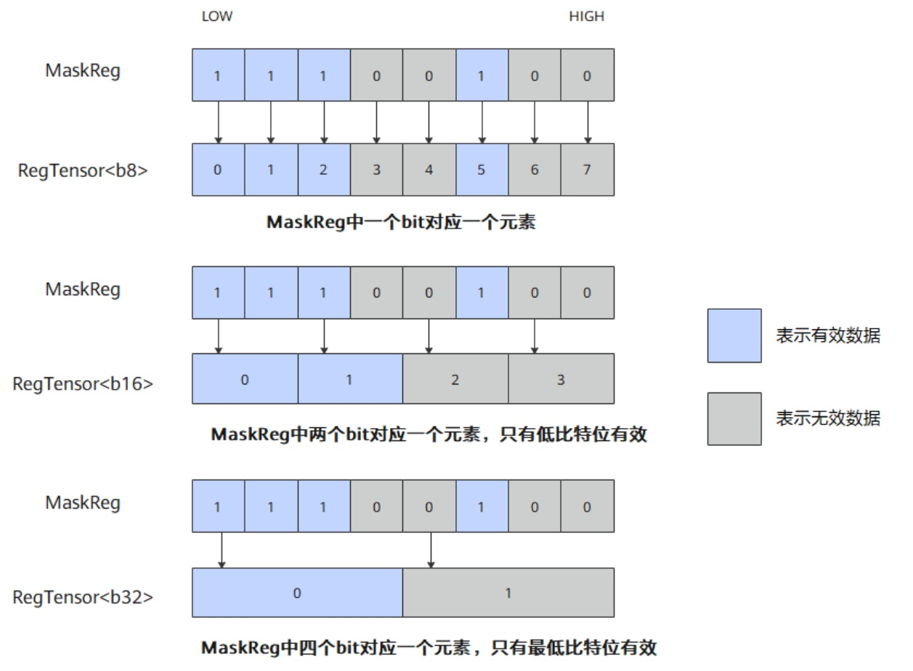

# vf.mask_reg（概念说明）

## 产品支持情况

<!-- npu="950" id1 -->
- Ascend 950PR/Ascend 950DT：支持
<!-- end id1 -->
<!-- npu="A3" id2 -->
- Atlas A3 训练系列产品/Atlas A3 推理系列产品：不支持
<!-- end id2 -->
<!-- npu="910b" id3 -->
- Atlas A2 训练系列产品/Atlas A2 推理系列产品：不支持
<!-- end id3 -->

## 功能说明

MaskReg（掩码寄存器）用于指示在计算过程中哪些元素参与计算，宽度为 [RegTensor](../reg_tensor.md) 的八分之一（VL/8）。

如下图所示，当操作数类型为 b8 时，每一个 element 对应 1bit MaskReg；当操作数类型为 b16 时，每一个 element 对应 2bit MaskReg，且仅 2bit 中的最低位是有效的；当操作数类型为 b32 时，每一个 element 对应 4bit MaskReg，且仅 4bit 中的最低位是有效的。

**图 1** MaskReg 计算过程


mask_reg 由 `vf.create_mask` 或 `vf.update_mask` 产生，作为 `MaskReg` 类型的参数直接传递给矢量计算 API，控制哪些元素参与运算。

## 函数原型

- CreateMask 接口

```python
preg = vf.create_mask(*, pattern=pl.MaskPattern.ALL, dtype=pl.DT_FP32)
```

- UpdateMask 接口

```python
preg = vf.update_mask(scalar, *, dtype=pl.DT_FP32)
```

## 参数说明

**CreateMask 参数说明**

| 参数 | 输入/输出 | 说明 |
|---|---|---|
| `pattern` | 输入 | 创建 MaskReg 的模式，字符串类型。取值见下表，默认 ``pl.MaskPattern.ALL`` |
| `dtype` | 输入 | 掩码对应的数据类型，决定掩码覆盖的元素个数 |

**MaskPattern 取值说明**

| 取值 | 含义 |
|---|---|
| `ALL` | 所有元素设置为有效数据 |
| `VL1` | 最低 1 个元素设置为有效数据 |
| `VL2` | 最低 2 个元素设置为有效数据 |
| `VL4` | 最低 4 个元素设置为有效数据 |
| `VL8` | 最低 8 个元素设置为有效数据 |
| `VL16` | 最低 16 个元素设置为有效数据 |
| `VL32` | 最低 32 个元素设置为有效数据 |
| `VL64` | 最低 64 个元素设置为有效数据 |
| `VL128` | 最低 128 个元素设置为有效数据 |
| `M3` | 3 的倍数设置为有效数据 |
| `M4` | 4 的倍数设置为有效数据 |
| `H` | 最低一半元素设置为有效数据 |
| `Q` | 最低四分之一元素设置为有效数据 |
| `ALLF` | 所有元素设置为无效数据 |

**UpdateMask 参数说明**

| 参数 | 输入/输出 | 说明 |
|---|---|---|
| `scalar` | 输入 | 标量值，其比特位定义新的掩码模式 |
| `dtype` | 输入 | 掩码对应的数据类型，决定掩码宽度（默认 `pl.DT_FP32`） |

## 数据类型

MaskReg 支持的数据类型为：b8、b16、b32、b64（即 `pl.DT_UINT8`/`pl.DT_INT8`、`pl.DT_UINT16`/`pl.DT_FP16`/`pl.DT_BF16`、`pl.DT_UINT32`/`pl.DT_FP32`/`pl.DT_INT32`、`pl.DT_INT64`/`pl.DT_UINT64`）。

## 返回值说明

返回一个 `MaskReg` 实例，供后续 VF 算子使用。

## 约束说明

- MaskReg 寄存器数量上限为 8。超出限制上限的寄存器数据会写入预留的 8K UB 内存中，可能会引起性能劣化。编译器会自动复用生命周期结束的寄存器和预留内存，若寄存器与预留内存均存在可用空间，将优先复用寄存器。

## Mask 设置方式

在 Mask 设置中，Reg 矢量计算支持多种灵活配置方式，可根据实际计算场景选择：

| 编号 | 设置方式 | 涉及接口 | 说明 |
|---|---|---|---|
| 1 | 调用接口设置 | `vf.create_mask` | 以固定的 pattern 设置 Mask，每次循环均使用此 Mask |
| 2 | 调用接口设置 | `vf.update_mask` | 根据 count 生成对应长度的有效位掩码，并自动更新剩余待处理元素数量 |
| 3 | 从 UB 搬运 | `vf.load_align` | 从 UB 搬运 Mask 数据到 MaskReg，通过 `dist` 关键字参数区分 MaskReg 目标 |
| 4 | 从 RegTensor 生成 | `vf.mask_gen_with_reg_tensor` | 从 RegTensor 的指定 bit 位生成 MaskReg |
| 5 | 从 SPR 读取 | `vf.get_mask_spr` | 从 SetVectorMask 设置的掩码寄存器 {MASK1, MASK0} 中读取 Mask 值 |

## 调用示例

```python
import pypto_pro.language as pl
import torch
import torch_npu


@pl.vector_function
def example_vf(src_tile, dst_tile):
    # create_mask 以固定 pattern 设置 Mask
    preg = vf.create_mask(pattern=pl.MaskPattern.ALL, dtype=pl.DT_FP32)
    reg = vf.load_align(src_tile, 0)
    # update_mask 从标量值生成掩码
    preg_tail = vf.update_mask(0xFFFFFFFF, dtype=pl.DT_FP32)
    vf.store_align(dst_tile, reg, preg_tail)


@pl.jit()
def example_kernel(
    a: pl.Tensor[[pl.DYNAMIC, pl.DYNAMIC], pl.DT_FP32],
    out: pl.Tensor[[pl.DYNAMIC, pl.DYNAMIC], pl.DT_FP32],
):
    tf = pl.TileType(shape=[1, 64], dtype=pl.DT_FP32, target_memory=pl.MemorySpace.Vec)
    in_a = pl.make_tile(tf, addr=0, size=256)
    t_out = pl.make_tile(tf, addr=256, size=256)
    with pl.section_vector():
        pl.load(in_a, a, [0, 0])
        pl.system.sync_src(set_pipe=pl.PipeType.MTE2, wait_pipe=pl.PipeType.V, event_id=0)
        pl.system.sync_dst(set_pipe=pl.PipeType.MTE2, wait_pipe=pl.PipeType.V, event_id=0)
        example_vf(in_a, t_out)
        pl.system.sync_src(set_pipe=pl.PipeType.V, wait_pipe=pl.PipeType.MTE3, event_id=1)
        pl.system.sync_dst(set_pipe=pl.PipeType.V, wait_pipe=pl.PipeType.MTE3, event_id=1)
        pl.store(out, t_out, [0, 0])


def test_example():
    device = "npu:0"
    core_nums = 1
    torch.npu.set_device(device)
    a = torch.randn([1, 64], device=device, dtype=torch.float32)
    out = torch.empty([1, 64], device=device, dtype=torch.float32)
    example_kernel[None, core_nums](a, out)
    torch.npu.synchronize()
    torch.testing.assert_close(out, a, rtol=1e-5, atol=1e-5)


if __name__ == "__main__":
    test_example()
    print("PASSED")
```
