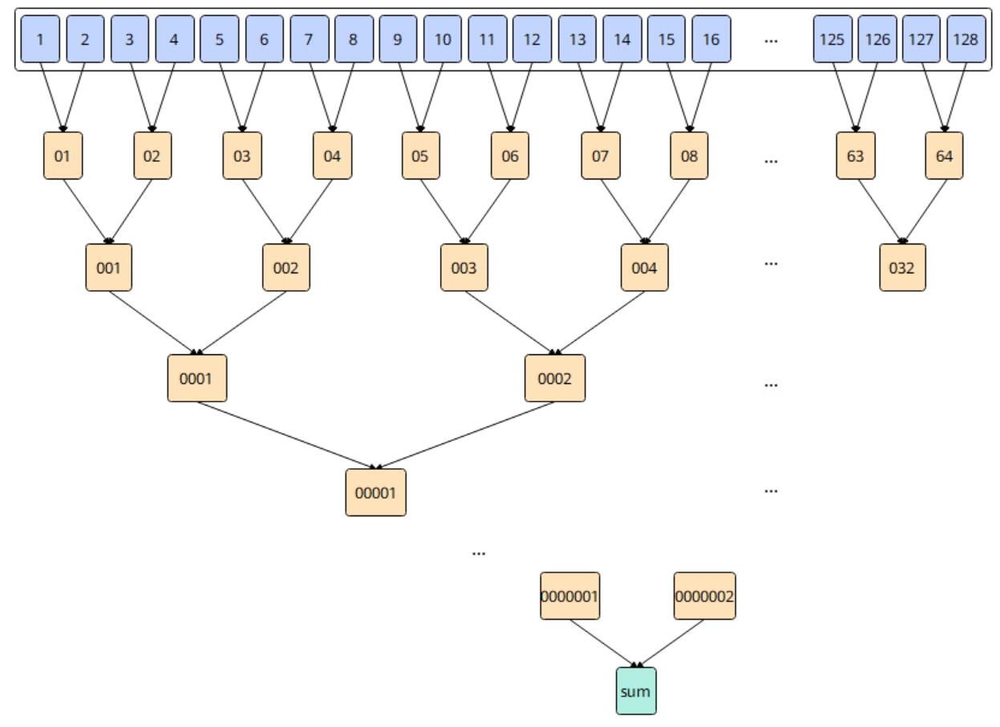

# vf.reduce_min

## 产品支持情况

<!-- npu="950" id1 -->
- Ascend 950PR/Ascend 950DT：支持
<!-- end id1 -->
<!-- npu="A3" id2 -->
- Atlas A3 训练系列产品/Atlas A3 推理系列产品：不支持
<!-- end id2 -->
<!-- npu="910b" id3 -->
- Atlas A2 训练系列产品/Atlas A2 推理系列产品：不支持
<!-- end id3 -->

## 功能说明

向量寄存器最小值归约：将源寄存器中的所有有效元素求最小值，结果写入目标寄存器的第一个元素。

必须在 `@pl.vector_function` 函数内使用。

## 函数原型

```python
dst = vf.reduce_min(src, preg, *, datablock=False, merge_mode=pl.MergeMode.ZEROING)
```

## 参数说明

| 参数 | 输入/输出 | 说明 |
|---|---|---|
| `dst` | 输出 | 目标向量寄存器，归约结果写入第一个元素 |
| `src` | 输入 | 源向量寄存器 |
| `preg` | 输入 | 掩码寄存器 |
| `datablock` | 输入 | 可选，``True`` 时按 datablock 粒度归约，默认 ``False`` |
| `merge_mode` | 输入 | 可选，合并模式：``pl.MergeMode.ZEROING``（默认）或 ``pl.MergeMode.MERGING`` |

## 数据类型

| src | dst |
|---|---|
| FP16 | FP16 |
| FP32 | FP32 |
| BF16 | BF16 |
| INT32 | INT32 |
| UINT32 | UINT32 |

## 返回值说明

返回目标向量寄存器（`RegTensor` 类型）。

## 约束说明

- 本接口操作数为寄存器，不涉及地址对齐。
- 本接口不修改全局寄存器的值。
- 源操作数与目标操作数的数据类型需要保持一致。
- 当所有元素均不参与计算时（mask 为空），将该数据类型的最大值写入 dstReg。
- 当存在多个最小值时，会将第一个最小值的索引保存在 dstReg 中。
- min(-0, +0) = -0。
- 如果输入数据存在 nan，将该数据类型的 nan 写入 dstReg，并将第一个 nan 的索引保存在 dstReg 中。

## 关键特性

**索引值需要强制类型转换**

dstReg 的最小值索引按照 dstReg 的数据类型存储，比如 dstReg 为 half 类型时，索引按照 half 类型存储，因此读取索引需要使用 reinterpret_cast 方法转换到整数类型。若数据类型是 half，需要使用 reinterpret_cast<uint16_t*>；若数据类型是 float，需要使用 reinterpret_cast<uint32_t*>。

归约求最小值的计算过程及索引保存方式如下图所示：

**图 1** ReduceMin 归约索引示意图



## 调用示例

```python
import pypto_pro.language as pl
import torch
import torch_npu


@pl.vector_function
def example_vf(src_tile, dst_tile):
    preg_all = vf.create_mask(pattern=pl.MaskPattern.ALL, dtype=pl.DT_FP32)
    src0 = vf.load_align(src_tile, 0)
    min0 = vf.reduce_min(src0, preg_all)
    vf.store_align(dst_tile, min0, preg_all)


@pl.jit()
def example_kernel(
    a: pl.Tensor[[pl.DYNAMIC, pl.DYNAMIC], pl.DT_FP32],
    out: pl.Tensor[[pl.DYNAMIC, pl.DYNAMIC], pl.DT_FP32],
):
    tf = pl.TileType(shape=[1, 64], dtype=pl.DT_FP32, target_memory=pl.MemorySpace.Vec)
    in_a = pl.make_tile(tf, addr=0, size=256)
    t_out = pl.make_tile(tf, addr=256, size=256)
    with pl.section_vector():
        pl.load(in_a, a, [0, 0])
        pl.system.sync_src(set_pipe=pl.PipeType.MTE2, wait_pipe=pl.PipeType.V, event_id=0)
        pl.system.sync_dst(set_pipe=pl.PipeType.MTE2, wait_pipe=pl.PipeType.V, event_id=0)
        example_vf(in_a, t_out)
        pl.system.sync_src(set_pipe=pl.PipeType.V, wait_pipe=pl.PipeType.MTE3, event_id=1)
        pl.system.sync_dst(set_pipe=pl.PipeType.V, wait_pipe=pl.PipeType.MTE3, event_id=1)
        pl.store(out, t_out, [0, 0])


def test_example():
    device = "npu:0"
    core_nums = 1
    torch.npu.set_device(device)
    a = torch.randn([1, 64], device=device, dtype=torch.float32)
    out = torch.empty([1, 64], device=device, dtype=torch.float32)
    example_kernel[None, core_nums](a, out)
    torch.npu.synchronize()
    torch.testing.assert_close(out[0, 0], torch.min(a), rtol=1e-5, atol=1e-5)


if __name__ == "__main__":
    test_example()
    print("PASSED")
```
