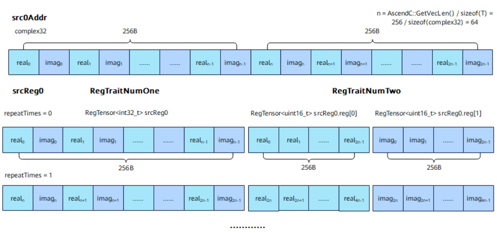
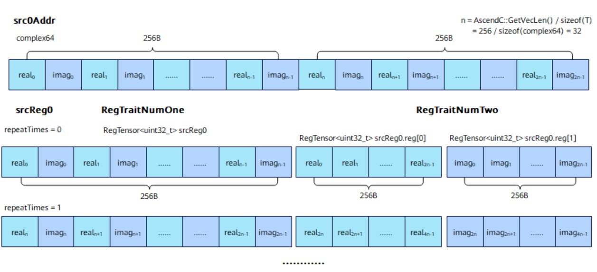
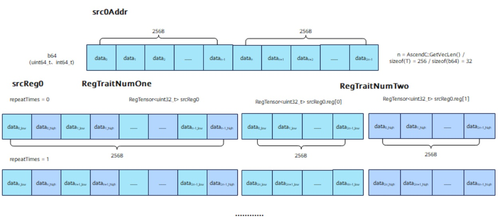

# vf.reg_tensor

## 产品支持情况

<!-- npu="950" id1 -->
- Ascend 950PR/Ascend 950DT：支持
<!-- end id1 -->
<!-- npu="A3" id2 -->
- Atlas A3 训练系列产品/Atlas A3 推理系列产品：不支持
<!-- end id2 -->
<!-- npu="910b" id3 -->
- Atlas A2 训练系列产品/Atlas A2 推理系列产品：不支持
<!-- end id3 -->

## 功能说明

向量寄存器，VF 计算的基本数据容器。用于存储从 UB tile 加载的数据、VF 运算的中间结果和最终输出。

`vf.reg_tensor` 是 `@pl.vector_function` 装饰的函数内的保留命名空间 `vf` 提供的核心类型，无需额外 import。

## 函数原型

`vf.reg_tensor` 为类型声明，不能直接调用，由编译器在赋值形式中自动声明。通过以下接口的赋值形式创建：

- 从 UB tile 加载数据

```python
reg = vf.load_align(tile, offset, *, dtype=None)
```

- 标量初始化

```python
reg = vf.full(scalar, preg, *, dtype)
```

- VF 运算结果赋值

```python
reg = vf.add(src_a, src_b, preg)
reg = vf.mul(src_a, src_b, preg)
# ...其他 VF 计算接口
```

## 参数说明

| 参数 | 输入/输出 | 说明 |
|---|---|---|
| `dtype` | 输入 | 寄存器存储的数据类型，决定寄存器覆盖的元素个数 |

## 支持的数据类型

| dtype | 元素个数 | 典型用途 |
|---|---|---|
| `pypto_pro.language.DT_FP32` | 64 个 | 单精度浮点运算 |
| `pypto_pro.language.DT_FP16` | 128 个 | 半精度浮点运算 |
| `pypto_pro.language.DT_UINT32` | 64 个 | 32 位无符号整数（索引、计数） |
| `pypto_pro.language.DT_UINT16` | 128 个 | 16 位无符号整数（掩码、键值） |
| `pypto_pro.language.DT_UINT8` | 256 个 | 8 位无符号整数（直方图统计） |

## 数据类型

RegTensor 支持的数据类型由 `dtype` 参数决定，不同 dtype 对应不同的元素个数（寄存器总大小固定为 256 字节）：

| dtype | 元素宽度 | 元素个数 |
|---|---|---|
| DT_INT8 / DT_UINT8 | 8 bit | 256 |
| DT_INT16 / DT_UINT16 / DT_FP16 / DT_BF16 | 16 bit | 128 |
| DT_INT32 / DT_UINT32 / DT_FP32 | 32 bit | 64 |
| DT_INT64 / DT_UINT64 | 64 bit | 32 |

## 返回值说明

`vf.reg_tensor` 为类型声明，不产生返回值。寄存器由赋值形式自动声明（如 `reg = vf.load_align(...)` 或 `reg = vf.add(...)`）。

## 约束说明

- `vf.reg_tensor` 不能直接调用，由编译器在赋值形式中自动声明。
- 寄存器在 `@pl.vector_function` 函数内创建和使用，函数结束后自动释放。
- 创建寄存器后必须通过 `vf.load_align` 或 `vf.full` 初始化数据，否则内容未定义。
- RegTensor 寄存器数量上限为 32。超出限制上限的寄存器数据会写入预留的 8K UB 内存中，可能会引起性能劣化。编译器会自动复用生命周期结束的寄存器和预留内存，若寄存器与预留内存均存在可用空间，将优先复用寄存器。

## 关键特性

### complex32 类型 RegTensor 存储结构

下图为 complex32 在 RegTraitNumOne 和 RegTraitNumTwo 场景下 RegTensor 存储情况：

**图 1** RegTensor 搬运 complex32



complex32 是一个包含两个 half（实部 real、虚部 imag）类型的复合类型，通常是连续存储，低位为实部高位为虚部。

在 RegTraitNumOne 场景下，从 UB（src0Addr）中以 DIST_NORM 模式搬运 VL 数据量，在 RegTensor 中连续存储。

在 RegTraitNumTwo 场景下，从 UB（src0Addr）中以 DIST_DINTLV_B16 双搬入模式读取 2*VL 数据量，将 complex32 数据交错搬运，偶数索引（实部）的元素存入 reg[0]，将奇数索引（虚部）的元素存入 reg[1]，数据类型为 uint16_t。两个 RegTensor 存储 512B 的数据量，reg[0] 存的是 128 个 complex32 的前 16 位（实部），reg[1] 存的是 128 个 complex32 的前 16 位（虚部）。

### complex64 类型 RegTensor 存储结构

下图为 complex64 在 RegTraitNumOne 和 RegTraitNumTwo 场景下 RegTensor 存储情况：

**图 2** RegTensor 搬运 complex64



complex64 是一个包含两个 float（实部 real、虚部 imag）类型的复合类型，通常是连续存储，低位为实部高位为虚部。

在 RegTraitNumOne 场景下，从 UB（src0Addr）中以 DIST_NORM 模式搬运 VL 数据量，在 RegTensor 中连续存储。

在 RegTraitNumTwo 场景下，从 UB（src0Addr）中以 DIST_DINTLV_B32 双搬入模式读取 2*VL 数据量，将 complex64 数据交错搬运，偶数索引（实部）的元素存入 reg[0]，将奇数索引（虚部）的元素存入 reg[1]，数据类型为 uint32_t。两个 RegTensor 存储 512B 的数据量，reg[0] 存的是 64 个 complex64 的前 32 位（实部），reg[1] 存的是 64 个 complex64 的后 32 位（虚部）。

### b64 类型 RegTensor 存储结构

下图为 b64（uint64_t、int64_t）在 RegTraitNumOne 和 RegTraitNumTwo 场景下 RegTensor 存储情况：

**图 3** RegTensor 搬运 b64



在 RegTraitNumOne 场景下，从 UB（src0Addr）中以 DIST_NORM 模式搬运 VL 数据量。

在 RegTraitNumTwo 场景下，从 UB（src0Addr）中以 DIST_DINTLV_B32 双搬入模式读取 2*VL 数据量，将 b64 数据交错搬运，偶数索引（低位）的元素存入 reg[0]，将奇数索引（高位）的元素存入 reg[1]，数据类型为 b32。两个 RegTensor 存储 512B 的数据量，reg[0] 存的是 64 个 b64 的前 32 位（低位），reg[1] 存的是 64 个 b64 的后 32 位（高位）。

## 使用模式

### 1. 从 UB tile 加载数据

```python
reg = vf.load_align(src_tile, 0)  # 从 tile 的字节偏移 0 处加载
```

### 2. 作为 VF 运算的输入/输出

```python
preg = vf.create_mask(pattern=pl.MaskPattern.ALL, dtype=pl.DT_FP32)

reg_a = vf.load_align(src_tile, 0)
reg_b = vf.load_align(src_tile, 0)
reg_out = vf.add(reg_a, reg_b, preg)
```

### 3. 写回 UB tile

```python
vf.store_align(dst_tile, reg_out, preg)
```

### 4. 标量初始化

```python
reg = vf.full(0.0, preg, dtype=pl.DT_FP32)  # 所有元素初始化为 0.0
```

## 与掩码寄存器的关系

`vf.reg_tensor` 存储数据，掩码寄存器（由 `vf.create_mask` 或 `vf.compare` 产生）控制哪些元素参与运算：

```python
# 数据寄存器
# 掩码寄存器（控制元素范围）
preg = vf.create_mask(pattern=pl.MaskPattern.ALL, dtype=pl.DT_FP32)

reg_a = vf.load_align(src_tile, 0)
reg_b = vf.load_align(src_tile, 0)
# 只有 preg 为真的元素参与加法
reg_out = vf.add(reg_a, reg_b, preg)
```

## 调用示例

```python
import pypto_pro.language as pl
import torch
import torch_npu


@pl.vector_function
def example_vf(src_a, src_b, dst_tile):
    preg = vf.create_mask(pattern=pl.MaskPattern.ALL, dtype=pl.DT_FP32)
    reg_a = vf.load_align(src_a, 0)
    reg_b = vf.load_align(src_b, 0)
    reg_out = vf.add(reg_a, reg_b, preg)
    vf.store_align(dst_tile, reg_out, preg)


@pl.jit()
def example_kernel(
    a: pl.Tensor[[pl.DYNAMIC, pl.DYNAMIC], pl.DT_FP32],
    b: pl.Tensor[[pl.DYNAMIC, pl.DYNAMIC], pl.DT_FP32],
    out: pl.Tensor[[pl.DYNAMIC, pl.DYNAMIC], pl.DT_FP32],
):
    tf = pl.TileType(shape=[1, 64], dtype=pl.DT_FP32, target_memory=pl.MemorySpace.Vec)
    in_a = pl.make_tile(tf, addr=0, size=256)
    in_b = pl.make_tile(tf, addr=256, size=256)
    t_out = pl.make_tile(tf, addr=512, size=256)
    with pl.section_vector():
        pl.load(in_a, a, [0, 0])
        pl.load(in_b, b, [0, 0])
        pl.system.sync_src(set_pipe=pl.PipeType.MTE2, wait_pipe=pl.PipeType.V, event_id=0)
        pl.system.sync_dst(set_pipe=pl.PipeType.MTE2, wait_pipe=pl.PipeType.V, event_id=0)
        example_vf(in_a, in_b, t_out)
        pl.system.sync_src(set_pipe=pl.PipeType.V, wait_pipe=pl.PipeType.MTE3, event_id=1)
        pl.system.sync_dst(set_pipe=pl.PipeType.V, wait_pipe=pl.PipeType.MTE3, event_id=1)
        pl.store(out, t_out, [0, 0])


def test_example():
    device = "npu:0"
    core_nums = 1
    torch.npu.set_device(device)
    a = torch.randn([1, 64], device=device, dtype=torch.float32)
    b = torch.randn([1, 64], device=device, dtype=torch.float32)
    out = torch.empty([1, 64], device=device, dtype=torch.float32)
    example_kernel[None, core_nums](a, b, out)
    torch.npu.synchronize()
    torch.testing.assert_close(out, a + b, rtol=1e-5, atol=1e-5)


if __name__ == "__main__":
    test_example()
    print("PASSED")
```

## 注意事项

1. **寄存器生命周期**：`vf.reg_tensor` 在 `@pl.vector_function` 函数内创建和使用，函数结束后自动释放
2. **元素个数**：寄存器覆盖的元素个数由 `dtype` 决定，与 `vf.create_mask` 的 `dtype` 参数对应
3. **无需 import**：`vf` 是 `@pl.vector_function` 函数内的保留命名空间，直接使用 `vf.reg_tensor` 即可
4. **数据加载**：创建寄存器后必须通过 `vf.load_align` 或 `vf.full` 初始化数据，否则内容未定义
