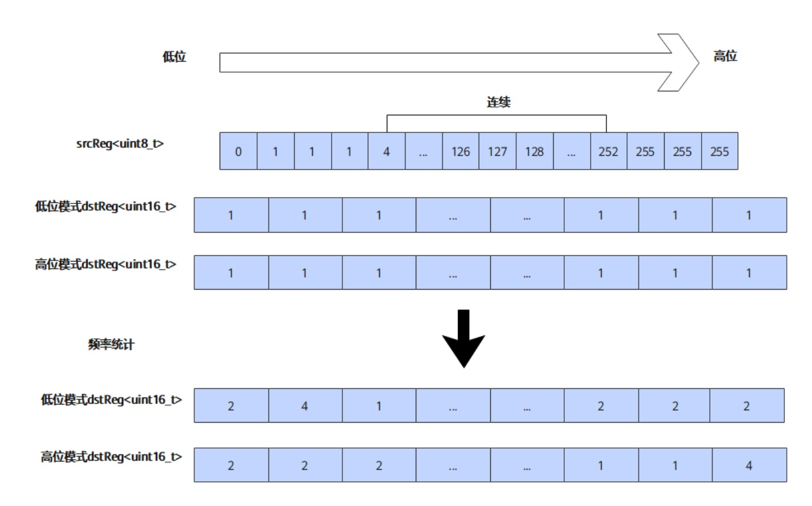
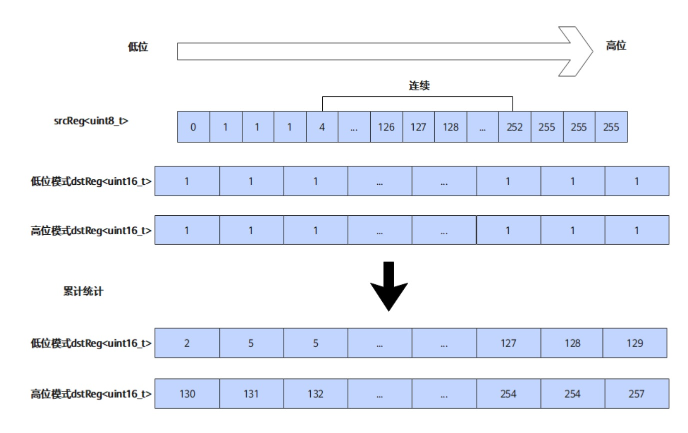

# vf.histograms

## 产品支持情况

<!-- npu="950" id1 -->
- Ascend 950PR/Ascend 950DT：支持
<!-- end id1 -->
<!-- npu="A3" id2 -->
- Atlas A3 训练系列产品/Atlas A3 推理系列产品：不支持
<!-- end id2 -->
<!-- npu="910b" id3 -->
- Atlas A2 训练系列产品/Atlas A2 推理系列产品：不支持
<!-- end id3 -->

## 功能说明

对直方图数据进行统计，在目的操作数 dst 的基础数据上加上源操作数 src 数据的统计结果，包括数据的频率统计和累计统计。

### 频率统计

如下图所示，在低位模式（BIN0）下，dst 用于统计 src 中 index 为 [0-127] 范围内（前半部分）各个值的出现频率；而在高位模式（BIN1）下，dst 则统计 [128-255] 范围内（后半部分）的频率。dst 中的第 n 位表示 src 中数值 n 的出现次数，并在原始 dst 数据的基础上进行累加。

**图 1** 频率统计



### 累计统计

如下图所示，在低位模式（BIN0）下，目的寄存器 dst 会统计源寄存器 src 中值落在低位区间 [0-127] 的数据分布情况；在高位模式（BIN1）下，目的寄存器 dst 则会统计 src 中值落在高位区间 [128-255] 的数据分布情况。在 dst 中，第 n 位的数据表示 src 中从 0 到 n 的所有数值在对应区间中出现的总频率。最终，统计结果会在目的寄存器原始数据的基础上进行累加。

**图 2** 累计统计



## 函数原型

```python
dst = vf.histograms(src, preg, *, bin_type, hist_type)
```

## 参数说明

| 参数 | 输入/输出 | 说明 |
|---|---|---|
| `dst` | 输出 | 目标向量寄存器，存放分桶计数结果。需先通过 `vf.full(0, ...)` 初始化为零，后续调用复用同一寄存器进行累加 |
| `src` | 输入 | 源向量寄存器，待统计的数据 |
| `preg` | 输入 | 掩码寄存器，指定参与统计的元素范围 |
| `bin_type` | 输入 | 分桶类型：`pl.BinType.BIN0`（默认）或 `pl.BinType.BIN1` |
| `hist_type` | 输入 | 统计模式：`pl.HistType.ACCUMULATE`（默认，累加到已有计数值）或 `pl.HistType.FREQUENCY`（频率统计） |

## 数据类型

| src | dst |
|---|---|
| INT16 | INT16 |
| INT32 | INT32 |
| UINT16 | UINT16 |
| UINT32 | UINT32 |

## 返回值说明

返回目标向量寄存器，存放分桶计数结果（累加模式下为累加后的值）。

## 约束说明

- src 与 dst 数据类型需一致。
- 本接口操作数为寄存器，不涉及地址对齐。
- 本接口不修改全局寄存器的值。
- `hist_type=ACCUMULATE` 为原地累加：dst 寄存器既被读又被写。首次调用前必须通过 `vf.full(0, ...)` 将 dst 初始化为零；后续 `dst = vf.histograms(...)` 复用同一寄存器继续累加。

## 调用示例

```python
import pypto_pro.language as pl
import torch
import torch_npu


@pl.vector_function
def example_vf(src_tile, dst_tile):
    preg_b8 = vf.create_mask(pattern=pl.MaskPattern.ALL, dtype=pl.DT_UINT8)
    preg_b16 = vf.create_mask(pattern=pl.MaskPattern.ALL, dtype=pl.DT_UINT16)
    # 加载 UINT16 数据，backend 会按 UINT8 重新解释用于直方图统计
    vreg = vf.load_align(src_tile, 0)
    # 初始化直方图累加寄存器为零
    dst_reg = vf.full(0, preg_b16, dtype=pl.DT_UINT16)
    # 累加直方图统计结果到 dst_reg
    dst_reg = vf.histograms(vreg, preg_b8, bin_type=pl.BinType.BIN0, hist_type=pl.HistType.ACCUMULATE)
    vf.store_align(dst_tile, dst_reg, preg_b16)


@pl.jit()
def example_kernel(
    a: pl.Tensor[[pl.DYNAMIC, pl.DYNAMIC], pl.DT_UINT16],
    out: pl.Tensor[[pl.DYNAMIC, pl.DYNAMIC], pl.DT_UINT16],
):
    tf = pl.TileType(shape=[1, 128], dtype=pl.DT_UINT16, target_memory=pl.MemorySpace.Vec)
    in_a = pl.make_tile(tf, addr=0, size=256)
    t_out = pl.make_tile(tf, addr=256, size=256)
    with pl.section_vector():
        pl.load(in_a, a, [0, 0])
        pl.system.sync_src(set_pipe=pl.PipeType.MTE2, wait_pipe=pl.PipeType.V, event_id=0)
        pl.system.sync_dst(set_pipe=pl.PipeType.MTE2, wait_pipe=pl.PipeType.V, event_id=0)
        example_vf(in_a, t_out)
        pl.system.sync_src(set_pipe=pl.PipeType.V, wait_pipe=pl.PipeType.MTE3, event_id=1)
        pl.system.sync_dst(set_pipe=pl.PipeType.V, wait_pipe=pl.PipeType.MTE3, event_id=1)
        pl.store(out, t_out, [0, 0])


def test_example():
    device = "npu:0"
    core_nums = 1
    torch.npu.set_device(device)
    a = torch.randint(0, 256, [1, 128], device=device, dtype=torch.int16)
    out = torch.empty([1, 128], device=device, dtype=torch.int16)
    example_kernel[None, core_nums](a, out)
    torch.npu.synchronize()
    assert out.dtype == torch.int16


if __name__ == "__main__":
    test_example()
    print("PASSED")
```
