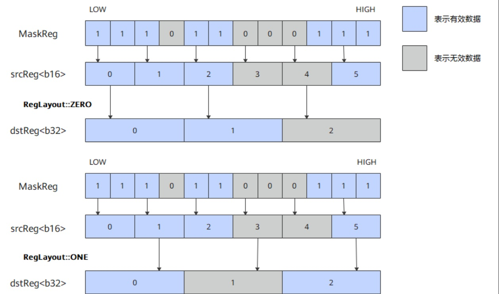
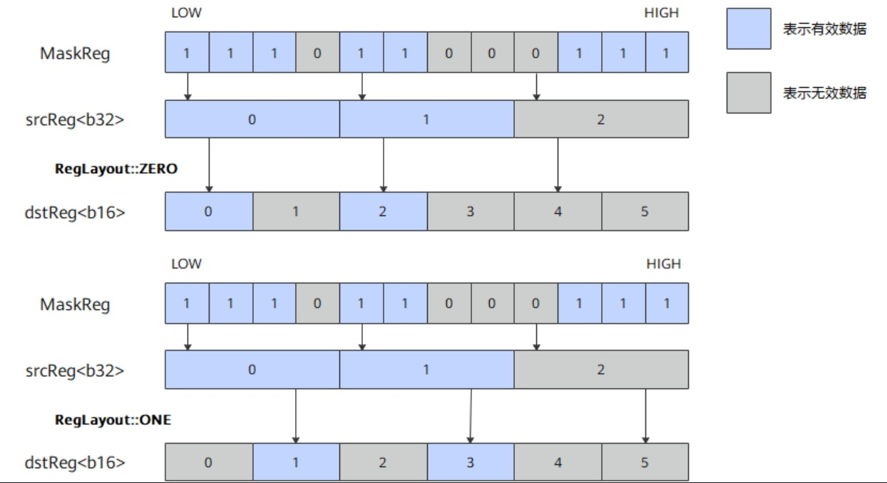

# vf.astype

## 产品支持情况

<!-- npu="950" id1 -->
- Ascend 950PR/Ascend 950DT：支持
<!-- end id1 -->
<!-- npu="A3" id2 -->
- Atlas A3 训练系列产品/Atlas A3 推理系列产品：不支持
<!-- end id2 -->
<!-- npu="910b" id3 -->
- Atlas A2 训练系列产品/Atlas A2 推理系列产品：不支持
<!-- end id3 -->

## 功能说明

向量元素数据类型转换（如 FP32→FP16）。`layout` 参数控制结果放置在偶数半区（``pl.CastLayout.ZERO``）还是奇数半区（``pl.CastLayout.ONE``）；`round_mode` 控制浮点转换的舍入方式；`saturate` 控制窄化转换的饱和处理。

不同数据类型下元素对应的 mask 位宽不一致，在类型转换时，MaskReg 根据输入的源操作数进行有效元素筛选。当源操作数和目的操作数位宽不同时，单条指令计算量以位宽更大的数据类型为准，layout 用于控制位宽小的元素在寄存器中的排布方式。

下图展示了 MaskReg 和 layout 同时作用时 b16 和 b32 进行类型转换的过程：

**图 1** b16 到 b32 类型转换过程



**图 2** b32 到 b16 类型转换过程



## 函数原型

```python
dst = vf.astype(src, preg, *, dtype=pl.DT_FP16, layout=pl.CastLayout.ZERO,
                round_mode=pl.VFRoundMode.CAST_ROUND, saturate=pl.SaturateMode.OFF)
```

## 参数说明

| 参数 | 输入/输出 | 说明 |
|---|---|---|
| `dst` | 输出 | 目标向量寄存器 |
| `src` | 输入 | 源向量寄存器 |
| `preg` | 输入 | 掩码寄存器 |
| `dtype` | 输入 | 必选，指定目标寄存器的数据类型（如 `pl.DT_FP16`、`pl.DT_INT32` 等）。由于类型转换后目标类型与源类型不同，必须显式指定 |
| `layout` | 输入 | ``pl.CastLayout.ZERO``（偶数半区）或 ``pl.CastLayout.ONE``（奇数半区） |
| `round_mode` | 输入 | 可选，浮点舍入模式，`pl.VFRoundMode` 枚举（见下表）。默认按最近舍入 |
| `saturate` | 输入 | 可选，`pl.SaturateMode.OFF`（默认）或 `pl.SaturateMode.ON`，窄化转换时是否饱和 |

### round_mode 取值

| pl.VFRoundMode | 舍入方式 |
|---|---|
| `CAST_RINT` | 舍入到最近偶数 |
| `CAST_FLOOR` | 向下取整 |
| `CAST_CEIL` | 向上取整 |
| `CAST_TRUNC` | 向零截断 |
| `CAST_RNA` | 舍入到最近、远离零 |
| `CAST_ODD` | Von Neumann 舍入（舍入到最近奇数） |
| `CAST_HYBRID` | 混合舍入（仅 Ascend 950PR/DT 支持） |
| `CAST_ROUND` | 默认舍入 |

## 数据类型

| src | dst |
|---|---|
| FP32 | FP16 |
| FP32 | INT32 |
| FP16 | FP32 |
| INT32 | FP32 |

## dtype 说明

`vf.astype` 是类型转换算子，目标寄存器的数据类型与源寄存器不同，无法从源操作数推断目标类型。因此必须通过 `dtype` 参数显式指定目标数据类型。例如 FP32→FP16 转换时指定 `dtype=pl.DT_FP16`，FP32→INT32 转换时指定 `dtype=pl.DT_INT32`。

## 返回值说明

返回目标向量寄存器（`RegTensor` 类型）。

## 约束说明

- 本接口操作数为寄存器，不涉及地址对齐。
- 本接口不修改全局寄存器的值。

## 调用示例

```python
import pypto_pro.language as pl
import torch
import torch_npu


@pl.vector_function
def example_vf(src_tile, dst_tile):
    preg = vf.create_mask(pattern=pl.MaskPattern.ALL, dtype=pl.DT_FP32)
    reg_a = vf.load_align(src_tile, 0)
    # FP32→FP16，layout=pl.CastLayout.ZERO 放偶数半区
    reg_f16 = vf.astype(reg_a, preg, dtype=pl.DT_FP16, layout=pl.CastLayout.ZERO)
    # FP16→FP32，widen back for store
    reg_f32 = vf.astype(reg_f16, preg, dtype=pl.DT_FP32)
    vf.store_align(dst_tile, reg_f32, preg)


@pl.jit()
def example_kernel(
    a: pl.Tensor[[pl.DYNAMIC, pl.DYNAMIC], pl.DT_FP32],
    out: pl.Tensor[[pl.DYNAMIC, pl.DYNAMIC], pl.DT_FP32],
):
    tf = pl.TileType(shape=[1, 64], dtype=pl.DT_FP32, target_memory=pl.MemorySpace.Vec)
    in_a = pl.make_tile(tf, addr=0, size=256)
    t_out = pl.make_tile(tf, addr=256, size=256)
    with pl.section_vector():
        pl.load(in_a, a, [0, 0])
        pl.system.sync_src(set_pipe=pl.PipeType.MTE2, wait_pipe=pl.PipeType.V, event_id=0)
        pl.system.sync_dst(set_pipe=pl.PipeType.MTE2, wait_pipe=pl.PipeType.V, event_id=0)
        example_vf(in_a, t_out)
        pl.system.sync_src(set_pipe=pl.PipeType.V, wait_pipe=pl.PipeType.MTE3, event_id=1)
        pl.system.sync_dst(set_pipe=pl.PipeType.V, wait_pipe=pl.PipeType.MTE3, event_id=1)
        pl.store(out, t_out, [0, 0])


def test_example():
    device = "npu:0"
    core_nums = 1
    torch.npu.set_device(device)
    a = torch.randn([1, 64], device=device, dtype=torch.float32)
    out = torch.empty([1, 64], device=device, dtype=torch.float32)
    example_kernel[None, core_nums](a, out)
    torch.npu.synchronize()
    torch.testing.assert_close(out, a.to(torch.float16).to(torch.float32), rtol=1e-3, atol=1e-3)


if __name__ == "__main__":
    test_example()
    print("PASSED")
```

指定舍入模式（FP32→INT32，Von Neumann 舍入）：

```python
import pypto_pro.language as pl
import torch
import torch_npu


@pl.vector_function
def example_vf_round(src_tile, dst_tile):
    preg = vf.create_mask(pattern=pl.MaskPattern.ALL, dtype=pl.DT_FP32)
    reg_a = vf.load_align(src_tile, 0)
    # FP32→INT32，round_mode=CAST_ODD 使用 Von Neumann 舍入
    reg_i = vf.astype(reg_a, preg, dtype=pl.DT_INT32, round_mode=pl.VFRoundMode.CAST_ODD)
    reg_f = vf.astype(reg_i, preg, dtype=pl.DT_FP32)
    vf.store_align(dst_tile, reg_f, preg)


@pl.jit()
def example_kernel_round(
    a: pl.Tensor[[pl.DYNAMIC, pl.DYNAMIC], pl.DT_FP32],
    out: pl.Tensor[[pl.DYNAMIC, pl.DYNAMIC], pl.DT_FP32],
):
    tf = pl.TileType(shape=[1, 64], dtype=pl.DT_FP32, target_memory=pl.MemorySpace.Vec)
    in_a = pl.make_tile(tf, addr=0, size=256)
    t_out = pl.make_tile(tf, addr=256, size=256)
    with pl.section_vector():
        pl.load(in_a, a, [0, 0])
        pl.system.sync_src(set_pipe=pl.PipeType.MTE2, wait_pipe=pl.PipeType.V, event_id=0)
        pl.system.sync_dst(set_pipe=pl.PipeType.MTE2, wait_pipe=pl.PipeType.V, event_id=0)
        example_vf_round(in_a, t_out)
        pl.system.sync_src(set_pipe=pl.PipeType.V, wait_pipe=pl.PipeType.MTE3, event_id=1)
        pl.system.sync_dst(set_pipe=pl.PipeType.V, wait_pipe=pl.PipeType.MTE3, event_id=1)
        pl.store(out, t_out, [0, 0])


def test_example_2():
    device = "npu:0"
    core_nums = 1
    torch.npu.set_device(device)
    a = torch.randn([1, 64], device=device, dtype=torch.float32)
    out = torch.empty([1, 64], device=device, dtype=torch.float32)
    example_kernel_round[None, core_nums](a, out)
    torch.npu.synchronize()
    torch.testing.assert_close(out, a.to(torch.int32).to(torch.float32), rtol=0, atol=1.0)


if __name__ == "__main__":
    test_example_2()
    print("PASSED")
```
