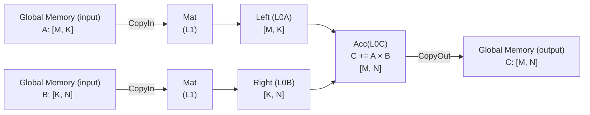

# Matmul算子快速入门

## 任务与目标

本节将详细介绍如何使用PyPTO Pro框架实现一个简单的MatMul算子，并通过测试用例验证其正确性。通过本节的学习，您将了解如何使用PyPTO Pro的API来构建自定义Matmul算子。

## 算子设计规格

**表1**Matmul算子设计规格

|    name     |  shape   | data type | format |
| :---------: | :------: | :-------: | :----: |
| input_left  | [-1,128] |  float16  |   ND   |
| input_right | [128,-1] |  float16  |   ND   |
|   output    | [-1,-1]  |  float32  |   ND   |

- 数学表达式

  给定左矩阵***A***和右矩阵***B***，通过矩阵乘法得到矩阵***C***
  $$
  A \in \mathbb{R}^{M \times K}, \qquad B \in \mathbb{R}^{K \times N}, \qquad C = A B \in \mathbb{R}^{M \times N}
  $$

	  每个C矩阵中的输出元素是***A***矩阵第*i*行和***B***矩阵第*j*列的点积：
  $$
  C_{i,j} = \sum_{k = 0}^{K-1} A_{i,k} \, B_{k,j}
  \qquad \text{for } 0 \le i < M, \; 0 \le j < N
  $$

- 使用的主要接口

  基础搬运接口：load_tile, store_tile, move

  基础计算接口：matmul

## 导入PyPTO Pro模块

在开始实现Matmul算子之前，首先需要导入PyPTO Pro、PyTorch模块。PyPTO Pro模块提供了kernel的编写、编译、jit执行的能力，PyTorch用于输入输出的创建和验证。

```python
import logging
import torch
import pypto_pro.language as pl
```

## 核心代码逻辑

实现Matmul Kernel函数。PyPTO Pro提供了丰富的Tile级别的硬件控制接口，用于实现高性能的算子计算。开发者需要自己实现数据的切块逻辑，同时调用对应的load_tile, move, matmul, store_tile接口完成Matmul的计算。一个Matmul的标准数据流向是：



其中Mat代表了AI Core中的L1，Left代表AI Core中的L0A，Right代表AI Core中的L0B，Acc代表AI Core中的L0C。

以下是Matmul算子的核心计算函数实现：

```python
@pl.jit(auto_mutex=True)
def matmul_example(a: pl.Tensor[[pl.DYNAMIC, 128], pl.DT_FP16], b: pl.Tensor[[128, pl.DYNAMIC], pl.DT_FP16], out: pl.Tensor[[pl.DYNAMIC, pl.DYNAMIC], pl.DT_FP32]):
    num_cores = pl.get_block_num()  # 获取核数
    core_id = pl.get_block_idx()    # 获取核Index
    M = a.shape[0]                  # 从输入张量获取运行时维度
    N = b.shape[1]

    # 使用make_tile_group定义Mat（L1）上的4-buffer，4-buffer需要定义4个mutex_id
    a_mat_4_buffer = pl.make_tile_group(
        type=pl.TileType(shape=[128, 128], dtype=pl.DT_FP16, target_memory=pl.MemorySpace.Mat),
        addrs=0, mutex_ids=[0, 1, 10, 11])
    b_mat_4_buffer = pl.make_tile_group(
        type=pl.TileType(shape=[128, 128], dtype=pl.DT_FP16, target_memory=pl.MemorySpace.Mat),
        addrs=0x20000, mutex_ids=[2, 3, 12, 13])
    # 使用make_tile_group定义Left（L0A）/ Right（L0B）上的double-buffer，double-buffer需要定义2个mutex_id
    a_left_db = pl.make_tile_group(
        type=pl.TileType(shape=[128, 128], dtype=pl.DT_FP16, target_memory=pl.MemorySpace.Left),
        addrs=0, mutex_ids=[4, 5])
    b_right_db = pl.make_tile_group(
        type=pl.TileType(shape=[128, 128], dtype=pl.DT_FP16, target_memory=pl.MemorySpace.Right),
        addrs=0, mutex_ids=[6, 7])
    # 使用make_tile_group定义Acc（L0C）上的double-buffer，double-buffer需要定义2个mutex_id
    acc_db = pl.make_tile_group(
        type=pl.TileType(shape=[128, 128], dtype=pl.DT_FP32, target_memory=pl.MemorySpace.Acc),
        addrs=0, mutex_ids=[8, 9])

    with pl.section_cube():
        for i in pl.range(core_id, M // 128, num_cores):
            for j in pl.range(0, N // 128, 1):
                a_l1_tile = a_mat_4_buffer.next()
                pl.load_tile(a_l1_tile, a, [i, 0])  # 将a矩阵从内存搬运到Mat
                b_l1_tile = b_mat_4_buffer.next()
                pl.load_tile(b_l1_tile, b, [0, j])  # 将b矩阵从内存搬运到Mat

                cur_a_left = a_left_db.next()
                pl.move(cur_a_left, a_l1_tile)      # 将a矩阵从Mat搬运到Left
                cur_b_right = b_right_db.next()
                pl.move(cur_b_right, b_l1_tile)     # 将b矩阵从Mat搬运到Right

                acc_tile = acc_db.next()
                pl.matmul(acc_tile, cur_a_left, cur_b_right)  # 矩阵乘法

                pl.store_tile(out, acc_tile, [i, j])  # 将数据从Acc写出到内存（FP32→FP32，Acc→GM 走 FIX 流水）
```

## 测试用例

为了验证Matmul算子的正确性，编写一个测试用例，该测试用例使用PyTorch Tensor作为输入，通过PyPTO Pro Kernel进行计算，并与PyTorch内置的Matmul函数进行结果比对，在开始执行PyPTO和PyTorch的相关代码之前，需要指定对应的Device ID，或者通过torch.npu接口获取当前的Device ID。

```python
import os
def run_perf_test():
    device_id = int(os.environ.get("TILE_FWK_DEVICE_ID", 0))
    device = f"npu:{device_id}"
    torch.npu.set_device(device)
    torch.manual_seed(42)
    M_SIZE = 8192
    N_SIZE = 8192
    K_SIZE = 128
    a = torch.randn(M_SIZE, K_SIZE, device=device, dtype=torch.float16)
    b = torch.randn(K_SIZE, N_SIZE, device=device, dtype=torch.float16)
    out = torch.zeros(M_SIZE, N_SIZE, device=device, dtype=torch.float32)
    core_num = 32

    matmul_example[None, core_num](a, b, out)
    # 调用kernel，实时编译
    torch.npu.synchronize()
    golden = torch.matmul(a.float(), b.float())
    max_diff = (out - golden).abs().max().item()
    logging.info("Max diff vs golden: %.6f", max_diff)
    torch.testing.assert_close(out, golden, rtol=1e-2, atol=1e-2)
    logging.info("Correctness PASS")
    return
```

## 编译与执行

切换到示例代码所在目录，在已安装PyPTO Pro的环境中运行：

```bash
# 配置CANN环境变量
source /usr/local/Ascend/ascend-toolkit/set_env.sh

#执行脚本
python3 matmul_example.py
```

程序执行成功后，显示以下信息：

```text
INFO:root:Max diff vs golden: 0.031250
INFO:root:Correctness PASS
```
